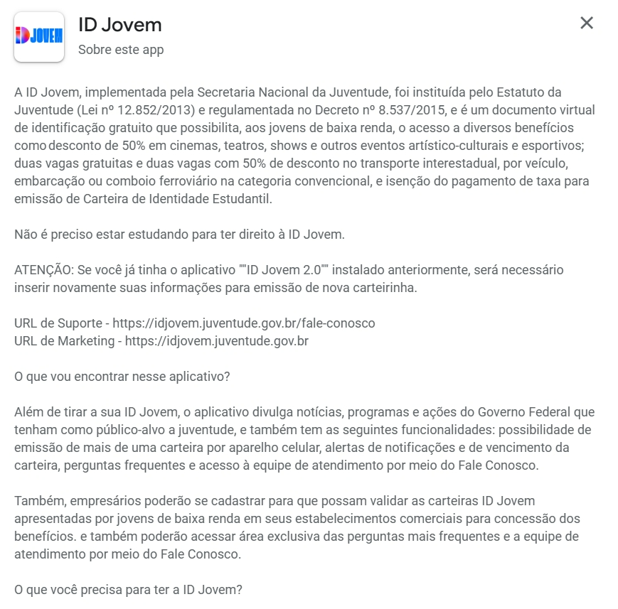

# Análise de Documentos

## Introdução

A **Análise de Documentos** é uma técnica amplamente utilizada na elicitação de requisitos, que consiste em examinar materiais já existentes, como legislações, relatórios, manuais oficiais e documentos técnicos relacionados ao domínio do sistema. Essa prática permite identificar informações relevantes de forma estruturada, servindo como base sólida para complementar outras técnicas de elicitação. Reconhecida pela sua objetividade e riqueza de dados, a análise documental possibilita compreender o contexto do software, reduzir ambiguidades e alinhar o desenvolvimento às normas e necessidades previamente estabelecidas, sendo especialmente útil em projetos como o ID Jovem (VAZQUEZ; SIMÕES, 2016).

## Técnica de Análise de Documentos

### Objetivo  
- Levantar informações já disponíveis sobre o ID Jovem.  
- Compreender melhor o domínio do sistema a partir de legislações, relatórios, notícias e feedbacks de usuários.  

### Fontes Analisadas  
- Legislação e normas que regulamentam o programa ID Jovem.  
- Site oficial e materiais de divulgação.  
- Notícias e reportagens sobre o uso do benefício.  
- Feedbacks de usuários em redes sociais e plataformas de reclamação.  

### Justificativa do Uso  
- Técnica simples e eficaz, pois **“aproveita documentos já produzidos, permitindo identificar informações relevantes de forma objetiva e direta”** (SERRANO Milene; SERRANO Mauricio) Requisitos – Aula 07*. Universidade de Brasília .  

### Benefícios Esperados  
- Reduz ambiguidades e inconsistências.  
- Alinha o desenvolvimento do sistema às normas já estabelecidas.  
- Fornece uma base sólida para complementar outras técnicas de elicitação.  
- Possibilita identificar requisitos reais a partir de documentos confiáveis. 

## Metodologia

## Documentos analisados

### Documento 1 – Site Oficial do ID Jovem  
- **Fonte:** [idjovem.juventude.gov.br](https://idjovem.juventude.gov.br/)  
- **Resumo:**O site oficial do ID Jovem apresenta informações completas sobre o programa, que é uma iniciativa do governo voltada para facilitar o acesso de jovens a direitos e benefícios sociais e culturais. Nele, é possível entender o que é o ID Jovem, como funciona, quais benefícios oferece e quem pode ter acesso. O portal também fornece formas de acesso, incluindo instruções passo a passo para emissão do documento digital, além de orientações de uso, garantindo que os jovens possam usufruir plenamente dos direitos oferecidos pelo programa. Dessa forma, o site funciona como um guia completo, esclarecendo dúvidas e facilitando a utilização do benefício de forma segura e prática.  
- **Possíveis requisitos identificados:**  
  - Necessidade de cadastro via CPF.  
  - Integração com sistemas governamentais.  
  - Geração digital do cartão ID Jovem.  

**Site Id Jovem:**  

*Fonte: Id Jovem Mobile (2025).*

---

### Documento 2 – Aplicativo (App Store / Google Play)  
- **Fonte:** Página do aplicativo nas lojas digitais ([Google Play e App Store](https://play.google.com/store/apps/details?id=com.idjovem2&hl=pt-BR)).  
- **Resumo:** A descrição oficial do aplicativo na App Store, o ID Jovem permite que jovens de baixa renda emitam sua carteira digital e acessem benefícios do programa. Com o app, é possível emitir mais de uma carteira, receber alertas, consultar perguntas frequentes, acessar atendimento e permitir que estabelecimentos validem a carteira para concessão de descontos em eventos culturais, esportivos e transporte interestadual.
- **Possíveis requisitos identificados:**  
  - Interface acessível via dispositivos móveis.  
  - Autenticação de usuários.  
  - Exibição clara dos direitos previstos em lei.  

###**Descrição App Store:**  

*Fonte: App Store (2025).*

---

## Resultados / Discussão

## Conclusão

## Referencias

## Referencias  Bibliograficas 

| Versão |    Data    |      Descrição       |                        Autor(es)                        |                       Revisor(es)                       |
| :----: | :--------: | :------------------: | :-----------------------------------------------------: | :-----------------------------------------------------: |
| `1.0`  | 25/09/2025 | Criação do documento | [Dylan](https://github.com/dylancavalcante) e [Giovana](https://github.com/GiovanaFontesS)| [Arthur](https://github.com/arthurfernandesj) |
