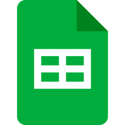

# Ferramentas

## Introdução 

Durante o desenvolvimento do projeto, diversas ferramentas foram empregadas de acordo com as necessidades específicas de cada etapa. Essa seleção foi essencial para organizar atividades, facilitar a comunicação entre os membros da equipe e apoiar a elaboração dos artefatos. A Tabela 1 apresenta as ferramentas utilizadas, destacando suas finalidades e as etapas do projeto em que cada uma foi aplicada.

## Cronograma de Participantes

Tabela 1: Cronograma de Participantes

<table>
  <thead>
    <tr>
      <th>Nome</th>
      <th>Data</th>
      <th>Hora</th>
    </tr>
  </thead>
  <tbody>
    <tr>
      <td>Enzo</td>
      <td>27/06/2025</td>
      <td>14:10</td>
    </tr>
    <tr>
      <td>Marcelo Makoto</td>
      <td>05/07/2025</td>
      <td>15:00</td>
    </tr>
    <tr>
      <td>Victor Pontual</td>
      <td>06/07/2025</td>
      <td>10:45</td>
    </tr>
    <tr>
      <td>Maria Eduarda</td>
      <td>06/07/2025</td>
      <td>18:10</td>
    </tr>
  </tbody>
</table>

Fonte: [Maria Eduarda](https://github.com/dudaa28) 

## Ferramentas Utilizadas

Tabela 2: Ferramentas Utilizadas no Projeto

| Logo | Ferramenta | Finalidade | Etapas Utilizadas |
| :-: | :-: | :-: | :-: |
|  | GitHub | Organização, versionamento e documentação de artefatos produzidos para o projeto. | Todas as etapas do projeto |
|  | Telegram | Comunicação secundária entre o grupo e docente. | Comunicação geral |
|  | Teams | Realização e gravação de reuniões e apresentações.| Reuniões, apresentações |
|  | Miro | Criação de diagramas, fluxogramas e esquemas visuais. | Brainstorm, modelagem |
|  | Figma | Produção de arte gráfica. | Prototipação, artefatos gráficos |
|  | MkDocs | Criação das páginas de documentação.| Todas as etapas do projeto |
|  | Visual Studio Code | Edição dos arquivos de documentação.| Todas as etapas do projeto |
|  | WhatsApp | Comunicação do time e avisos de demandas.| Comunicação geral |
|  | YouTube | Hospedagem de vídeos produzidos.| Entregas, apresentações |
|  | Google Planilhas | Criação de planilhas relacionadas ao cronograma e horários.| Priorização (FTF, In or Out, $100 Test) |
|  | Google Docs | Primeira escrita de documentos e tabelas.| Todas as etapas do projeto |
|  | ChatGPT | Ferramenta de consulta de dúvidas. | Todas as etapas |
|  | ZenHub | Atribuição de demandas e gerenciamento do time.| Gerenciamento do projeto |
|  | This Person Not Exist | Criação de imagens falsas para personas.| Personas |
|  | Canva | Criação de slides para apresentações.| Apresentações |
|  | CapCut | Edição de gravações das apresentações e reuniões.| Entregas, Atas, Reuniões |

Fonte: <a href="https://github.com/arthurfernandesj">Arthur Fernandes</a>

## Referências Bibliográficas

><a id="FRM1" href="#anchor_1">1.</a> GitHub. Disponível em: https://docs.github.com/pt. Acesso em: 12 de abr. de 2025.
>
><a id="FRM2" href="#anchor_2">2.</a> Discord. Disponível em: https://discord.com/company. Acesso em: 12 de abr. de 2025.
>
><a id="FRM3" href="#anchor_3">3.</a> Microsoft Teams. Disponível em: https://www.microsoft.com/pt-br/microsoft-teams/group-chat-software. Acesso em: 12 de abr. de 2025.
>
><a id="FRM4" href="#anchor_4">4.</a> OBS Studio. Disponível em: https://obsproject.com/pt-br. Acesso em: 12 de abr. de 2025.
>
><a id="FRM5" href="#anchor_5">5.</a> Figma. Disponível em: https://www.figma.com. Acesso em: 12 de abr. de 2025.
>
><a id="FRM6" href="#anchor_6">6.</a> MkDocs. Disponível em: https://www.mkdocs.org. Acesso em: 12 de abr. de 2025.
>
><a id="FRM7" href="#anchor_7">7.</a> Visual Studio Code. Disponível em: https://code.visualstudio.com. Acesso em: 12 de abr. de 2025.
>
><a id="FRM8" href="#anchor_8">8.</a> WhatsApp. Disponível em: https://www.whatsapp.com/?lang=pt_br. Acesso em: 12 de abr. de 2025.
>
><a id="FRM9" href="#anchor_9">9.</a> YouTube. Disponível em: https://about.youtube. Acesso em: 12 de abr. de 2025.
>
><a id="FRM10" href="#anchor_10">10.</a> Google Planilhas. Disponível em: https://www.google.com/intl/pt-BR/sheets/about. Acesso em: 12 de abr. de 2025.
>
><a id="FRM11" href="#anchor_11">11.</a> Google Docs. Disponível em: https://www.google.com/intl/pt-BR/docs/about. Acesso em: 12 de abr. de 2025.
>
><a id="FRM12" href="#anchor_12">12.</a> ChatGPT. Disponível em: https://openai.com/index/chatgpt. Acesso em: 12 de abr. de 2025.
>
><a id="FRM13" href="#anchor_13">13.</a> CapCut. Disponível em: https://www.capcut.com. Acesso em: 13 de abr. de 2025.
>
><a id="FRM14" href="#anchor_13">14.</a> Diagrams.net. Disponível em: https://app.diagrams.net/. Acesso em: 18 de jun. de 2025.
>
><a id="FRM15" href="#anchor_15">15.</a> Canva. Disponível em: https://www.canva.com/. Acesso em: 22 de jun. de 2025.
>

 

## Histórico de Versões

| Versão | Data       | Descrição                         | Autor(es)    | Revisor(es)  |
|:-----: | :--------: | :------------------------------- | :---------- | :---------- |
| `1.0`    | 27/06/2025 | Criação da página de Ferramentas Utilizadas | [Arthur Fernandes](https://github.com/arthurfernandesj)   | [Leticia Lopes](https://github.com/leticialopes20) |
