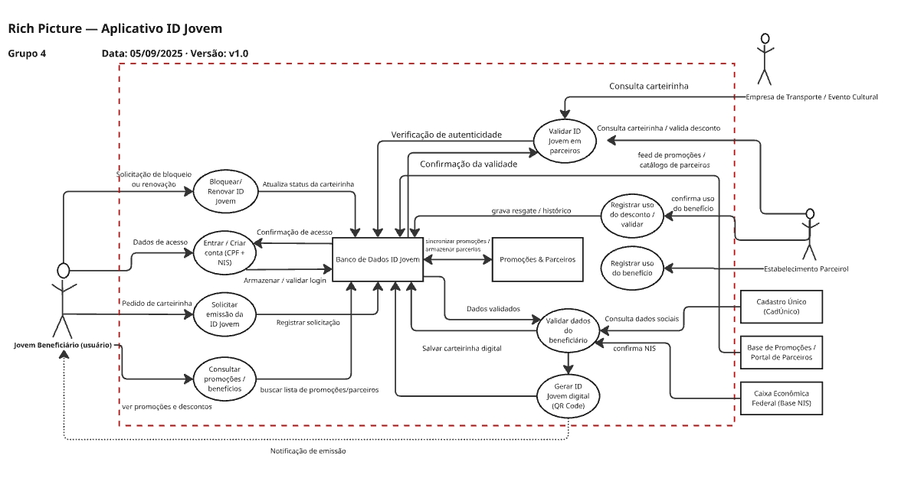
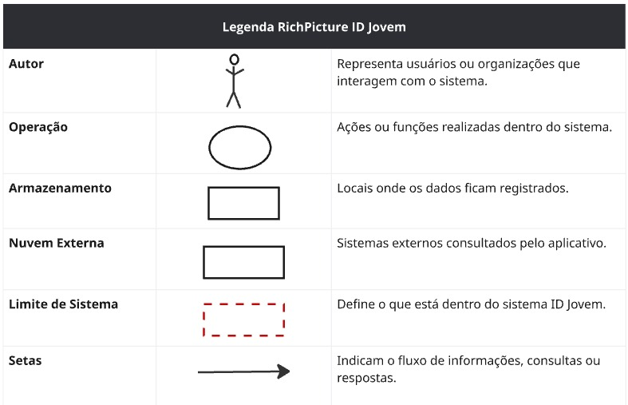

# Rich Picture: Aplicativo ID Jovem

## Introdução

Uma Rich Picture é um diagrama que ilustra as fronteiras, os elementos e as interações de um sistema complexo. Em vez de focar em uma notação técnica rígida, ela utiliza uma combinação de ícones, textos e símbolos para mapear os fluxos de informação, os processos e as relações entre os diferentes atores envolvidos. O objetivo é fornecer uma visão clara e compartilhada do escopo e do contexto do sistema.

No caso do Aplicativo ID Jovem, a Rich Picture (Figura 1) delimita as funcionalidades centrais do sistema, como a solicitação de emissão, a verificação de autenticidade e a consulta da carteirinha. Ela demonstra a interação do ator principal, o **Jovem Beneficiário**, outros autores **Estabelecimento Parceiro** e **Empresa de Transporte / Evento Cultural**, com o sistema e também as conexões com entidades externas, como as **Empresas de Transporte** e os sistemas governamentais do **Cadastro Único (CadÚnico)** e da **Caixa Econômica Federal**, que validam os dados dos usuários.

## Pesquisa e Coleta de Dados 
Para a elaboração do Rich Picture do ID Jovem, realizamos uma breve pesquisa com o objetivo de compreender melhor as funcionalidades do aplicativo. Foram consultadas informações disponibilizadas no portal do Governo Federal, onde é possível encontrar detalhes sobre quem pode utilizar o programa, como solicitar os serviços, seu funcionamento e demais orientações. Além disso, também analisamos a própria documentação do ID Jovem, que serviu de base para estruturar e representar de forma mais clara os elementos e relações presentes no Rich Picture.

## Pesquisa e Coleta de Dados 
Para a elaboração do Rich Picture do ID Jovem, realizamos uma breve pesquisa com o objetivo de compreender melhor as funcionalidades do aplicativo. Foram consultadas informações disponibilizadas no portal do Governo Federal, onde é possível encontrar detalhes sobre quem pode utilizar o programa, como solicitar os serviços, seu funcionamento e demais orientações. Além disso, também analisamos a própria documentação do ID Jovem, que serviu de base para estruturar e representar de forma mais clara os elementos e relações presentes no Rich Picture.

## Metodologia e Ferramentas

A ferramenta Miro foi fundamental para a elaboração do diagrama visual do projeto. Com ela, criamos a Rich Picture e sua legenda correspondente, que detalha o significado de cada elemento gráfico. Esse diagrama, mostrado na Figura 1, é essencial para uma visão completa do escopo e do contexto do nosso trabalho.

_Figura 1: Rich Picture do ecossistema IdJovem._

Fonte: <a href="https://github.com/GiovanaFontesS">Giovana Fontes</a>

## Legenda

A legenda a seguir (Figura 2) detalha os símbolos visuais que compõem a Rich Picture do ID Jovem. Cada elemento foi escolhido para representar um componente-chave do ecossistema do programa:

-   **Ator:** Representa usuários ou organizações que interagem com o sistema.
-   **Operação:** Ações ou funções realizadas dentro do sistema.
-   **Armazenamento:** Locais onde os dados ficam registrados.
-   **Nuvem externa:** Sistemas externos consultados pelo aplicativo.
-   **Limite do sistema:** Define o que está dentro do sistema ID Jovem.
-   **Setas:** Indicam o fluxo de informações, consultas ou respostas.

_Figura 2: Legenda oficial da Rich Picture do ID Jovem._

Fonte: <a href="https://github.com/GiovanaFontesS">Giovana Fontes</a>

# Histórico de Versões

| Versão | Data       | Descrição                                   | Autor       | Revisor          |
| :----- | :--------- | :------------------------------------------ | :---------- | :--------------- |
| 1.0    | 08/09/2025 | Criação do documento para o projeto IdJovem | Danilo Melo | [Arthur Fernandes](https://github.com/arthurfernandesj)|
| 1.2    | 16/09/2025 | Atualização nas legendas                    | [Arthur Fernandes](https://github.com/arthurfernandesj) | [Giovana Fontes](https://github.com/giovanaFontesS)|
| 1.3    | 18/09/2025 | Alteração Rich Picture e Legenda                    |[Giovana Fontes](https://github.com/giovanaFontesS) | [Arthur Fernandes](https://github.com/arthurfernandesj)|
