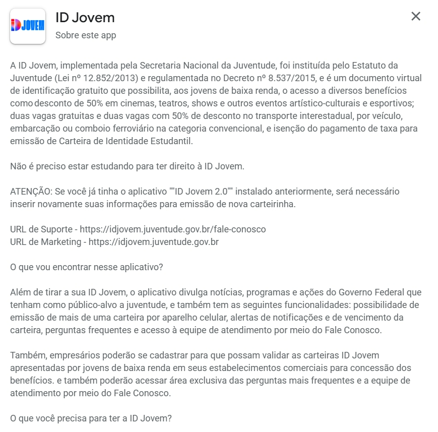

# Análise de Documentos

## Introdução 

A Análise de Documentos é uma técnica amplamente utilizada no processo de elicitação de requisitos, consistindo no exame de materiais previamente existentes, como legislações, relatórios, manuais oficiais e documentos técnicos relacionados ao domínio do sistema. Essa prática permite identificar informações relevantes de maneira estruturada, fornecendo uma base sólida para complementar outras técnicas de levantamento.

Reconhecida por sua objetividade e riqueza de dados, a análise documental contribui para a compreensão do contexto do software, reduz ambiguidades e alinha o desenvolvimento às normas e necessidades já estabelecidas. Dessa forma, torna-se uma abordagem essencial para garantir que os requisitos sejam fundamentados em fontes confiáveis e consistentes <a id="anchor_1" href="#QT1">[1]</a>.

<small><em>Revisado por [Chat GPT](https://chatgpt.com/), em 21 de Novembro 2025</em></small>

## **Técnica de Análise de Documentos**

### Objetivo

* Identificar e reunir informações já disponíveis relacionadas ao domínio do sistema.
* Compreender o funcionamento e o contexto do problema por meio da análise de legislações, relatórios, notícias e feedbacks de usuários.

### Fontes Analisadas

* Legislações e normas associadas ao contexto do sistema.
* Documentação oficial e materiais institucionais.
* Notícias e reportagens relevantes.
* Feedbacks de usuários em redes sociais e plataformas de reclamação.

### Justificativa do Uso

A Análise de Documentos foi adotada por ser uma técnica simples, consistente e de alta confiabilidade, uma vez que **“aproveita documentos já produzidos, permitindo identificar informações relevantes de forma objetiva e direta”** <a id="anchor_2" href="#QT2">[2]</a>.  
Seu uso possibilita compreender o domínio do sistema com maior precisão, garantindo que as decisões tomadas no desenvolvimento estejam alinhadas às informações previamente registradas em fontes formais.

### Benefícios Esperados

* Redução de ambiguidades e inconsistências nos requisitos.
* Alinhamento do desenvolvimento às normas, regras e práticas já estabelecidas.
* Construção de uma base sólida que complementa outras técnicas de elicitação.
* Identificação de requisitos reais a partir de documentos confiáveis e verificáveis.

<small><em>Revisado por [Chat GPT](https://chatgpt.com/), em 21 de Novembro 2025</em></small>

## Metodologia

### Documentos Analisados

#### Site Oficial do Programa

O site oficial apresenta informações completas sobre o programa, descrevendo seus objetivos, público-alvo e benefícios oferecidos. O portal detalha como o usuário pode emitir o documento digital, apresenta orientações de uso e esclarece dúvidas frequentes, funcionando como um guia centralizado e confiável. Além disso, disponibiliza instruções passo a passo para o acesso ao benefício, permitindo que os usuários compreendam o funcionamento do sistema e utilizem seus recursos de forma segura e adequada.   

Imagem 1: Site Oficial

  

Fonte: <a href="https://idjovem.juventude.gov.br" target="_blank">Portal Oficial</a> (2025).

 

#### Aplicativo (App Store / Google Play)

A descrição oficial do aplicativo nas lojas digitais apresenta de forma clara suas principais funcionalidades. Por meio do app, o usuário pode emitir sua carteira digital, acessar os benefícios disponíveis, consultar perguntas frequentes, receber notificações importantes e buscar atendimento quando necessário. Além disso, o aplicativo permite a validação da carteira por estabelecimentos autorizados, garantindo a correta aplicação dos benefícios. Dessa forma, o app funciona como uma ferramenta prática, acessível e centralizada para utilização dos serviços oferecidos pelo programa.

Imagem 2: App Store

  

Fonte: <a href="https://" target="_blank">App Store </a> (2025).

<small><em>Revisado por [Chat GPT](https://chatgpt.com/), em 21 de Novembro 2025</em></small>

## **Resultados / Discussão**

A análise documental realizada permitiu identificar e organizar informações relevantes de maneira clara, confiável e fundamentada. De acordo com o [Guia de Técnicas de Elicitação de Requisitos](https://retraining.inf.ufsc.br/guia/app/classificacoes/tecnicas-de-elicitacao-de-requisitos/entidades) da UFSC (2023), essa técnica se destaca por aproveitar registros já existentes, garantindo economia de tempo, consistência e maior precisão durante o levantamento de requisitos. No presente estudo, legislações, portais oficiais e materiais digitais forneceram uma visão abrangente do funcionamento do sistema e de suas principais necessidades.

A partir desses documentos, foi possível identificar requisitos funcionais diretamente relacionados às operações do sistema, como a geração da carteira digital e os mecanismos de autenticação de usuários. Também foram evidenciados requisitos não funcionais importantes, especialmente aqueles ligados à segurança, acessibilidade, desempenho e usabilidade — elementos essenciais para garantir que o público-alvo consiga utilizar o serviço sem obstáculos técnicos.

Além disso, a análise documental contribuiu para avaliar a coerência entre as normas legais que regem o programa e sua implementação prática. Essa comparação evidenciou pontos críticos, como a necessidade de integração eficiente entre sistemas governamentais e a importância de manter informações atualizadas para evitar inconsistências operacionais.

O cruzamento das informações coletadas reforça o papel da análise documental como uma técnica inicial robusta e indispensável. Ela não apenas direciona o entendimento preliminar do domínio do sistema, como também serve de base sólida para a aplicação de outras técnicas de elicitação, como entrevistas, questionários e observações diretas, fortalecendo a qualidade e a precisão dos requisitos levantados.

<small><em>Revisado por [Chat GPT](https://chatgpt.com/), em 21 de Novembro 2025</em></small>

### Requisitos Identificados

<strong>Tabela 1 – Requisitos Identificados na Análise Documental</strong>

| ID     | Tipo              | Requisito                                                                   |
| ------ | ----------------- | --------------------------------------------------------------------------- |
| **AD01**  | **Funcional**     | Cadastro do jovem beneficiário por meio do CPF                                         |
| **AD02**  | **Funcional**     | Geração e emissão da carteira digital ID Jovem                              |
| **AD03**  | **Funcional**     | Integração com bancos de dados governamentais                               |
| **AD04**  | **Funcional**     | Autenticação e login do jovem beneficiário no aplicativo                               |
| **AD05**  | **Funcional**     | Possibilidade de emissão de mais de uma carteira digital                    |
| **AD06**  | **Funcional**     | Exibição clara das regras de acesso e direitos garantidos                   |
| **AD07**  | **Funcional**     | Disponibilização de perguntas frequentes e atendimento                      |
| **AD08**  | **Funcional**     | Validação da carteira em estabelecimentos conveniados                       |
| **AD09**  | **Não Funcional** | Usabilidade: Interface simples e acessível                                  |
| **AD10**  | **Não Funcional** | Portabilidade: Disponibilidade em múltiplas plataformas (web, Android, iOS) |
| **AD11**  | **Não Funcional** | Segurança: Proteção de dados pessoais (especialmente CPF)                   |
| **AD12**  | **Não Funcional** | Confiabilidade: Informações oficiais e atualizadas                          |
| **AD13**  | **Não Funcional** | Performance: Emissão rápida e estável da carteira digital                   |
| **AD14**  | **Não Funcional** | Acessibilidade: Informações claras e de fácil entendimento                  |
| **AD15**  | **Não Funcional** | Desempenho: O tempo de carregamento das páginas do site oficial não deve exceder 3 segundos em conexões de internet de baixa velocidade. |
| **AD16**  | **Não Funcional** | Confiabilidade: O aplicativo deve garantir que as informações sobre os benefícios estejam 100% sincronizadas com a base de dados oficial. |
| **AD17**  | **Não Funcional** | Suportabilidade: O sistema deve ser compatível com as duas versões anteriores dos principais navegadores web e sistemas operacionais móveis. |
| **AD18**  | **Não Funcional** | Usabilidade: A navegação entre as seções do site e do aplicativo deve ser consistente e previsível para o jovem beneficiário. |

Fonte: <a href="https://github.com/dylancavalcante">Dylan Cavalcante</a>

## Conclusão

A análise documental realizada demonstrou ser uma técnica extremamente eficiente para a elicitação de requisitos, permitindo identificar aspectos funcionais e não funcionais de maneira estruturada, confiável e independente de interação direta inicial com os usuários. A consulta a documentos oficiais, legislações, portais institucionais e materiais digitais forneceu informações consistentes e verificáveis, contribuindo para reduzir ambiguidades e orientar o desenvolvimento conforme normas e diretrizes previamente estabelecidas.

Dessa forma, a técnica se consolida como uma etapa essencial no processo de levantamento de requisitos, oferecendo uma base sólida para as fases subsequentes. Sua aplicação pode — e deve — ser complementada por entrevistas, questionários e observação

## Bibliografia 

> UNIVERSIDADE FEDERAL DE SANTA CATARINA. Técnicas de elicitação de requisitos: Análise de Documentos. Disponível em: [UNIVERSIDADE FEDERAL DE SANTA CATARINA](https://retraining.inf.ufsc.br/guia/app/classificacoes/tecnicas-de-elicitacao-de-requisitos/entidades/tecnicas-de-elicitacao-de-requisitos-analise-de-documentos). Acesso em: 26 set. 2025.

> BRASIL. ID Jovem. Disponível em: [ID Jovem](https://idjovem.juventude.gov.br). Acesso em: 26 set. 2025.

> APPLE; GOOGLE. Aplicativo ID Jovem. Disponível em: [Aplicativo ID Jovem - Apple](https://apps.apple.com) e [Aplicativo ID Jovem - Play Store](https://play.google.com). Acesso em: 26 set. 2025.

>  SERRANO, Milene; SERRANO, Mauricio. *Requisitos – Aula 07*. Universidade de Brasília, 2016.

>  VAZQUEZ, C. E.; SIMÕES, G. S. *Engenharia de Requisitos: software orientado ao negócio*. Rio de Janeiro: Brasport, 2016.

## Histórico de Versão

| Versão |    Data    |       Descrição      |                                          Autor(es)                                         |                  Revisor(es)                  |
| :----: | :--------: | :------------------: | :----------------------------------------------------------------------------------------: | :-------------------------------------------: |
|  `1.0` | 25/09/2025 | Criação do documento | [Dylan](https://github.com/dylancavalcante) e [Giovana](https://github.com/GiovanaFontesS) | [Arthur](https://github.com/arthurfernandesj) |
|  `1.1` | 30/09/2025 | Correção das imagens | [Arthur](https://github.com/arthurfernandesj) | [Giovana](https://github.com/GiovanaFontesS) |
|  `1.2` | 10/10/2025 | Correção das Referências | [Arthur](https://github.com/arthurfernandesj) | [Giovana](https://github.com/GiovanaFontesS) |
| `1.3` | 21/11/2025 | Ajuste e padronização da bibliografia em Markdown, com links clicáveis e formatação revisada | [Arthur](https://github.com/arthurfernandes) | [Giovana](https://github.com/GiovanaFontesS) |

## Agrecimentos

Queremos agradecer ao [Chat GPT](https://chatgpt.com/), ferramenta de Inteligência Artificial Generativa, pelo apoio durante o desenvolvimento deste projeto ID Jovem. Sua ajuda foi essencial na revisão de textos, na organização das ideias e na pesquisa de conteúdos complementares que contribuíram para deixar nossa documentação mais clara e completa.

De acordo com o Código de Conduta da Sociedade Brasileira de Computação (SBC), destacamos que a ferramenta foi utilizada apenas como apoio técnico e linguístico.
Todo o conteúdo apresentado é de autoria do Grupo 04, que assume total responsabilidade por sua originalidade e precisão.

