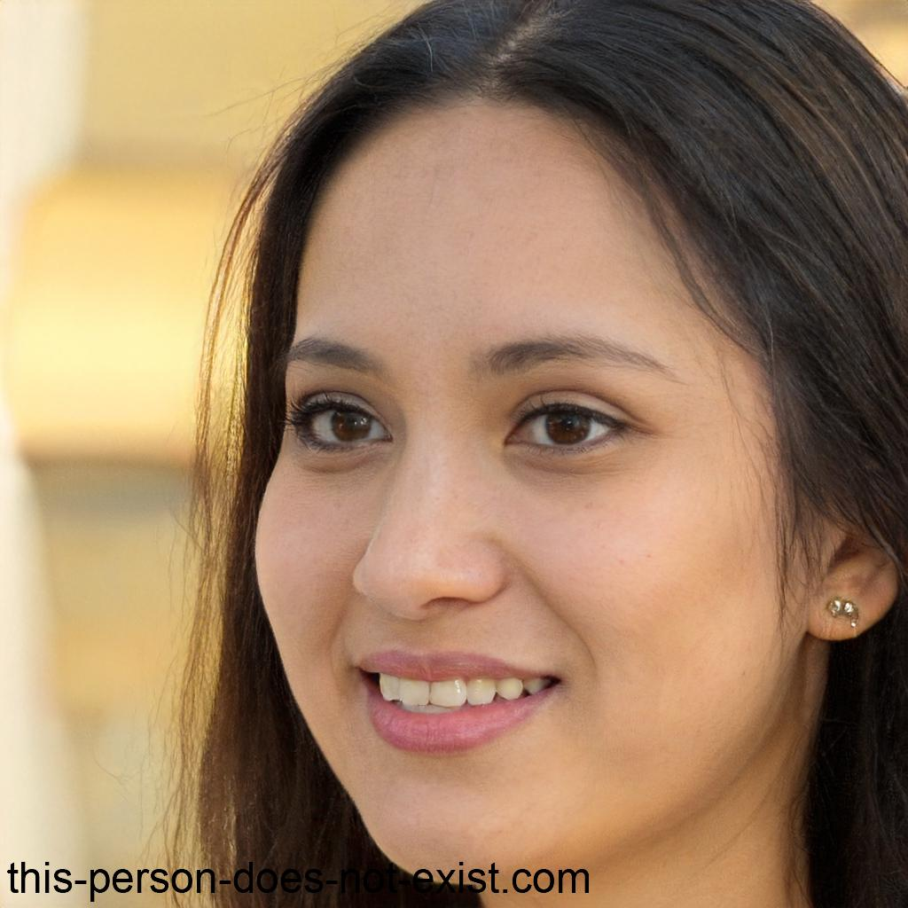
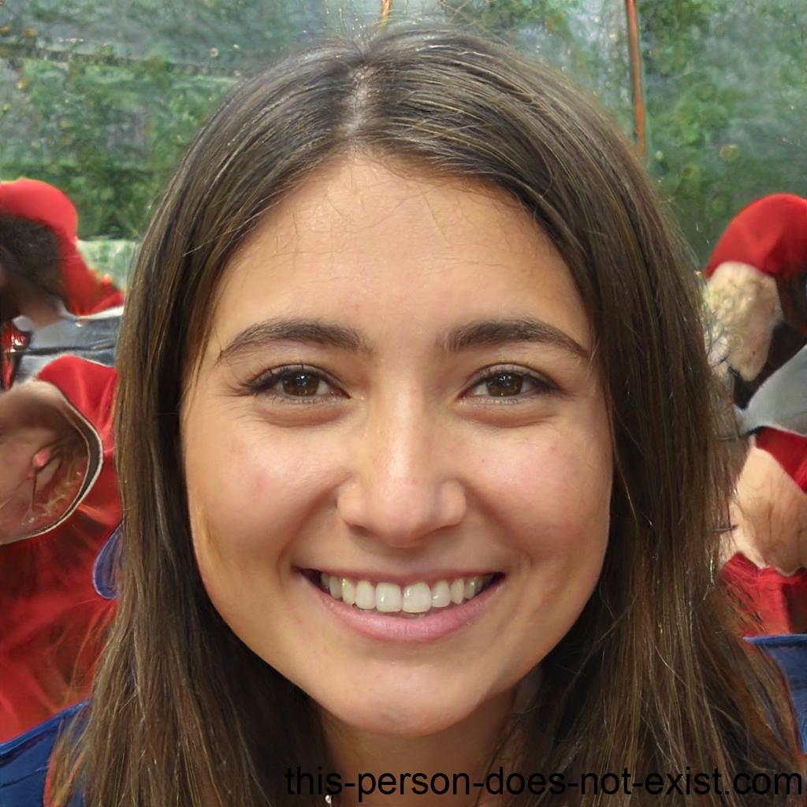
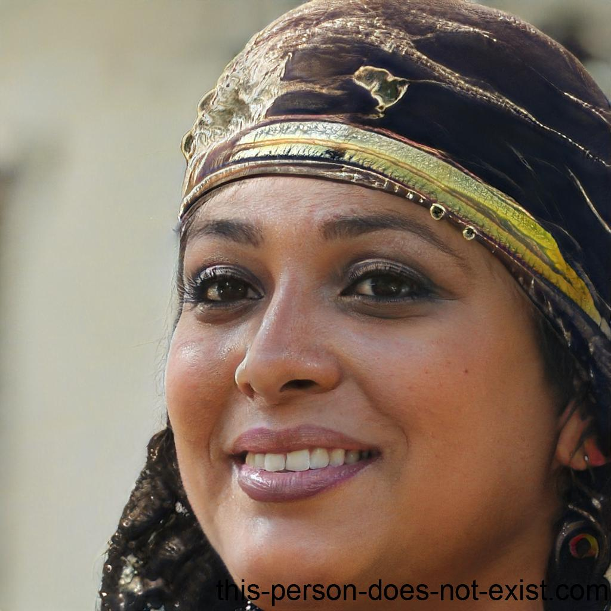

# Personas

## Introdução

O desenvolvimento de um aplicativo eficaz requer uma compreensão profunda dos usuários que irão interagir com ele. Nesse contexto, as personas desempenham um papel fundamental, persona é um personagem fictício, um arquétipo hipotético de um grupo de usuários reais, permitindo que as equipes de desenvolvimento criem produtos que atendam às necessidades e expectativas de diferentes segmentos de usuários <a id="TEC1" href="#RP1">[1]</a>. Este documento tem como objetivo apresentar as personas desenvolvidas para o projeto de elicitação de requisitos do aplicativo **ID Jovem**, fornecendo insights valiosos sobre os diversos perfis de usuários que serão considerados durante o processo de desenvolvimento.

## Metodologia

Para definição das personas, a equipe realizou:

1. **Questionário online:**: Para a coleta de dados sobre os usuários do aplicativo, o grupo utilizou duas técnicas principais de elicitação de requisitos: questionários online e entrevistas semiestruturadas. As perguntas elaboradas foram objetivas e abordaram aspectos demográficos (idade, gênero, localização), profissionais (ocupação, escolaridade) e comportamentais (interesses relacionados ao aplicativo, desafios enfrentados no uso do **ID Jovem**, preferências tecnológicas). Essas técnicas permitiram obter informações tanto quantitativas quanto qualitativas dos usuários reais e potenciais.

2. **Análise dos dados coletados:** Os dados coletados foram analisados para identificar padrões e características comuns entre os usuários. Essa análise revelou insights valiosos sobre necessidades, comportamentos e desafios, que serviram como base para a definição dos perfis de usuário representados pelas personas.

3. **Estruturação das personas:** Os dados coletados fundamentaram a criação de personas que representam os principais perfis de usuário. Cada persona foi detalhada com características específicas que espelham necessidades, comportamentos e desafios reais no uso do ID Jovem.

## Elenco

O elenco de personas no projeto do aplicativo **ID Jovem** consiste em quatro personas principais e uma antipersona, totalizando cinco perfis de usuários. A quantidade foi definida após uma análise cuidadosa dos dados coletados durante o processo de elicitação de requisitos.

As quatro personas principais foram criadas para refletir a diversidade do público-alvo. Cada uma representa um segmento significativo de usuários reais ou potenciais do aplicativo **ID Jovem**, contemplando distintas características demográficas, necessidades, experiências e expectativas em relação ao sistema.

-   **Ana Clara (Persona Primária):** 19 anos, estudante universitária, com muita experiência em tecnologia, e utiliza o aplicativo para acessar benefícios de meia-entrada em shows e cinema, obter desconto em transporte interestadual.
-   **João Pedro( Persona Primária):** 24 anos e é um trabalhador informal, tem competência média com atividades digitais, e busca ter acesso facilitado a transporte interestadual e eventos culturais.
-   **Camila Souza (Persona Primária):** 23 anos, é mãe solo e estudante de curso técnico e busca garantir transporte interestadual gratuito ou com desconto para visitar familiares.
-   **Rafaela Lima(Persona Secundária):** 34 anos, professora do ensino público, busca orientar seus alunos sobre o uso do ID Jovem, acompanhando processos e tirando dúvidas. Possui competência digital média a alta.

Por fim, foi definida uma **antipersona** para representar um público que não é foco do aplicativo:

-   **Carlos Henrique(antipersona):** tem 45 anos, representa um usuário de meia idade, é empresário do setor privado, com habilidades tecnológicas avançadas, não utiliza o ID Jovem, não se enquadra nos requisitos e não tem interesse nos benefícios do programa.

A quantidade de personas elaboradas mostrou-se suficiente para representar os segmentos principais de usuários, permitindo que o aplicativo atenda adequadamente a um espectro amplo de competências digitais.

As tabelas de 1 a 5 apresentam o elenco de personas.

<b>Tabela 1</b> - Persona Primária Ana Clara.

| 

Figura 1- Persona Primária Ana Clara.
<figure style="display:inline-block;margin:0;"> <figcaption>Autor: <a href="https://github.com/eduardar0">Eduarda</a> (2025). <a id="TEC2" href="#RP2">[2]</a></figcaption></figure>
 |
| ----------------------------------------------------------------------------------------------------------------------------------------------------------------------------------------------------------------------------------------------------------------------------------------------- |
| **Nome**: Ana Clara                                                                                                                                                                                                                                                                             |
| **Status**: Persona Primária.                                                                                                                                                                                                                                                                   |
| **Gênero**: Feminino.                                                                                                                                                                                                                                                                           |
| **Idade**: 19 anos                                                                                                                                                                                                                                                                              |
| **Profissão**: Estudante universitária e estagiária.                                                                                                                                                                                                                                            |
| **Escolaridade**: Cursando o ensino superior.                                                                                                                                                                                                                                                   |
| **Localização**: Brasília/DF                                                                                                                                                                                                                                                                    |
| **Objetivo**: Acessar benefícios de meia-entrada em shows e cinema, obter desconto em transporte interestadual.                                                                                                                                                                                 |
| **Frustrações**: Falta de informações claras sobre validade do benefício; dificuldade em atualizar dados cadastrais.                                                                                                                                                                            |
| **Necessidades**: App intuitivo, possibilidade de checar status do cadastro e validar carteirinha rapidamente.                                                                                                                                                                                  |
| **Competências digitais**: Alta, usa aplicativos bancários e redes sociais diariamente.                                                                                                                                                                                                         |

<b>Tabela 2</b> - Persona Primária Joao Pedro.

| 

Figura 2- Persona Primária João Pedro.
<figure style="display:inline-block;margin:0;"> <figcaption>Autor: <a href="https://github.com/eduardar0">Eduarda</a> (2025). <a id="TEC2" href="#RP2">[2]</a></figcaption></figure>
 |
| -------------------------------------------------------------------------------------------------------------------------------------------------------------------------------------------------------------------------------------------------------------------------------------------------- |
| **Nome**: Joao Pedro                                                                                                                                                                                                                                                                               |
| **Status**: Persona Primária.                                                                                                                                                                                                                                                                      |
| **Gênero**: Masculino.                                                                                                                                                                                                                                                                             |
| **Idade**: 24 anos                                                                                                                                                                                                                                                                                 |
| **Profissão**: Trabalhador Informal.                                                                                                                                                                                                                                                               |
| **Escolaridade**: Ensino médio completo.                                                                                                                                                                                                                                                           |
| **Localização**: Goiania/GO                                                                                                                                                                                                                                                                        |
| **Objetivo**: Ter acesso facilitado a transporte interestadual e eventos culturais.                                                                                                                                                                                                                |
| **Frustrações**: Pouco tempo livre; dificuldade em entender processos burocráticos.                                                                                                                                                                                                                |
| **Necessidades**: App rápido, simples e que funcione bem em redes móveis limitadas.                                                                                                                                                                                                                |
| **Competências digitais**: Média – usa redes sociais e apps de entrega, mas tem celular básico.                                                                                                                                                                                                    |

<b>Tabela 3</b> - Persona Primária Camila Souza.

| 

Figura 3- Persona Primária Camila Souza.
<figure style="display:inline-block;margin:0;"> <figcaption>Autor: <a href="https://github.com/eduardar0">Eduarda</a> (2025). <a id="TEC2" href="#RP2">[2]</a></figcaption></figure>
 |
| --------------------------------------------------------------------------------------------------------------------------------------------------------------------------------------------------------------------------------------------------------------------------------------------------- |
| **Nome**: Camila                                                                                                                                                                                                                                                                                    |
| **Status**: Persona Primária.                                                                                                                                                                                                                                                                       |
| **Gênero**: Feminino.                                                                                                                                                                                                                                                                               |
| **Idade**: 23 anos                                                                                                                                                                                                                                                                                  |
| **Profissão**:Mãe solo e estudante de curso técnico.                                                                                                                                                                                                                                                |
| **Escolaridade**: Ensino medio completo.                                                                                                                                                                                                                                                            |
| **Localização**: São Paulo/SP.                                                                                                                                                                                                                                                                      |
| **Objetivo**: Garantir transporte interestadual gratuito ou com desconto para visitar familiares.                                                                                                                                                                                                   |
| **Frustrações**: Pouca acessibilidade em sistemas públicos; dificuldade em encontrar suporte rápido.                                                                                                                                                                                                |
| **Necessidades**: App acessível (fontes maiores, contraste, acessibilidade para deficiência visual) , com canal de ajuda.                                                                                                                                                                           |
| **Competências digitais**: Baixa a média – usa WhatsApp e aplicativos básicos.                                                                                                                                                                                                                      |

<b>Tabela 4</b> - Persona Secundária Rafaela Lima.

| 

Figura 4- Persona Secundária Rafaela Lima.
<figure style="display:inline-block;margin:0;"> <figcaption>Autor: <a href="https://github.com/eduardar0">Eduarda</a> (2025). <a id="TEC2" href="#RP2">[2]</a></figcaption></figure>
 |
| ------------------------------------------------------------------------------------------------------------------------------------------------------------------------------------------------------------------------------------------------------------------------------------------------------ |
| **Nome**: Rafaela Lima.                                                                                                                                                                                                                                                                                |
| **Status**: Persona Secundária.                                                                                                                                                                                                                                                                        |
| **Gênero**: Feminino.                                                                                                                                                                                                                                                                                  |
| **Idade**: 35 anos                                                                                                                                                                                                                                                                                     |
| **Profissão**: Professora do ensino público.                                                                                                                                                                                                                                                           |
| **Escolaridade**: Ensino Superior completo.                                                                                                                                                                                                                                                            |
| **Localização**: Recife/PE.                                                                                                                                                                                                                                                                            |
| **Objetivo**: Orientar alunos sobre o uso do ID Jovem; acompanhar o processo para tirar dúvidas frequentes dos jovens.                                                                                                                                                                                 |
| **Frustrações**: Falta de informações atualizadas para repassar aos estudantes; dificuldade em encontrar um canal oficial de atendimento.                                                                                                                                                              |
| **Necessidades**: Ter acesso a tutoriais e materiais explicativos dentro do app ou no site; facilidade para consultar regras atualizadas do benefício.                                                                                                                                                 |
| **Competências digitais**: Média a alta – utiliza diariamente plataformas educacionais, redes sociais e aplicativos de gestão escolar.                                                                                                                                                                 |

<b>Tabela 5</b> - Antipersona- Carlos Henrique.

| 

Figura 5- Antipersona - Carlos Henrique.
<figure style="display:inline-block;margin:0;"> <figcaption>Autor: <a href="https://github.com/eduardar0">Eduarda</a> (2025). <a id="TEC2" href="#RP2">[2]</a></figcaption></figure>
 |
| ------------------------------------------------------------------------------------------------------------------------------------------------------------------------------------------------------------------------------------------------------------------------------------------------------ |
| **Nome**: Carlos Henrique.                                                                                                                                                                                                                                                                             |
| **Status**: Antipersona.                                                                                                                                                                                                                                                                               |
| **Gênero**: Masculino.                                                                                                                                                                                                                                                                                 |
| **Idade**: 45 anos                                                                                                                                                                                                                                                                                     |
| **Profissão**: Empresário do setor privado.                                                                                                                                                                                                                                                            |
| **Escolaridade**: Ensino Superior completo.                                                                                                                                                                                                                                                            |
| **Localização**: Curitiba/PR.                                                                                                                                                                                                                                                                          |
| **Objetivo**: Não utiliza o ID Jovem, não se enquadra nos requisitos e não tem interesse nos benefícios do programa.                                                                                                                                                                                   |
| **Frustrações**:Considera o programa irrelevante para sua realidade; acredita que sistemas governamentais são lentos.                                                                                                                                                                                  |
| **Necessidades**: Não tem necessidade direta do app, eventualmente apenas deseja informações sobre como funciona para fins institucionais.                                                                                                                                                             |
| **Competências digitais**: Alta – utiliza apps bancários, plataformas de gestão e redes sociais para negócios.                                                                                                                                                                                         |

## Referências Bibliográficas

> <a id="QT1" href="#anchor_1">1.</a> BARBOSA, S. D. J. et al. Personas. In: BARBOSA, S. D. J. et al. **Interação Humano-Computador e Experiência do usuário**. [S. l.]: Autopublicação, 2021. cap. 8.2, p. 167.

> <a id="QT2" href="#anchor_2">2.</a> THIS PERSON DOES NOT EXIST. [Gerador de imagens de rostos humanos]. [S. l.: s. n.], [20--?]. Disponível em: <a href="https://thispersondoesnotexist.com/">https://thispersondoesnotexist.com/</a>. Acesso em: 28 set. 2025.

## Histórico de Versão

| Versão |    Data    |                              Descrição                              |                                      Autor(es)                                       | Data de revisão |                 Revisor(es)                  |
| :----: | :--------: | :-----------------------------------------------------------------: | :----------------------------------------------------------------------------------: | :-------------: | :------------------------------------------: |
| `1.0`  | 08/09/2025 |                Versão inicial da página de Personas                 | [Eduarda](https://github.com/eduardar0), [Dylan](https://github.com/dylancavalcante) |   09/09/2025    | [Leticia](https://github.com/leticialopes20) |
| `1.1`  | 13/09/2025 | Adicionadas mais personas, referências bibliográficas e antipersona | [Eduarda](https://github.com/eduardar0), [Dylan](https://github.com/dylancavalcante) |   13/09/2025    | [Leticia](https://github.com/leticialopes20) |
| `1.2`  | 28/09/2025 |       Correção e padronização das referências bibliográficas        |                      [Danilo Melo](https://github.com/EngDann)                       |   28/09/2025    |                                            |
| `1.3`  | 28/09/2025 |       Correção do tamanho das imagens, e centralização              |                      [Eduarda](https://github.com/eduardar0)                         |   28/09/2025    | [Dylan](https://github.com/dylancavalcante) |
| `1.4`  | 28/09/2025 |       Correção da legenda das imagens              |                      [Eduarda](https://github.com/eduardar0)                         |   28/09/2025    | [Dylan](https://github.com/dylancavalcante) |

