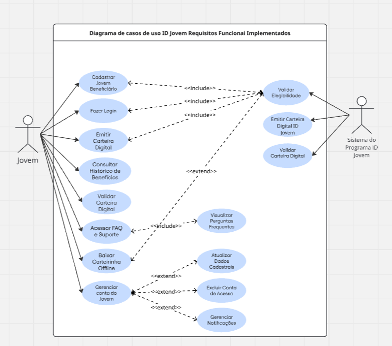
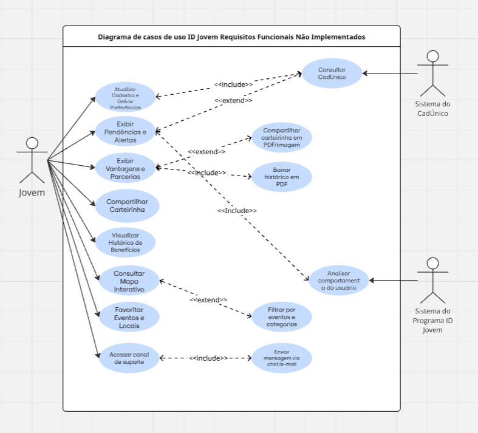
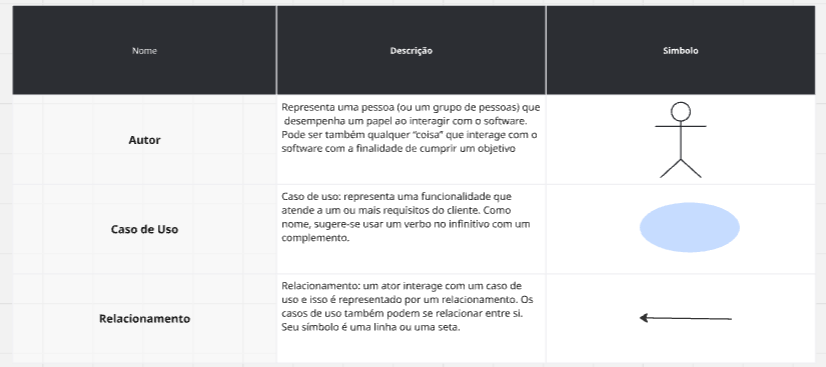

# Casos de Uso 

## **Introdução**

Casos de uso são ferramentas essenciais na especificação de requisitos funcionais de um sistema, pois permitem descrever de forma clara e estruturada as interações entre os usuários (atores) e o software.   Cada caso de uso detalha um conjunto de passos que representam o cenário principal, bem como possíveis cenários alternativos, com o objetivo de alcançar determinada meta do ator dentro do sistema. Diferentemente de uma abordagem de implementação, os casos de uso focam no “o quê” o sistema deve fazer, e não no “como” será feito, deixando de lado detalhes sobre arquitetura, componentes de hardware ou linguagens de programação. A especificação baseada em casos de uso inclui o **diagrama de casos de uso**, a **descrição dos atores** e a própria **especificação detalhada de cada caso**, fornecendo uma visão completa das funcionalidades esperadas do sistema. <a id="TEC1" href="#RP2">(GUIA FACETADO..., 2017).</a>

## Casos de Uso

## 1) *Objetivo*

Descrever de maneira estruturada e clara as interações entre os atores e o sistema ID Jovem, contemplando tanto o fluxo principal quanto cenários alternativos. Garantir que cada ator possa alcançar seus objetivos dentro do sistema, fornecendo uma visão completa das funcionalidades esperadas e das condições associadas a cada caso de uso.

## 2) *Justificativa do Uso*

A utilização de casos de uso é eficaz por permitir especificar o que o sistema deve fazer, sem entrar em detalhes de design ou implementação, promovendo uma comunicação clara entre a equipe técnica e os stakeholders. Além disso, facilita a identificação de requisitos funcionais, fluxos alternativos, pré e pós-condições, e regras de negócio, garantindo maior consistência e alinhamento com as necessidades reais do sistema.

## **Metodologia**

Para a especificação dos casos de uso do sistema ID Jovem, adotou-se uma abordagem que busca descrever de forma completa o comportamento esperado de cada funcionalidade. Cada caso de uso é detalhado em termos de nome, breve descrição do comportamento lógico, atores que interagem com o sistema, pré-condições necessárias ao início e pós-condições esperadas ao término. Além disso, são apresentados os passos do fluxo principal, incluindo o intercâmbio de informações entre o usuário e o software e os requisitos de armazenamento associados, bem como diferentes cenários alternativos e de exceção. <a id="TEC1" href="#RP2">(VAZQUEZ; SIMÕES, 2016).</a> Sempre que aplicável, são indicadas as regras de negócio pertinentes, podendo-se fazer referência a um espaço específico destinado a elas, considerando que tais regras podem se aplicar a múltiplos casos de uso. Essa abordagem permite um registro estruturado e consistente das funcionalidades, assegurando clareza para análise, desenvolvimento e posterior validação do sistema.

# Diagrama de Casos de Uso 

## Introdução 

O diagrama de casos de uso é uma ferramenta gráfica que permite representar de forma clara quais funcionalidades de um software atendem a quais usuários ou sistemas específicos. Ele facilita a identificação de cada caso de uso como uma unidade de função dentro do software em análise, mostrando não apenas as funcionalidades, mas também os papéis que os usuários desempenham, chamados de atores, e como esses elementos se inter-relacionam <a id="TEC1" href="#RP2">(VAZQUEZ; SIMÕES, 2016)</a> . Os atores podem ser pessoas, grupos, outros sistemas ou dispositivos que interagem com o software para alcançar determinados objetivos. Cada caso de uso representa uma funcionalidade específica, normalmente nomeada com um verbo no infinitivo, e pode ser visualizado como uma elipse dentro dos limites do sistema. Conforme definem Vazquez e Simões (2016), o objetivo central deste diagrama é "descrever quem faz o quê no sistema", representando visualmente os eventos para os quais o sistema deve prover uma resposta e as entidades externas com as quais ele interage. Já os relacionamentos mostram como os atores interagem com os casos de uso ou como os próprios casos de uso se conectam entre si, por meio de linhas ou setas. Essa representação visual proporciona uma compreensão rápida e intuitiva das funcionalidades do sistema e de seus usuários, servindo como base para análise, documentação e comunicação entre a equipe de desenvolvimento e os stakeholders.

## 1) Objetivo

O objetivo do diagrama de casos de uso no contexto do aplicativo ID Jovem é representar de forma visual e estruturada todas as funcionalidades do sistema, identificando claramente os atores que interagem com ele e os objetivos que cada usuário deseja alcançar. Isso permite mapear os fluxos principais e alternativos das ações dentro do aplicativo, oferecendo uma visão abrangente das operações que o sistema deve suportar, como emissão de carteirinhas, consulta de benefícios e notificações aos usuários.

## 2) Justificativa do Uso

A utilização do diagrama de casos de uso é justificada por sua capacidade de demonstrar de maneira intuitiva e organizada as interações entre usuários e funcionalidades, sem entrar em detalhes de implementação. No caso do ID Jovem, isso facilita a comunicação entre desenvolvedores, analistas e stakeholders, assegurando que todos compreendam claramente como o sistema deve se comportar e quais serviços precisam ser disponibilizados, além de servir como base para levantamento de requisitos, planejamento de testes e documentação do software.

## Diagrama de Casos de Uso ID Jovem Requisitos Funcionais Implementados 

Fonte: <a href="https://github.com/GiovanaFontesS">Giovana Fontes</a>

---
## Diagrama de Casos de Uso ID Jovem Requisitos Funcionais Não Implementados 

Fonte: <a href="https://github.com/GiovanaFontesS">Giovana Fontes</a>

---
## Legenda do Diagrama 

Fonte: <a href="https://github.com/GiovanaFontesS">Giovana Fontes</a>

---
### Caso de Uso 1 ([RF07](https://requisitos-de-software.github.io/2025.2-Grupo04/Entregas/Entregas_02/Elicitacao/Requisitos_Elicitados/#rf07))

Tabela 1: Atualizar Dados via CadÚnico

| [RF07](https://requisitos-de-software.github.io/2025.2-Grupo04/Entregas/Entregas_02/Elicitacao/Requisitos_Elicitados/#rf07) | **Descrição** |
| ------------------------------ | ----------------------------------------------------------------------------------------------------------------------------------------------------------------------------------------------------------------------------------------------------------------------------------------------------------------------------------------------------------------------------------- |
| **Nome do Caso de Uso** | Atualizar Dados do Beneficiário via CadÚnico |
| **Rastreabilidade** | [BS09](https://requisitos-de-software.github.io/2025.2-Grupo04/Entregas/Entregas_02/Elicitacao/Brainstorming/), [IDJ08](https://requisitos-de-software.github.io/2025.2-Grupo04/Entregas/Entregas_02/Elicitacao/Introspec%C3%A7%C3%A3o/) |
| **Ator Principal** | Beneficiário do ID Jovem |
| **Atores Secundários** | Sistema CadÚnico, Sistema ID Jovem |
| **Objetivo** | Permitir que o sistema ID Jovem integre-se automaticamente com o CadÚnico para atualizar os dados do perfil do jovem. |
| **Pré-condições** | - O participante do programa deve estar autenticado no aplicativo ID Jovem. - O jovem deve estar cadastrado no CadÚnico. |
| **Fluxo Principal de Eventos** | 1. O **beneficiário do ID Jovem** acessa o aplicativo. 2. Seleciona a opção "Atualizar meus dados". 3. O sistema solicita autenticação e validação no CadÚnico. 4. O sistema recebe os dados atualizados do CadÚnico. 5. As informações do **perfil do jovem** são atualizadas automaticamente no ID Jovem. 6. O **beneficiário** recebe confirmação da atualização. |
| **Fluxos Alternativos** | - O jovem opta por atualizar apenas dados específicos. - O sistema exibe histórico de alterações feitas anteriormente via CadÚnico. |
| **Exceções** | - Falha na conexão com CadÚnico: o sistema exibe mensagem de erro e oferece opção de tentar novamente. - Dados divergentes: o sistema notifica o participante e solicita validação manual. - Jovem não cadastrado no CadÚnico: sistema informa a necessidade de cadastro prévio. |
| **Pós-condições** | - Os dados do perfil do jovem no ID Jovem foram atualizados com sucesso ou permanecem pendentes até a resolução de erro. |
| **Autor** | [Leticia Lopes](https://github.com/leticialopes20) |

<b>Fonte: <i> [Letícia Lopes](https://github.com/leticialopes20) </i></b>

### Caso de Uso 2 ([RF08](https://requisitos-de-software.github.io/2025.2-Grupo04/Entregas/Entregas_02/Elicitacao/Requisitos_Elicitados/#rf08))

Tabela 2: Notificações de Vencimento e Renovação de Benefício

| [RF08](https://requisitos-de-software.github.io/2025.2-Grupo04/Entregas/Entregas_02/Elicitacao/Requisitos_Elicitados/#rf08) | **Descrição** |
| ------------------------------ | ------------------------------------------------------------------------------------------------------------------------------------------------------------------------------------------------------------------------------------------------------------------------------------------------------------------------------------------------------------------------------- |
| **Nome do Caso de Uso** | Receber Notificações de Vencimento e Renovação de Benefício |
| **Rastreabilidade** | [BS11](https://requisitos-de-software.github.io/2025.2-Grupo04/Entregas/Entregas_02/Elicitacao/Brainstorming/), [ST04](https://requisitos-de-software.github.io/2025.2-Grupo04/Entregas/Entregas_02/Elicitacao/Storytelling/), [IDJ11](https://requisitos-de-software.github.io/2025.2-Grupo04/Entregas/Entregas_02/Elicitacao/Introspecção/) |
| **Ator Principal** | Beneficiário do ID Jovem |
| **Atores Secundários** | Sistema de Notificações, Sistema ID Jovem |
| **Objetivo** | Permitir que o **participante do programa** receba notificações sobre o vencimento e a renovação do benefício ID Jovem. |
| **Pré-condições** | - O jovem deve estar autenticado no aplicativo. - O benefício do participante deve ter data de vencimento registrada no sistema. |
| **Fluxo Principal de Eventos** | 1. O **beneficiário do ID Jovem** acessa o aplicativo. 2. O sistema verifica datas de vencimento dos benefícios cadastrados. 3. O sistema envia notificações ao **participante** sobre o vencimento próximo. 4. O sistema envia notificações quando a renovação estiver disponível. 5. O **beneficiário** visualiza a notificação e realiza a renovação se desejar. |
| **Fluxos Alternativos** | - O jovem escolhe receber notificações via e-mail ou SMS. - O participante adia a renovação e recebe lembrete posterior. |
| **Exceções** | - Falha no envio da notificação: sistema registra tentativa e exibe alerta no aplicativo. - Dados de vencimento ausentes ou incorretos: sistema solicita atualização junto ao jovem. |
| **Pós-condições** | - O **beneficiário** foi notificado sobre vencimento ou renovação do benefício. |
| **Autor** | [Leticia Lopes](https://github.com/leticialopes20) |

<b>Fonte: <i> [Letícia Lopes](https://github.com/leticialopes20) </i></b>

### Caso de Uso 3 ([RF10](https://requisitos-de-software.github.io/2025.2-Grupo04/Entregas/Entregas_02/Elicitacao/Requisitos_Elicitados/#rf10))

Tabela 3: Consultar Locais e Parceiros

| [RF10](https://requisitos-de-software.github.io/2025.2-Grupo04/Entregas/Entregas_02/Elicitacao/Requisitos_Elicitados/#rf10) | **Descrição** |
| ------------------------------ | ----------------------------------------------------------------------------------------------------------------------------------------------------------------------------------------------------------------------------------------------------------------------------------------------------------------------------------------------------------------------------------- |
| **Nome do Caso de Uso** | Consultar Locais e Parceiros |
| **Rastreabilidade** | [BS10](https://requisitos-de-software.github.io/2025.2-Grupo04/Entregas/Entregas_02/Elicitacao/Brainstorming/), [ST06](https://requisitos-de-software.github.io/2025.2-Grupo04/Entregas/Entregas_02/Elicitacao/Storytelling/) |
| **Ator Principal** | Jovem Beneficiário |
| **Atores Secundários** | Sistema de Localização, Sistema ID Jovem |
| **Objetivo** | Permitir que o jovem beneficiário consulte estabelecimentos e parceiros que aceitam os benefícios do ID Jovem. |
| **Pré-condições** | - O jovem deve estar cadastrado e com a carteira digital ativa. - O aplicativo deve ter acesso à localização do dispositivo. |
| **Fluxo Principal de Eventos** | 1. O **jovem beneficiário** acessa o aplicativo ID Jovem. 2. Seleciona a opção "Locais Parceiros". 3. O sistema solicita permissão de localização. 4. O aplicativo exibe estabelecimentos conveniados próximos. 5. O **jovem** visualiza informações detalhadas de cada parceiro. 6. O sistema mostra rotas de acesso aos estabelecimentos selecionados. |
| **Fluxos Alternativos** | - O jovem pode filtrar por benefício específico (transporte ou cultura). - O jovem pode buscar estabelecimentos em localização específica. |
| **Exceções** | - Se não houver parceiros na região, o sistema sugere expandir a área de busca. - Se o GPS estiver desativado, o sistema funciona com busca manual por endereço. |
| **Pós-condições** | - O **jovem beneficiário** localizou estabelecimentos parceiros para utilização dos benefícios. |
| **Autor** | [Eduarda Domingos](https://github.com/eduardar0) |

<b>Fonte: <i> [Eduarda Domingos](https://github.com/eduardar0) </i></b>

### Caso de Uso 4 ([RF11](https://requisitos-de-software.github.io/2025.2-Grupo04/Entregas/Entregas_02/Elicitacao/Requisitos_Elicitados/#rf11))

Tabela 4: Solicitar Suporte ao Beneficiário

| [RF11](https://requisitos-de-software.github.io/2025.2-Grupo04/Entregas/Entregas_02/Elicitacao/Requisitos_Elicitados/#rf11) | **Descrição** |
| ------------------------------ | ------------------------------------------------------------------------------------------------------------------------------------------------------------------------------------------------------------------------------------------------------------------------------------------------------------------------------------------------------------------------------- |
| **Nome do Caso de Uso** | Solicitar Suporte ao Beneficiário |
| **Rastreabilidade** | [ENT05](https://requisitos-de-software.github.io/2025.2-Grupo04/Entregas/Entregas_02/Elicitacao/Entrevista/), [BS08](https://requisitos-de-software.github.io/2025.2-Grupo04/Entregas/Entregas_02/Elicitacao/Brainstorming/), [IDJ05](https://requisitos-de-software.github.io/2025.2-Grupo04/Entregas/Entregas_02/Elicitacao/Introspecção/) |
| **Ator Principal** | Jovem Beneficiário |
| **Atores Secundários** | Sistema de Atendimento, Sistema ID Jovem |
| **Objetivo** | Permitir que o jovem beneficiário solicite suporte através de chat, e-mail ou formulário de contato. |
| **Pré-condições** | - O jovem deve estar autenticado no aplicativo. |
| **Fluxo Principal de Eventos** | 1. O **jovem beneficiário** acessa o aplicativo ID Jovem. 2. Seleciona a opção "Ajuda" ou "Suporte". 3. O sistema apresenta opções de contato (chat, e-mail, formulário). 4. O **jovem** escolhe o canal preferido e descreve o problema. 5. O sistema registra a solicitação e gera número de protocolo. 6. O **jovem beneficiário** recebe confirmação e acompanha o atendimento. |
| **Fluxos Alternativos** | - Para dúvidas urgentes, o jovem é atendido imediatamente por chat. - O sistema sugere soluções na base de conhecimento antes do contato. |
| **Exceções** | - Se o canal escolhido estiver indisponível, o sistema oferece alternativas. - Se houver falha no envio, o sistema salva rascunho para tentativa posterior. |
| **Pós-condições** | - A solicitação de suporte foi registrada e o **jovem beneficiário** receberá resposta pelo canal escolhido. |
| **Autor** | [Eduarda Domingos](https://github.com/eduardar0) |

<b>Fonte: <i> [Eduarda Domingos](https://github.com/eduardar0) </i></b>

### Caso de Uso 5 ([RF13](https://requisitos-de-software.github.io/2025.2-Grupo04/Entregas/Entregas_02/Elicitacao/Requisitos_Elicitados/#rf13))**

Tabela 5: Visualizar Novidades e Novos Parceiros

| [RF13](https://requisitos-de-software.github.io/2025.2-Grupo04/Entregas/Entregas_02/Elicitacao/Requisitos_Elicitados/#rf13) | **Descrição** |
| :--- | :--- |
| **Nome do Caso de Uso** | Visualizar Novidades e Novos Parceiros |
| **Rastreabilidade** | [BS13](https://requisitos-de-software.github.io/2025.2-Grupo04/Entregas/Entregas_02/Elicitacao/Brainstorming/), [ST05](https://requisitos-de-software.github.io/2025.2-Grupo04/Entregas/Entregas_02/Elicitacao/Storytelling/) |
| **Ator Principal** | Jovem Beneficiário |
| **Atores Secundários** | Administrador do Sistema, Sistema ID Jovem |
| **Objetivo** | Permitir que o Jovem Beneficiário visualize uma seção dedicada a novidades, atualizações e divulgação de novos parceiros para se manter informado. |
| **Pré-condições** | - O Jovem Beneficiário deve estar com o aplicativo instalado e ter acesso à internet. |
| **Fluxo Principal de Eventos** | 1. O **Jovem Beneficiário** abre o aplicativo e acessa a seção “Novidades e Parceiros”. 2. O **Sistema ID Jovem** consulta e exibe as publicações mais recentes cadastradas pelo **Administrador do Sistema**. 3. O **Jovem Beneficiário** visualiza as postagens sobre novas parcerias, eventos e benefícios. 4. O **Jovem Beneficiário** clica em uma publicação de interesse para ver mais detalhes. 5. O sistema permite que o **Jovem Beneficiário** interaja com a publicação (curta, compartilhe ou salve). |
| **Fluxos Alternativos** | - Caso não haja novas publicações, o sistema exibe as postagens mais antigas ou uma mensagem indicando a ausência de novidades. |
| **Exceções** | - Falha ao carregar os dados de novidades devido à falta de conexão com a internet. - Erro na sincronização com a base de dados de parceiros e notícias. |
| **Pós-condições** | - O Jovem Beneficiário se mantém atualizado sobre as novidades e os parceiros do programa ID Jovem. |
| **Autor** | [Dylan Cavalcante](https://github.com/dylancavalcante) |

Fonte: <i> <a href="https://github.com/dylancavalcante">Dylan Cavalcante</a> </i>

### Caso de Uso 6 ([RF12](https://requisitos-de-software.github.io/2025.2-Grupo04/Entregas/Entregas_02/Elicitacao/Requisitos_Elicitados/#rf12))**

Tabela 6: Consultar Histórico de Utilização

| [RF12](https://requisitos-de-software.github.io/2025.2-Grupo04/Entregas/Entregas_02/Elicitacao/Requisitos_Elicitados/#rf12) | **Descrição** |
| :--- | :--- |
| **Nome do Caso de Uso** | Consultar Histórico de Utilização dos Benefícios |
| **Rastreabilidade** | [BS12](https://requisitos-de-software.github.io/2025.2-Grupo04/Entregas/Entregas_02/Elicitacao/Brainstorming/), [IDJ12](https://requisitos-de-software.github.io/2025.2-Grupo04/Entregas/Entregas_02/Elicitacao/Introspec%C3%A7%C3%A3o/) |
| **Ator Principal** | Jovem Beneficiário |
| **Atores Secundários** | Sistema ID Jovem, Banco de Dados de Transações |
| **Objetivo** | Permitir que o Jovem Beneficiário acesse o histórico completo de uso de seus benefícios, como passagens e ingressos, para controle pessoal. |
| **Pré-condições** | - O Jovem Beneficiário deve estar autenticado no aplicativo ID Jovem. |
| **Fluxo Principal de Eventos** | 1. O **Jovem Beneficiário** faz login no aplicativo. 2. O **Jovem Beneficiário** seleciona a opção “Histórico de Benefícios”. 3. O **Sistema ID Jovem** consulta o **Banco de Dados de Transações**. 4. O sistema exibe uma lista detalhada com data, local, tipo de benefício, valor e parceiro de cada utilização. 5. O **Jovem Beneficiário** aplica filtros por período ou tipo de benefício. 6. O sistema permite que o **Jovem Beneficiário** exporte o histórico em formato PDF ou CSV. |
| **Fluxos Alternativos** | - Caso o jovem não possua histórico, o sistema exibirá uma mensagem informativa. |
| **Exceções** | - Falha na conexão com o banco de dados, impedindo a exibição do histórico. - Erro ao gerar o arquivo para exportação. |
| **Pós-condições** | - O Jovem Beneficiário tem acesso ao seu histórico de utilização de benefícios e pode exportá-lo, se desejado. |
| **Autor** | [Dylan Cavalcante](https://github.com/dylancavalcante) |

Fonte: <i> <a href="https://github.com/dylancavalcante">Dylan Cavalcante</a> </i>

### Caso de Uso 7 ([RF17](https://requisitos-de-software.github.io/2025.2-Grupo04/Entregas/Entregas_02/Elicitacao/Requisitos_Elicitados/#rf17))

Tabela 5: Compartilhar Carteirinha Digital

| [RF17](https://requisitos-de-software.github.io/2025.2-Grupo04/Entregas/Entregas_02/Elicitacao/Requisitos_Elicitados/#rf17) | **Descrição** |
| ------------------------------ | ------------------------------------------------------------------------------------------------------------------------------------------------------------------------------------------------------------------------------------------------------------------------------------------------------------------------------------------------------------------------------- |
| **Nome do Caso de Uso** | Compartilhar Carteirinha Digital |
| **Rastreabilidade** | [IDJ17](https://requisitos-de-software.github.io/2025.2-Grupo04/Entregas/Entregas_02/Elicitacao/Introspecção/) [IDJ10](https://requisitos-de-software.github.io/2025.2-Grupo04/Entregas/Entregas_02/Elicitacao/Introspecção/) |
| **Ator Principal** | Jovem Beneficiário |
| **Atores Secundários** | Sistema do ID Jovem, Serviço de Compartilhamento do Dispositivo |
| **Objetivo** | Permitir que o jovem beneficiário compartilhe sua carteirinha digital em formato PDF ou imagem, facilitando o acesso em diferentes dispositivos ou o envio a terceiros. |
| **Pré-condições** | - O jovem beneficiário deve estar autenticado no aplicativo. - O usuário deve possuir uma carteirinha digital válida e ativa. |
| **Fluxo Principal de Eventos** | 1. O **jovem beneficiário** acessa o aplicativo e faz login. 2. O sistema valida o acesso e exibe a carteirinha digital. 3. O **jovem beneficiário** seleciona a opção “Compartilhar Carteirinha”. 4. O sistema apresenta opções de formato: PDF ou imagem (JPEG/PNG). 5. O **jovem beneficiário** escolhe o formato e o canal de envio (e-mail, WhatsApp, drive etc.). 6. O sistema gera o arquivo e utiliza o serviço de compartilhamento nativo do dispositivo. 7. O envio é concluído e o sistema exibe uma mensagem de sucesso. |
| **Fluxos Alternativos** | - O sistema sugere canais de compartilhamento mais utilizados pelo usuário. |
| **Exceções** | - Falha na geração do arquivo PDF/imagem. - Jovem beneficiário sem carteirinha ativa. - Permissões de compartilhamento negadas. - Interrupção no processo de envio. |
| **Pós-condições** | - A carteirinha digital foi compartilhada com sucesso pelo canal escolhido. |
| **Autor** | [Giovana](https://github.com/GiovanaFontesS) |

<b>Fonte: <i>[Giovana](https://github.com/GiovanaFontesS)</i></b>

### Caso de Uso 8 ([RF18](https://requisitos-de-software.github.io/2025.2-Grupo04/Entregas/Entregas_02/Elicitacao/Requisitos_Elicitados/#rf18))

Tabela 6: Exibir Pendências e Erros Relacionados aos Benefícios

| [RF18](https://requisitos-de-software.github.io/2025.2-Grupo04/Entregas/Entregas_02/Elicitacao/Requisitos_Elicitados/#rf18) | **Descrição** |
| ------------------------------ | ------------------------------------------------------------------------------------------------------------------------------------------------------------------------------------------------------------------------------------------------------------------------------------------------------------------------------------------------------------------------------- |
| **Nome do Caso de Uso** | Exibir Pendências e Erros dos Benefícios |
| **Rastreabilidade** | [IDJ18](https://requisitos-de-software.github.io/2025.2-Grupo04/Entregas/Entregas_02/Elicitacao/Introspecção/)  [IDJ15](https://requisitos-de-software.github.io/2025.2-Grupo04/Entregas/Entregas_02/Elicitacao/Introspecção/) [IDJ12](https://requisitos-de-software.github.io/2025.2-Grupo04/Entregas/Entregas_02/Elicitacao/Introspecção/) |
| **Ator Principal** | Jovem Beneficiário |
| **Atores Secundários** | Sistema do ID Jovem, Banco de Dados de Benefícios, CadÚnico (integração futura) |
| **Objetivo** | Fornecer informações claras sobre pendências, inconsistências ou erros detectados nos benefícios, permitindo a correção proativa dos dados. |
| **Pré-condições** | - O jovem beneficiário deve estar autenticado no aplicativo. - O sistema deve ter acesso ao banco de dados de benefícios e à conexão com o CadÚnico. |
| **Fluxo Principal de Eventos** | 1. O **jovem beneficiário** acessa o aplicativo e faz login. 2. O sistema realiza verificação automática dos dados do benefício. 3. Caso sejam identificadas pendências, o sistema exibe notificação ao usuário. 4. O usuário acessa a seção “Pendências e Erros”. 5. O sistema lista as pendências detectadas, indicando o tipo de problema e orientações para resolução. 6. O **jovem beneficiário** pode atualizar os dados ou entrar em contato com o suporte. |
| **Fluxos Alternativos** | - O sistema pode sugerir correção automática para dados desatualizados quando possível. |
| **Exceções** | - Falha na conexão com o servidor. - Erro na sincronização de dados com o CadÚnico. - Pendência não identificada corretamente. - Tempo limite de resposta excedido. |
| **Pós-condições** | - As pendências e erros foram exibidos corretamente, permitindo que o jovem beneficiário tome ações corretivas. |
| **Autor** | [Giovana](https://github.com/GiovanaFontesS) |

<b>Fonte: <i>[Giovana](https://github.com/GiovanaFontesS)</i></b>

### Caso de Uso 09 ([RF20](https://requisitos-de-software.github.io/2025.2-Grupo04/Entregas/Entregas_02/Elicitacao/Requisitos_Elicitados/#rf20))

Tabela 9: Alertas de Irregularidades no Uso dos Benefícios

| [RF20](https://requisitos-de-software.github.io/2025.2-Grupo04/Entregas/Entregas_02/Elicitacao/Requisitos_Elicitados/#rf20) | **Descrição** |
| ------------------------------ | ------------------------------------------------------------------------------------------------------------------------------------------------------------------------------------------------------------------------------------------------------------------------------------------------------------------------------------------------------------------------------- |
| **Nome do Caso de Uso** | Alertas de Irregularidades no Uso dos Benefícios |
| **Rastreabilidade** | [ENT09](https://requisitos-de-software.github.io/2025.2-Grupo04/Entregas/Entregas_02/Elicitacao/Entrevista/)|
| **Ator Principal** | Jovem Beneficiário |
| **Atores Secundários** | Sistema ID Jovem, Banco de Dados de Benefícios, CadÚnico (integração futura) |
| **Objetivo** | Alertar o jovem beneficiário sobre possíveis irregularidades no uso de seus benefícios, permitindo que ele realize a correção, atualização de dados ou verificação preventiva. |
| **Pré-condições** | - O jovem beneficiário deve estar autenticado no aplicativo ID Jovem. - O sistema deve ter acesso ao banco de dados de benefícios e ao histórico de uso. - A conexão com a internet deve estar ativa. |
| **Fluxo Principal de Eventos** | 1. O **jovem beneficiário** acessa o aplicativo ID Jovem e realiza login. 2. O sistema consulta o **histórico de uso dos benefícios** no banco de dados. 3. O sistema executa uma análise automática para identificar possíveis irregularidades ou inconsistências. 4. Caso sejam detectadas irregularidades, o sistema **gera uma notificação** para o jovem beneficiário. 5. O **jovem beneficiário** acessa a seção “Alertas de Irregularidades”. 6. O sistema exibe **detalhes da irregularidade** (tipo, data, benefício envolvido e possíveis causas). 7. O sistema apresenta **orientações** para correção, atualização de dados ou contato com o suporte. 8. O **jovem beneficiário** pode escolher entre **contestar a irregularidade**, **atualizar dados cadastrais** ou **entrar em contato com o suporte**. 9. O sistema registra a ação tomada pelo usuário e atualiza o status da irregularidade. |
| **Fluxos Alternativos** | **4a.** Caso nenhuma irregularidade seja identificada, o sistema exibe a mensagem: “Nenhuma irregularidade encontrada em seus benefícios.” **8a.** Se o jovem escolher contestar, o sistema abre um formulário específico para envio de justificativa e documentação comprobatória. **8b.** Se o jovem optar por contato com o suporte, é redirecionado para o canal de atendimento integrado. |
| **Exceções** | - Falha na conexão com o servidor impede a verificação de irregularidades. - Erro ao sincronizar dados com o CadÚnico impede a atualização completa do histórico. - Irregularidade não detectada corretamente devido a erro no monitoramento. - Tempo limite de resposta excedido na análise de dados. |
| **Pós-condições** | - As irregularidades identificadas são exibidas ao **jovem beneficiário**. - As ações de correção, contestação ou atualização são registradas no sistema. - O status das irregularidades é atualizado para “em análise” ou “resolvido”. |
| **Autor** | [Arthur Fernandes](https://github.com/arthurfernandesj) |

<b>Fonte: <i>[Arthur Fernandes](https://github.com/arthurfernandesj) </i></b>

### Caso de Uso 10 ([RF21](https://requisitos-de-software.github.io/2025.2-Grupo04/Entregas/Entregas_02/Elicitacao/Requisitos_Elicitados/#rf21))

Tabela 10: Visualização Geográfica de Parceiros e Eventos

| [RF21](https://requisitos-de-software.github.io/2025.2-Grupo04/Entregas/Entregas_02/Elicitacao/Requisitos_Elicitados/#rf21) | **Descrição** |
| ------------------------------ | ------------------------------------------------------------------------------------------------------------------------------------------------------------------------------------------------------------------------------------------------------------------------------------------------------------------------------------------------------------------------------- |
| **Nome do Caso de Uso** | Visualização Geográfica de Parceiros e Eventos |
| **Rastreabilidade** | [ENT10](https://requisitos-de-software.github.io/2025.2-Grupo04/Entregas/Entregas_02/Elicitacao/Entrevista/)|
| **Ator Principal** | Jovem Beneficiário |
| **Atores Secundários** | Sistema ID Jovem, Banco de Dados de Parceiros e Eventos, Serviço de Geolocalização (API de Mapas) |
| **Objetivo** | Permitir que o jovem beneficiário visualize, por meio de um mapa interativo, a localização de parceiros e eventos disponíveis em sua região, com informações detalhadas e filtros de pesquisa. |
| **Pré-condições** | - O jovem beneficiário deve estar autenticado no aplicativo ID Jovem. - O dispositivo deve possuir conexão ativa à internet. - O serviço de geolocalização deve estar habilitado e com permissão concedida. |
| **Fluxo Principal de Eventos** | 1. O **jovem beneficiário** acessa o aplicativo ID Jovem e realiza login. 2. O **jovem** seleciona a opção “Mapa de Parceiros e Eventos”. 3. O sistema solicita **permissão de acesso à localização** do usuário. 4. Após a autorização, o sistema exibe o **mapa interativo**, mostrando os parceiros e eventos próximos à localização atual. 5. O **jovem beneficiário** pode **filtrar os resultados** por tipo de parceiro, data, categoria de evento ou distância. 6. O sistema atualiza o mapa conforme os filtros aplicados. 7. O **jovem** clica em um marcador no mapa. 8. O sistema exibe **informações detalhadas** sobre o parceiro ou evento selecionado (nome, endereço, horários, benefícios disponíveis e opções de rota). |
| **Fluxos Alternativos** | **3a.** Se o jovem negar a permissão de localização, o sistema solicita que ele insira um endereço ou CEP manualmente para realizar a busca. **5a.** O jovem pode redefinir filtros para exibir todos os parceiros e eventos disponíveis. **8a.** Caso o local selecionado tenha integração com outro sistema (ex: compra de ingressos ou reserva), o aplicativo redireciona para a página correspondente. |
| **Exceções** | - Falha na obtenção da localização do usuário impede a exibição do mapa. - Erro de carregamento do mapa ou indisponibilidade da API de geolocalização. - Nenhum parceiro ou evento encontrado na região consultada. - Perda de conexão com a internet durante o carregamento dos dados. |
| **Pós-condições** | - O **jovem beneficiário** visualiza no mapa os parceiros e eventos disponíveis em sua região. - Os filtros e preferências de visualização podem ser armazenados para futuras consultas. - O sistema mantém atualizadas as informações exibidas conforme a base de dados de parceiros e eventos. |
| **Autor** | [Arthur Fernandes](https://github.com/arthurfernandesj) |

<b>Fonte: <i>[Arthur Fernandes](https://github.com/arthurfernandesj)</i></b>

## Referências Bibliográficas

> <a id="TEC1" href="#anchor_2">1.</a> </a> GUIA FACETADO DE TÉCNICAS DE ELICITAÇÃO DE REQUISITOS. Florianópolis: UFSC, 2017. Disponível em: <a href="https://retraining.inf.ufsc.br/guia/app/classificacoes/tecnicas-de-elicitacao-de-requisitos/entidades">https://retraining.inf.ufsc.br/guia/app/classificacoes/tecnicas-de-elicitacao-de-requisitos/entidades</a>. Acesso em: 22 set. 2025.

> <a id="TEC2" href="#anchor_2">2.</a> </a> VAZQUEZ, Carlos; SIMÕES, Guilherme. Engenharia de Requisitos: software orientado ao negócio. Rio de Janeiro: Brasport, 2016.</a>. Acesso em: 22 set. 2025.

## Bibliografia

> VAZQUEZ, Carlos; SIMÕES, Guilherme. Engenharia de Requisitos: software orientado ao negócio. Rio de Janeiro: Brasport, 2016.</a>. Acesso em: 22 set. 2025.

>
## Histórico de Versão

| Versão |    Data    |       Descrição      |                                          Autor(es)                                         |                  Revisor(es)                  |
| :----: | :--------: | :------------------: | :----------------------------------------------------------------------------------------: | :-------------------------------------------: |
|  `1.0` | 09/10/2025 | Criação do documento | [Dylan](https://github.com/dylancavalcante) | [Arthur](https://github.com/arthurfernandesj) |
|  `1.1` | 10/10/2025 | Conteúdo introdutório | [Giovana](https://github.com/GiovanaFontesS) |  [Dylan](https://github.com/dylancavalcante) |
|  `1.2` | 12/10/2025 | Mudança bibliografia | [Eduarda](https://github.com/eduardar0) |  [Dylan](https://github.com/dylancavalcante) |
|  `1.3` | 12/10/2025 | Adição de uso de caso 01 e 02 | [Leticia](https://github.com/leticialopes20) | [Arthur](https://github.com/arthurfernandesj) |
|  `1.4` | 12/10/2025 | Adição de uso de caso 03 e 04 | [Eduarda](https://github.com/eduardar0) | [Arthur](https://github.com/arthurfernandesj) |
|  `1.5` | 12/10/2025 | Adição de uso de caso 07 e 08 | [Giovana](https://github.com/GiovanaFontesS) | [Arthur](https://github.com/arthurfernandesj) |
|  `1.6` | 12/10/2025 | Adição de uso de caso 05 e 06 | [Dylan](https://github.com/dylancavalcante) | [Giovana](https://github.com/GiovanaFontesS) |
|  `1.7` | 12/10/2025 | Adição de uso de caso 09 e 10 | [Arthur](https://github.com/arthurfernandesj) | [Leticia](https://github.com/leticialopes20) | 
