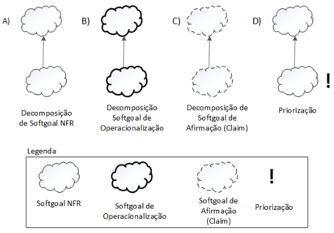
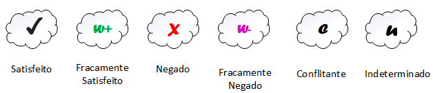
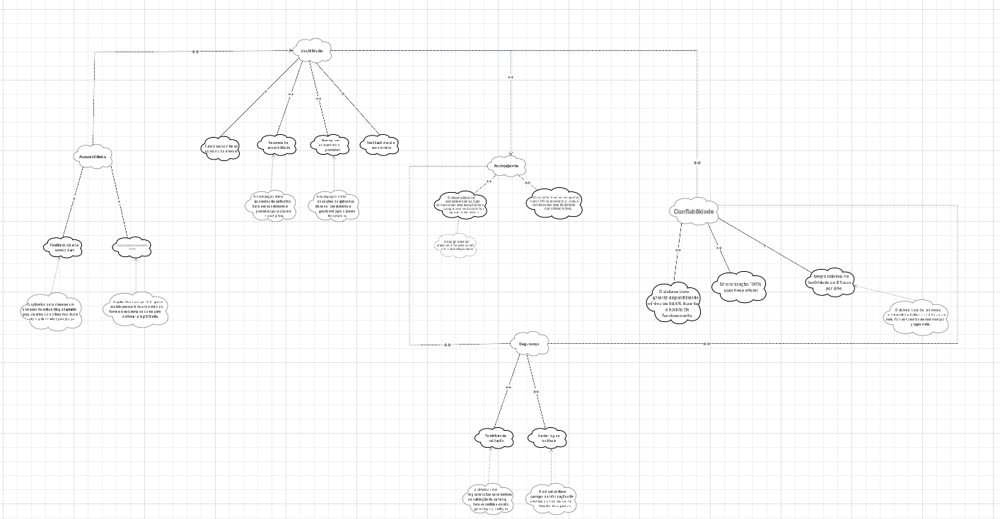
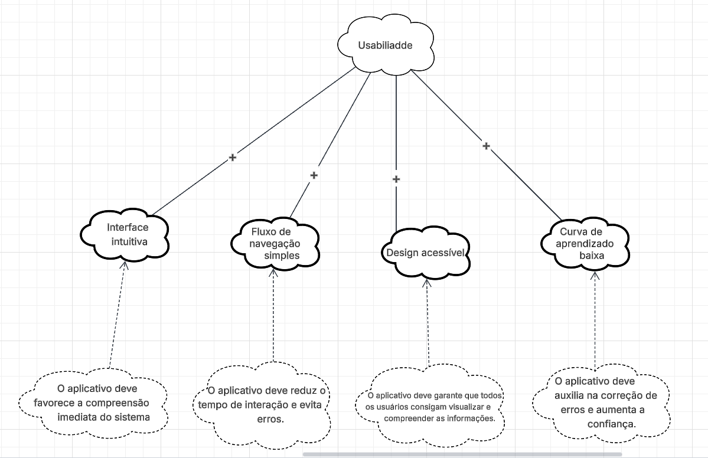
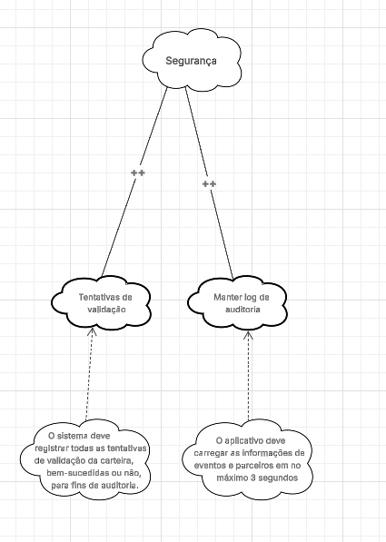
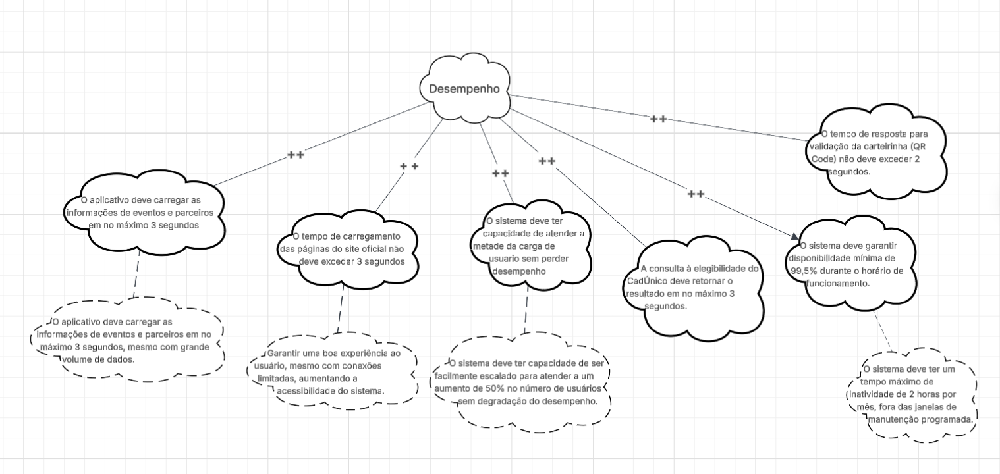
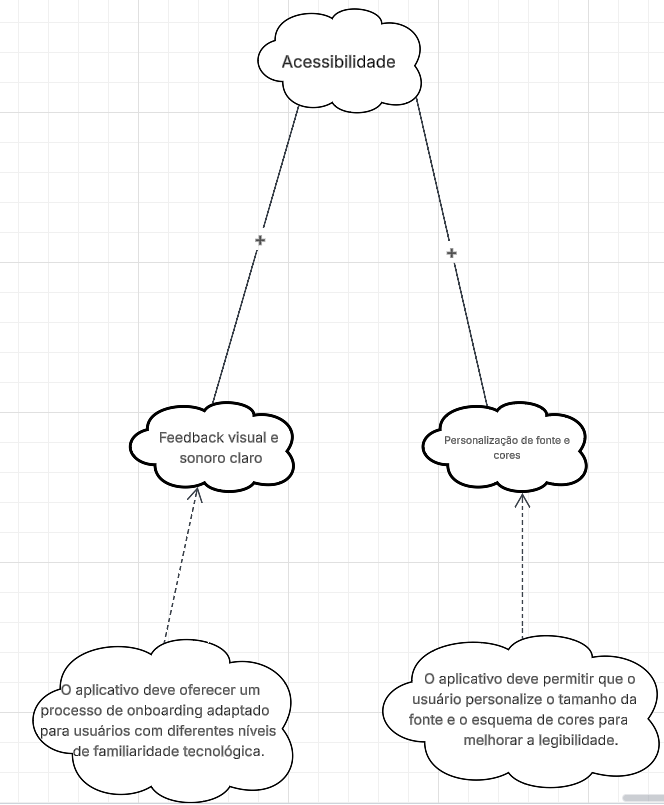
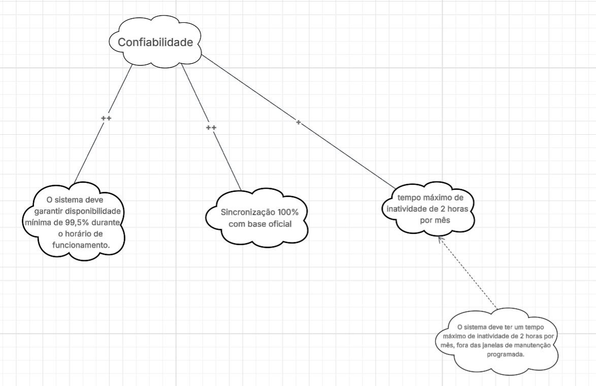
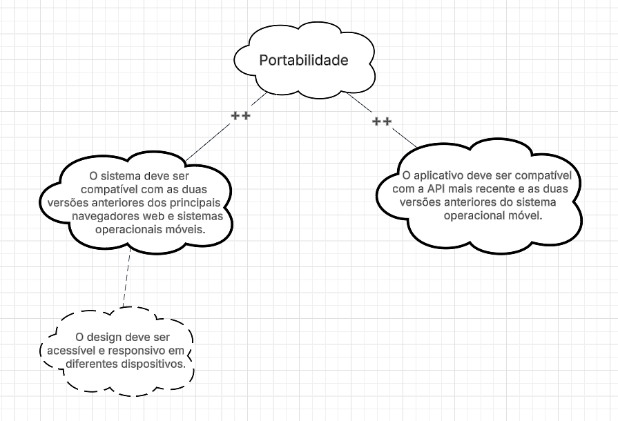

# NFR Framework

## Introdução

No contexto do desenvolvimento do aplicativo ID Jovem, os [Requisitos Não-Funcionais (RNFs)](https://requisitos-de-software.github.io/2025.2-Grupo04/Entregas/Entregas_02/Elicitacao/Requisitos_Elicitados/#rnf01) desempenham um papel essencial ao definir qualidades e restrições que afetam diretamente a experiência do jovem beneficiário, a segurança dos dados, o desempenho e a conformidade com as legislações vigentes. Dentre esses requisitos, destaca-se a importância de garantir a proteção das informações pessoais e a confiabilidade na emissão e validação da Identidade Jovem.

Com o objetivo de representar e analisar esses requisitos de maneira estruturada, este trabalho adota o NFR Framework, uma abordagem proposta por [Chung et al. (2000)](#ref-chung). Esse framework possibilita a modelagem dos RNFs por meio de *softgoals*, que representam objetivos qualitativos sem critérios de satisfação exatos, mas fundamentais para a qualidade do produto. 

A representação gráfica desses *softgoals* é feita através de um grafo SIG (Softgoal Interdependency Graph), que evidencia suas interdependências, influências e possíveis conflitos. Assim, o NFR Framework aplicado ao ID Jovem contribui para o fortalecimento da usabilidade, segurança, confiabilidade e acessibilidade do aplicativo, assegurando que os jovens beneficiários utilizem a plataforma de forma prática e segura.

<small>_Revisado por [Chat GPT](https://chatgpt.com/share/68fa1d62-74e4-8000-b2e7-9e7dd04bf86c), em 20 de outubro de 2025_</small>

---

## SIG - Softgoal Interdependency Graph

O NFR Framework funciona por meio da construção e análise de um grafo chamado Softgoal Interdependency Graph (SIG), que representa graficamente os Requisitos Não-Funcionais (softgoals), suas interdependências, alternativas e justificativas. Esse grafo permite avaliar se os requisitos de alto nível foram atendidos e apoia decisões de projeto voltadas à melhoria do aplicativo ID Jovem.

### Tipos de SIG

O SIG é dividido em três tipos principais:

- Softgoals NFR: representam alternativas técnicas e soluções práticas (como processos, restrições ou estruturas) para atender aos softgoals do aplicativo ID Jovem — por exemplo, garantir desempenho adequado ao emitir o cartão digital.

- Softgoals de Operacionalização: representam os softgoals e suas interdependências, permitindo identificar conflitos e sinergias, como a relação entre acessibilidade e desempenho no uso do app.

- Softgoals de Afirmação: trazem justificativas baseadas em características do domínio do ID Jovem (como requisitos de segurança e prioridade de acesso), apoiando decisões e rastreabilidade do sistema.

Figura 1: Tipos de Softgoal

Fonte: [SILVA, 2019](#ref-silva)

### Tipos e Interdependências de Softgoals no NFR Framework

- O NFR Framework utiliza três tipos de *softgoals*, representados por diferentes estilos de nuvens:
  - Softgoals NFR: nuvens claras  
  - Softgoals de Operacionalização: nuvens com linhas grossas  
  - Softgoals de Afirmação: nuvens com linhas tracejadas  

- Cada *softgoal NFR* possui um tipo (ex: Usabilidade) e um tópico (ex: Interface do Usuário), que indicam a parte específica do aplicativo ID Jovem à qual se referem.

- As interdependências entre os *softgoals* são classificadas em:
  - Refinamentos (top-down), onde um *softgoal* pai gera filhos mais específicos, podendo ser:
    - Decomposição de Softgoal NFR: divide um requisito não-funcional em outros mais detalhados, como dividir “Confiabilidade” em “Disponibilidade” e “Segurança”.
    - Decomposição de Operacionalização: refina soluções implementáveis, como criptografia de dados ou autenticação do beneficiário.
    - Decomposição de Afirmação: detalha justificativas de projeto, como priorizar o acesso rápido mesmo em conexões móveis limitadas.
    - Priorização: refina um *softgoal* destacando sua importância dentro do aplicativo, como dar prioridade à acessibilidade sobre o desempenho visual.

Essa estrutura permite representar, refinar e justificar de forma clara os requisitos não-funcionais que impactam diretamente a qualidade e a confiabilidade do aplicativo ID Jovem, garantindo que o sistema cumpra seu propósito social com eficiência e segurança.

Figura 2: Tipos e Interdependências de Softgoals no NFR Framework

 

Fonte: [SILVA, 2019](#ref-silva)

### Contribuições e Tipos no NFR Framework

- Durante o refinamento dos *softgoals*, um *softgoal* descendente pode contribuir positiva ou negativamente, de forma total ou parcial, para a satisfação do *softgoal* ascendente.
- A satisfação de softgoal indica que o requisito não-funcional deve ser atendido dentro de limites aceitáveis, o que é essencial no ID Jovem, pois certos aspectos (como desempenho e segurança) podem influenciar-se mutuamente.

- AND: todos os descendentes precisam ser satisfeitos para o ascendente ser satisfeito (ex: para alcançar “Segurança”, é necessário satisfazer “Criptografia” e “Validação de Identidade”).  
- OR: basta um descendente satisfeito para o ascendente ser satisfeito (ex: “Autenticação” pode ser feita via CPF ou QR Code).  
- MAKE (++): contribuição altamente positiva; a satisfação do descendente garante a satisfação do ascendente.  
- BREAK (--): contribuição altamente negativa; a satisfação do descendente prejudica o ascendente.  
- HELP (+): contribuição parcialmente positiva; satisfação parcial do descendente contribui parcialmente para o ascendente.  
- HURT (-): contribuição parcialmente negativa; satisfação do descendente prejudica parcialmente o ascendente.  
- UNKNOWN (?): contribuição desconhecida, pode ser positiva ou negativa.  
- EQUALS: o descendente só é satisfeito se o ascendente for satisfeito.  
- SOME: há um sinal conhecido (positivo ou negativo), mas o grau da contribuição é incerto.

Essas contribuições permitem entender como decisões técnicas no ID Jovem (como escolha de layout, autenticação e performance) afetam a satisfação global dos requisitos de qualidade do sistema.

---
<small>_Revisado por [Chat GPT](https://chatgpt.com/share/68fa1d62-74e4-8000-b2e7-9e7dd04bf86c), em 20 de outubro de 2025_</small>

### Procedimento de Avaliação no NFR Framework

- O procedimento de avaliação determina o grau em que os requisitos não-funcionais (*softgoals*) são satisfeitos por um conjunto de decisões de projeto.  
- Cada *softgoal* ou interdependência do Softgoal Interdependency Graph (SIG) recebe um rótulo que indica seu status de satisfação.  

#### Tipos de rótulos usados:

- ✓ (satisfeito): O requisito é plenamente atendido.  
- $\mathcal{W}^{+}$ (fracamente satisfeito): Atendido parcialmente; impacto positivo moderado.  
- X (negado): O requisito não é atendido.  
- $\mathcal{W}^{-}$ (fracamente negado): Negação parcial; impacto negativo brando.  
- ↯ (conflitante): Há conflito entre requisitos, coexistindo aspectos positivos e negativos.  
- u (indeterminado): Não há dados suficientes para determinar o impacto.

No contexto do ID Jovem, essa avaliação permite verificar, por exemplo, se as melhorias na usabilidade não comprometem a segurança dos dados, garantindo um equilíbrio entre experiência do Jovem Beneficiário e conformidade com os requisitos legais e técnicos.

A avaliação é feita de forma hiererárquica:
- Inicia-se pelos *softgoals* de nível mais baixo, relacionados a decisões específicas (como design de tela ou criptografia).
- Em seguida, os rótulos são propagados para os níveis superiores, avaliando o impacto cumulativo até os *softgoals* de alto nível (como “Confiabilidade” e “Segurança da Informação”).

Figura 3: Procedimento de Avaliação no NFR Framework

Fonte: [SILVA, 2019](#ref-silva)

---

## Metodologia

Para aplicar o NFR Framework ao desenvolvimento do aplicativo, adotamos uma abordagem em etapas estruturadas, com o objetivo de identificar, modelar, analisar e tomar decisões relacionadas aos requisitos não funcionais (softgoals) do sistema. A metodologia compreende as seguintes fases:

### 1. Identificação dos Requisitos Não Funcionais (Softgoals)

Nesta etapa, foram identificados os principais requisitos não funcionais relevantes ao contexto do aplicativo, como:

- Usabilidade  
- Desempenho  
- Segurança  
- Acessibilidade  
- Confiabilidade  
- Portabilidade

Essa identificação foi baseada em entrevistas com stakeholders, análise de mercado e levantamento de requisitos funcionais relacionados. Os requisitos não funcionais são representados como softgoals, que expressam intenções qualitativas sem critérios rígidos de satisfação.

### 2. Modelagem com o NFR Framework

A modelagem foi realizada utilizando a notação proposta por [*Chung et al. (2000)*](#ref-chung), representando os softgoals em uma estrutura hierárquica com relacionamentos de contribuição entre eles. Foram utilizados os seguintes tipos de contribuição:

- MAKE (++)
- HELP (+)
- HURT (-)
- BREAK (--)
- OR
- AND
- EQUALS
- UNKNOWN (?)
- SOME 

Também foram especificadas as operacionalizações, ou seja, decisões de projeto que implementam cada softgoal.

#### Uso do Cartão de Especificação

Durante essa fase de modelagem, utilizou-se o Cartão de Especificação como instrumento de apoio à documentação e análise. Cada cartão foi preenchido com os seguintes elementos:

- Nome do softgoal  
- Descrição do requisito não funcional  
- Alternativas de operacionalização  
- Contribuições com outros softgoals  
- Justificativa das decisões  
- Responsável e data da análise  

<small>_Revisado por [Chat GPT](https://chatgpt.com/share/68fa1d62-74e4-8000-b2e7-9e7dd04bf86c), em 20 de outubro de 2025_</small>

A Tabela 1 ilustra o modelo adotado para a elaboração dos cartões de especificação.

Tabela 1: Template de cartão de especificação 

<table border="1" cellpadding="6" cellspacing="0">
  <tr><th colspan="2">Requisito Não Funcional – RNFXX</th></tr>
  <tr><td><b>Classificação</b></td><td> Classificação do RNF conforme a hierarquia do catálogo.</td></tr>
  <tr><td><b>Descrição</b></td><td>Declaração única do significado do requisito.</td></tr>
  <tr><td><b>Justificativa</b></td><td>Justificativa sobre a criação do requisito</td></tr>
  <tr><td><b>Origem do Requisito</b></td><td>Origem do requisito (stakeholder, norma técnica e etc...)</td></tr>
  <tr><td><b>Critério de Aceitação</b></td><td>Métrica do requisito que possa ser testada e que deve ser satisfeita.</td></tr>
  <tr><td><b>Dependências</b></td><td>Requisitos relacionados a este.</td></tr>
  <tr><td><b>Prioridade</b></td><td>Um número usado para decidir a importância relativa deste requisito entre os outros RNFs (varia de 1 a 10). A prioridade mínima é 1 e a máxima é 10.</td></tr>
  <tr><td><b>Conflitos</b></td><td>Requisitos conflitantes com este.</td></tr>
  <tr><td><b>História</b></td><td>Data de criação e de modificações.</td></tr>
</table>

Autor: [Arthur Fernandes](https://github.com/arthurfernandesj) 

O cartão facilitou a rastreabilidade, clareza e consistência das informações, além de permitir uma análise comparativa entre alternativas e apoiar a comunicação com os stakeholders durante a modelagem dos requisitos.

### 3. Avaliação dos Softgoals

Após modelar os softgoals e suas contribuições, foi realizado o procedimento de avaliação, no qual cada softgoal recebeu um rótulo indicando o grau de satisfação:

- `✓` Satisfeito: Requisito não funcional plenamente atendido.  
- `𝒲+` Fracamente satisfeito: Satisfação parcial.  
- `X` Negado: Requisito contradiz outro.  
- `𝒲-` Fracamente negado: Impacto negativo moderado.  
- `🗲` Conflitante: Conflito entre requisitos.  
- `u` Indeterminado: Impacto incerto ou desconhecido.

A avaliação começou pelos softgoals de nível mais baixo (operacionalizações), subindo até os níveis superiores da hierarquia para analisar o impacto global das decisões.

### 4. Tomada de Decisão

Com base nas análises e rótulos atribuídos, foram tomadas decisões de projeto priorizando as alternativas que maximizassem a satisfação dos softgoals mais críticos.  
Em casos de conflito (por exemplo, Desempenho vs. Segurança), foram realizadas ponderações junto aos stakeholders, buscando o melhor compromisso entre eficiência e proteção dos dados do Jovem Beneficiário.

---

### 5. Validação

A etapa de validação da modelagem seguiu duas vertentes principais:

- Rastreabilidade com as histórias de usuário:  
  Verificou-se se os *softgoals* contemplavam os desejos e expectativas expressas por cada persona.  

- Análise de cobertura:  
  Avaliou-se se os principais atributos de qualidade esperados para um aplicativo público financeiro — como disponibilidade, desempenho e segurança — foram devidamente modelados.

Essa validação assegurou que os requisitos não funcionais fossem não apenas documentados, mas também rastreáveis, justificáveis e compatíveis com os requisitos funcionais do ID Jovem.

---

### Cronograma de Participantes

### Tabela 2: Participação na Elaboração do Documento de NFR Framework

| Nome | Contribuições |
|------|---------------|
| **[Arthur Fernandes](https://github.com/arthurfernandesj)** | • Tabelas <a href="#tab4">4</a>, <a href="#tab5">5</a>, <a href="#tab6">6</a> (Cartões de Especificação RNF06, RNF07, RNF08) • Figuras 4, 5, 6, 8, 9, 11 (SIGs Geral, Usabilidade, Segurança, Acessibilidade, Confiabilidade, Completo) • Tabela <a href="#tab22">22</a> (Avaliação de Impactos - Usabilidade) |
| **[Breno Lourenço](https://github.com/BrenoLTeixeira)** | • Tabelas <a href="#tab19">19</a>, <a href="#tab20">20</a>, <a href="#tab21">21</a> (Cartões de Especificação RNF22, RNF23, RNF24) • Figura 7 (SIG Desempenho) • Figura 10 (SIG Portabilidade) • Tabela <a href="#tab27">27</a> (Avaliação de Impactos - Portabilidade) |
| **[Dylan Cavalcante](https://github.com/dylancavalcante)** | • Tabelas <a href="#tab16">16</a>, <a href="#tab17">17</a>, <a href="#tab18">18</a> (Cartões de Especificação RNF19, RNF20, RNF21) • Tabela <a href="#tab26">26</a> (Avaliação de Impactos - Confiabilidade) |
| **[Eduarda Domingos](https://github.com/eduardar0)** | • Tabelas <a href="#tab13">13</a>, <a href="#tab14">14</a>, <a href="#tab15">15</a> (Cartões de Especificação RNF16, RNF17, RNF18) • Tabela <a href="#tab25">25</a> (Avaliação de Impactos - Acessibilidade) |
| **[Giovana Fontes](https://github.com/GiovanaFontesS)** | • Tabelas <a href="#tab7">7</a>, <a href="#tab8">8</a>, <a href="#tab9">9</a> (Cartões de Especificação RNF10, RNF11, RNF12) • Tabela <a href="#tab23">23</a> (Avaliação de Impactos - Segurança) |
| **[Letícia Lopes](https://github.com/leticialopes20)** | • Tabelas <a href="#tab10">10</a>, <a href="#tab11">11</a>, <a href="#tab12">12</a> (Cartões de Especificação RNF13, RNF14, RNF15) • Figura 7 (SIG Desempenho) • Tabela <a href="#tab24">24</a> (Avaliação de Impactos - Desempenho) |

Fonte: <a href="https://github.com/leticialopes20">Letícia Lopes</a>

### Requisitos Não-Funcionais

Tabela 3: Requisitos Não-Funcionais utilizados na criação do NFR Framework

| Código | Versão | Descrição | Origem |
|------------|------------|--------------------------------------------------------------------------------------------------------|------------|
| [RNF06](https://requisitos-de-software.github.io/2025.2-Grupo04/Entregas/Entregas_02/Elicitacao/Requisitos_Elicitados/#rnf06) | 1.0 | O aplicativo deve funcionar com baixo consumo de internet e ser acessível em regiões carentes | [BS24](https://requisitos-de-software.github.io/2025.2-Grupo04/Entregas/Entregas_02/Elicitacao/Brainstorming)|
| [RNF07](https://requisitos-de-software.github.io/2025.2-Grupo04/Entregas/Entregas_02/Elicitacao/Requisitos_Elicitados/#rnf07) | 1.0 | O aplicativo deve possuir recursos de acessibilidade (alto contraste, leitura de tela, voz e Libras)| [BS20](https://requisitos-de-software.github.io/2025.2-Grupo04/Entregas/Entregas_02/Elicitacao/Brainstorming), [IDJ09](https://requisitos-de-software.github.io/2025.2-Grupo04/Entregas/Entregas_02/Elicitacao/Introspeccao/#idj09) |
|[RNF08](https://requisitos-de-software.github.io/2025.2-Grupo04/Entregas/Entregas_02/Elicitacao/Requisitos_Elicitados/#rnf08) | 1.0 | O sistema deve garantir disponibilidade mínima de 99,5% | [BS27](https://requisitos-de-software.github.io/2025.2-Grupo04/Entregas/Entregas_02/Elicitacao/Brainstorming) |
|[RNF10](https://requisitos-de-software.github.io/2025.2-Grupo04/Entregas/Entregas_02/Elicitacao/Requisitos_Elicitados/#rnf10) | 1.0 | O tempo de carregamento das páginas do site oficial não deve exceder 3 segundos em conexões de internet de baixa velocidade | [BS24](https://requisitos-de-software.github.io/2025.2-Grupo04/Entregas/Entregas_02/Elicitacao/Brainstorming) |
|[RNF11](https://requisitos-de-software.io/2025.2-Grupo04/Entregas/Entregas_02/Elicitacao/Requisitos_Elicitados/#rnf11) | 1.0 | O aplicativo deve garantir que as informações sobre os benefícios estejam 100% sincronizadas com a base de dados oficial| [IDJ08](https://requisitos-de-software.github.io/2025.2-Grupo04/Entregas/Entregas_02/Elicitacao/Introspeccao/#idj08) |
|[RNF12](https://requisitos-de-software.github.io/2025.2-Grupo04/Entregas/Entregas_02/Elicitacao/Requisitos_Elicitados/#rnf12) | 1.0 | O sistema deve ser compatível com as duas versões anteriores dos principais navegadores web e sistemas operacionais móveis| [BS15](https://requisitos-de-software.github.io/2025.2-Grupo04/Entregas/Entregas_02/Elicitacao/Brainstorming), [BS23](https://requisitos-de-software.github.io/2025.2-Grupo04/Entregas/Entregas_02/Elicitacao/Brainstorming), [ST09](https://requisitos-de-software.github.io/2025.2-Grupo04/Entregas/Entregas_02/Elicitacao/Storytelling/#st09) |
|[RNF13](https://requisitos-de-software.github.io/2025.2-Grupo04/Entregas/Entregas_02/Elicitacao/Requisitos_Elicitados/#rnf13) | 1.0 |A navegação entre as seções do aplicativo deve ser consistente e previsível para o jovem beneficiário | [BS16](https://requisitos-de-software.github.io/2025.2-Grupo04/Entregas/Entregas_02/Elicitacao/Brainstorming), [ENT17](https://requisitos-de-software.github.io/2025.2-Grupo04/Entregas/Entregas_02/Elicitacao/Entrevista/) |
|[RNF14](https://requisitos-de-software.github.io/2025.2-Grupo04/Entregas/Entregas_02/Elicitacao/Requisitos_Elicitados/#rnf14) | 1.0 |O aplicativo deve apresentar um feedback visual e sonoro claro para cada interação do jovem beneficiário | [BS26](https://requisitos-de-software.github.io/2025.2-Grupo04/Entregas/Entregas_02/Elicitacao/Brainstorming) |
|[RNF15](https://requisitos-de-software.github.io/2025.2-Grupo04/Entregas/Entregas_02/Elicitacao/Requisitos_Elicitados/#rnf15) | 1.0 | O sistema deve ter um tempo máximo de inatividade de 2 horas por mês, fora das janelas de manutenção programada | [BS27](https://requisitos-de-software.github.io/2025.2-Grupo04/Entregas/Entregas_02/Elicitacao/Brainstorming) |
|[RNF16](https://requisitos-de-software.github.io/2025.2-Grupo04/Entregas/Entregas_02/Elicitacao/Requisitos_Elicitados/#rnf16) | 1.0 |O tempo de resposta para validação da carteirinha (QR Code) não deve exceder 2 segundos |[BS28](https://requisitos-de-software.github.io/2025.2-Grupo04/Entregas/Entregas_02/Elicitacao/Brainstorming) |
|[RNF17](https://requisitos-de-software.github.io/2025.2-Grupo04/Entregas/Entregas_02/Elicitacao/Requisitos_Elicitados/#rnf17) | 1.0 |A equipe de desenvolvimento deve disponibilizar atualizações de segurança e correções de bugs em um ciclo de, no máximo, 3 meses | [BS29](https://requisitos-de-software.github.io/2025.2-Grupo04/Entregas/Entregas_02/Elicitacao/Brainstorming) |
|[RNF18](https://requisitos-de-software.github.io/2025.2-Grupo04/Entregas/Entregas_02/Elicitacao/Requisitos_Elicitados/#rnf18) | 1.0 | O aplicativo deve permitir que o jovem beneficiário personalize o tamanho da fonte e o esquema de cores para melhorar a legibilidade | [IDJ18](https://requisitos-de-software.github.io/2025.2-Grupo04/Entregas/Entregas_02/Elicitacao/Introspeccao/#idj18) |
|[RNF19](https://requisitos-de-software.github.io/2025.2-Grupo04/Entregas/Entregas_02/Elicitacao/Requisitos_Elicitados/#rnf19) | 1.0 |O sistema deve registrar todas as tentativas de validação da carteira, bem-sucedidas ou não, para fins de auditoria | [IDJ19](https://requisitos-de-software.github.io/2025.2-Grupo04/Entregas/Entregas_02/Elicitacao/Introspeccao/#idj19) |
|[RNF20](https://requisitos-de-software.github.io/2025.2-Grupo04/Entregas/Entregas_02/Elicitacao/Requisitos_Elicitados/#rnf20) | 1.0 | A consulta à elegibilidade do CadÚnico deve retornar o resultado em no máximo 3 segundos| [IDJ20](https://requisitos-de-software.github.io/2025.2-Grupo04/Entregas/Entregas_02/Elicitacao/Introspeccao/#idj20) |
|[RNF21](https://requisitos-de-software.github.io/2025.2-Grupo04/Entregas/Entregas_02/Elicitacao/Requisitos_Elicitados/#rnf21) | 1.0 | O sistema deve ter capacidade de ser facilmente escalado para atender a um aumento de 50% no número de jovens beneficiários sem degradação do desempenho| [IDJ21](https://requisitos-de-software.github.io/2025.2-Grupo04/Entregas/Entregas_02/Elicitacao/Introspeccao/#idj21) |
|[RNF22](https://requisitos-de-software.github.io/2025.2-Grupo04/Entregas/Entregas_02/Elicitacao/Requisitos_Elicitados/#rnf22) | 1.0 | O sistema deve manter um log de auditoria de todas as emissões e validações de carteirinhas por 5 anos| [ST12](https://requisitos-de-software.github.io/2025.2-Grupo04/Entregas/Entregas_02/Elicitacao/Storytelling/#st12) |
|[RNF23](https://requisitos-de-software.github.io/2025.2-Grupo04/Entregas/Entregas_02/Elicitacao/Requisitos_Elicitados/#rnf23) | 1.0 | O aplicativo deve carregar as informações de eventos e parceiros em no máximo 3 segundos, mesmo com grande volume de dados | [ST13](https://requisitos-de-software.github.io/2025.2-Grupo04/Entregas/Entregas_02/Elicitacao/Storytelling/#st13) |
|[RNF24](https://requisitos-de-software.github.io/2025.2-Grupo04/Entregas/Entregas_02/Elicitacao/Requisitos_Elicitados/#rnf24) | 1.0 | O aplicativo deve ser compatível com a API mais recente e as duas versões anteriores do sistema operacional móvel | [ST14](https://requisitos-de-software.github.io/2025.2-Grupo04/Entregas/Entregas_02/Elicitacao/Storytelling/#st14)|

Fontes: [Letícia Lopes](https://github.com/leticialopes20) e [Arthur Fernandes](https://github.com/arthurfernandesj), 2025

---

## Cartão Especificação

<b>Tabela 4:</b> Baixo consumo de internet

<table border="1" cellpadding="6" cellspacing="0">
  <tr><th colspan="2">Requisito Não Funcional – <a href="#rnf06">RNF06</a></th></tr>
  <tr><td><b>Classificação</b></td><td>Usabilidade</td></tr>
  <tr><td><b>Descrição</b></td><td>O aplicativo deve funcionar com baixo consumo de internet, garantindo acessibilidade em regiões com conexão limitada e aparelhos de baixa performance.</td></tr>
  <tr><td><b>Justificativa</b></td><td>Jovens em regiões carentes podem ter acesso limitado à internet e a dispositivos com menor capacidade de processamento, sendo essencial que o app seja leve e eficiente.</td></tr>
  <tr><td><b>Origem do Requisito</b></td><td><a href="https://requisitos-de-software.github.io/2025.2-Grupo04/Entregas/Entregas_02/Elicitacao/Brainstorming">BS24</a></td></tr>
  <tr><td><b>Critério de Aceitação</b></td><td>O aplicativo deve carregar páginas e funcionalidades básicas em até 3 segundos em conexões de internet de baixa velocidade (até 3G) e em dispositivos com memória limitada.</td></tr>
  <tr><td><b>Dependências</b></td><td>Otimização de imagens, cache de navegador, compressão de arquivos e interface simplificada para reduzir consumo de dados.</td></tr>
  <tr><td><b>Prioridade</b></td><td>9</td></tr>
  <tr><td><b>Conflitos</b></td><td><a href="#rnf08">RNF08</a> (Inclusão de mídia pesada) – pode aumentar consumo de dados e reduzir desempenho</td></tr>
  <tr><td><b>História</b></td><td>20/10/2025</td></tr>
</table>

Fonte: [Arthur Fernandes](https://github.com/arthurfernandesj)

<b>Tabela 5:</b> Recursos de acessibilidade

<table border="1" cellpadding="6" cellspacing="0">
  <tr><th colspan="2">Requisito Não Funcional – <a href="#rnf07">RNF07</a></th></tr>
  <tr><td><b>Classificação</b></td><td>Usabilidade</td></tr>
  <tr><td><b>Descrição</b></td><td>O aplicativo deve possuir recursos de acessibilidade, como alto contraste, leitura de tela, suporte a voz e Libras.</td></tr>
  <tr><td><b>Justificativa</b></td><td>Garantir que jovens com deficiência visual, auditiva ou outras necessidades especiais consigam utilizar o aplicativo de forma independente e eficiente.</td></tr>
  <tr><td><b>Origem do Requisito</b></td><td><a href="https://requisitos-de-software.github.io/2025.2-Grupo04/Entregas/Entregas_02/Elicitacao/Brainstorming/">BS20</a>, <a href="https://requisitos-de-software.github.io/2025.2-Grupo04/Entregas/Entregas_02/Elicitacao/Introspeccao/#idj09">IDJ09</a></td></tr>
  <tr><td><b>Critério de Aceitação</b></td><td>O aplicativo deve ser compatível com leitores de tela, permitir alternância de alto contraste e oferecer suporte a Libras em conteúdos essenciais.</td></tr>
  <tr><td><b>Dependências</b></td><td>Implementação de alto contraste, suporte a leitores de tela, integração com biblioteca de Libras, compatibilidade com diferentes dispositivos.</td></tr>
  <tr><td><b>Prioridade</b></td><td>10</td></tr>
  <tr><td><b>Conflitos</b></td><td><a href="#rnf08">RNF08</a> (Disponibilidade do sistema) – ajustes de acessibilidade podem impactar performance se não otimizados</td></tr>
  <tr><td><b>História</b></td><td>20/10/2025</td></tr>
</table>

Fonte: [Arthur Fernandes](https://github.com/arthurfernandesj)

<b>Tabela 6:</b> Requisito Não Funcional – RNF08

<table border="1" cellpadding="6" cellspacing="0">
  <tr><th colspan="2">Requisito Não Funcional – <a href="#RNF08">RNF08</a></th></tr>
  <tr><td><b>Classificação</b></td><td>Confiabilidade / Desempenho</td></tr>
  <tr><td><b>Descrição</b></td><td>O sistema deve garantir disponibilidade mínima de 99,5% durante o horário de funcionamento.</td></tr>
  <tr><td><b>Justificativa</b></td><td>Garantir que os Jovens Beneficiários consigam acessar o aplicativo a qualquer momento, evitando frustrações e interrupções no acesso aos benefícios.</td></tr>
  <tr><td><b>Origem do Requisito</b></td><td><a href="https://requisitos-de-software.github.io/2025.2-Grupo04/Entregas/Entregas_02/Elicitacao/Brainstorming">BS27</a></td></tr>
  <tr><td><b>Critério de Aceitação</b></td><td>Monitoramento do sistema deve comprovar que a disponibilidade real não é inferior a 99,5% em um período de 30 dias.</td></tr>
  <tr><td><b>Dependências</b></td><td>Infraestrutura de servidores, otimização de processos de atualização e monitoramento contínuo do sistema.</td></tr>
  <tr><td><b>Prioridade</b></td><td>9</td></tr>
  <tr><td><b>Conflitos</b></td><td>Atualizações do sistema podem reduzir temporariamente a disponibilidade se não houver planejamento adequado.</td></tr>
  <tr><td><b>História</b></td><td>20/10/2025</td></tr>
</table>

Fonte: [Arthur Fernandes](https://github.com/arthurfernandesj)

<b>Tabela 7:</b> Tempo de carregamento das páginas do site oficial

<table border="1" cellpadding="6" cellspacing="0">
  <tr><th colspan="2">Requisito Não Funcional – <a href="#rnf10">RNF10</a></th></tr>
  <tr><td><b>Classificação</b></td><td>Desempenho</td></tr>
  <tr><td><b>Descrição</b></td><td>O tempo de carregamento das páginas do site oficial não deve exceder 3 segundos em conexões de internet de baixa velocidade.</td></tr>
  <tr><td><b>Justificativa</b></td><td>Garantir uma boa experiência ao Jovem Beneficiário, mesmo com conexões limitadas, aumentando a acessibilidade do sistema.</td></tr>
  <tr><td><b>Origem do Requisito</b></td><td><a href="https://requisitos-de-software.github.io/2025.2-Grupo04/Entregas/Entregas_02/Elicitacao/Brainstorming">BS24</a></td></tr>
  <tr><td><b>Critério de Aceitação</b></td><td>As páginas devem carregar completamente em até 3 segundos em conexões de até 2 Mbps.</td></tr>
  <tr><td><b>Dependências</b></td><td>Otimização de imagens, cache de navegador e compressão de arquivos.</td></tr>
  <tr><td><b>Prioridade</b></td><td>8</td></tr>
  <tr><td><b>Conflitos</b></td><td>Recursos gráficos muito pesados podem impactar o desempenho.</td></tr>
  <tr><td><b>História</b></td><td>20/10/2025</td></tr>
</table>

Fonte: [Giovana Fontes](https://github.com/GiovanaFontesS)

<b>Tabela 8:</b> Sincronização de informações sobre os benefícios

<table border="1" cellpadding="6" cellspacing="0">
  <tr><th colspan="2">Requisito Não Funcional – <a href="#rnf11">RNF11</a></th></tr>
  <tr><td><b>Classificação</b></td><td>Confiabilidade</td></tr>
  <tr><td><b>Descrição</b></td><td>O aplicativo deve garantir que as informações sobre os benefícios estejam 100% sincronizadas com a base de dados oficial.</td></tr>
  <tr><td><b>Justificativa</b></td><td>Evita inconsistências e garante que o Jovem Beneficiário sempre tenha acesso a informações oficiais e atualizadas.</td></tr>
  <tr><td><b>Origem do Requisito</b></td><td><a href="https://requisitos-de-software.github.io/2025.2-Grupo04/Entregas/Entregas_02/Elicitacao/Introspeccao/#idj08">IDJ08</a></td></tr>
  <tr><td><b>Critério de Aceitação</b></td><td>As informações devem ser atualizadas automaticamente a cada modificação na base oficial, com atraso máximo de 5 minutos.</td></tr>
  <tr><td><b>Dependências</b></td><td>API oficial de dados e conexão estável com o servidor governamental.</td></tr>
  <tr><td><b>Prioridade</b></td><td>9</td></tr>
  <tr><td><b>Conflitos</b></td><td>Possíveis atrasos em caso de falha de rede ou servidor instável.</td></tr>
  <tr><td><b>História</b></td><td>20/10/2025</td></tr>
</table>

Fonte: [Giovana Fontes](https://github.com/GiovanaFontesS)

<b>Tabela 9:</b> Compatibilidade com versões anteriores de navegadores e sistemas operacionais

<table border="1" cellpadding="6" cellspacing="0">
  <tr><th colspan="2">Requisito Não Funcional – <a href="#rnf12">RNF12</a></th></tr>
  <tr><td><b>Classificação</b></td><td>Portabilidade</td></tr>
  <tr><td><b>Descrição</b></td><td>O sistema deve ser compatível com as duas versões anteriores dos principais navegadores web e sistemas operacionais móveis.</td></tr>
  <tr><td><b>Justificativa</b></td><td>Garante que os Jovens Beneficiários com dispositivos mais antigos também consigam acessar e utilizar o sistema sem limitações.</td></tr>
  <tr><td><b>Origem do Requisito</b></td><td><a href="https://requisitos-de-software.github.io/2025.2-Grupo04/Entregas/Entregas_02/Elicitacao/Brainstorming">BS15</a>, <a href="https://requisitos-de-software.github.io/2025.2-Grupo04/Entregas/Entregas_02/Elicitacao/Brainstorming">BS23</a>, <a href= "https://requisitos-de-software.github.io/2025.2-Grupo04/Entregas/Entregas_02/Elicitacao/Storytelling/#st09"> ST09</td></tr>
  <tr><td><b>Critério de Aceitação</b></td><td>Compatibilidade confirmada com as duas versões anteriores de navegadores (Chrome, Firefox, Safari) e sistemas Android/iOS.</td></tr>
  <tr><td><b>Dependências</b></td><td>Bibliotecas responsivas e testes de compatibilidade entre plataformas.</td></tr>
  <tr><td><b>Prioridade</b></td><td>7</td></tr>
  <tr><td><b>Conflitos</b></td><td>Novas funcionalidades podem ser limitadas por compatibilidade retroativa.</td></tr>
  <tr><td><b>História</b></td><td>20/10/2025</td></tr>
</table>

Fonte: [Giovana Fontes](https://github.com/GiovanaFontesS)

<b>Tabela 10:</b> Navegação entre seções do aplicativo consistente e previsível para o Jovem Beneficiário

<table border="1" cellpadding="6" cellspacing="0">
  <tr><th colspan="2">Requisito Não Funcional – <a href="#rnf13">RNF13</a></th></tr>
  <tr><td><b>Classificação</b></td><td>Usabilidade</td></tr>
  <tr><td><b>Descrição</b></td><td>A navegação entre as seções do aplicativo deve ser consistente e previsível para o jovem beneficiário.</td></tr>
  <tr><td><b>Justificativa</b></td><td>Uma navegação previsível e uniforme melhora a experiência do Jovem Beneficiário e reduz a curva de aprendizado no uso do aplicativo.</td></tr>
  <tr><td><b>Origem do Requisito</b></td><td><a href="https://requisitos-de-software.github.io/2025.2-Grupo04/Entregas/Entregas_02/Elicitacao/Brainstorming">BS16</a>, <a href= "https://requisitos-de-software.github.io/2025.2-Grupo04/Entregas/Entregas_02/Elicitacao/Entrevista/#ent17"> ENT17</tr>
  <tr><td><b>Critério de Aceitação</b></td><td>O jovem beneficiário deve conseguir identificar facilmente onde está e retornar à página inicial sem dificuldade em até dois cliques.</td></tr>
  <tr><td><b>Dependências</b></td><td>Framework de UI consistente, padrões de design system, componentes de navegação unificados</td></tr>
  <tr><td><b>Prioridade</b></td><td>8</td></tr>
  <tr><td><b>Conflitos</b></td><td>Possível conflito com <a href="#rnf10">RNF10</a> se a navegação complexa impactar tempo de carregamento</td></tr>
  <tr><td><b>História</b></td><td>20/10/2025</td></tr>
</table>

Fonte: [Letícia Lopes](https://github.com/leticialopes20) 

<b>Tabela 11:</b> Apresentação de feedback visual e sonoro claros para cada interação do Jovem Beneficiário no aplicativo

<table border="1" cellpadding="6" cellspacing="0">
  <tr><th colspan="2">Requisito Não Funcional – <a href="#rnf14">RNF14</a></th></tr>
  <tr><td><b>Classificação</b></td><td>Usabilidade / Acessibilidade</td></tr>
  <tr><td><b>Descrição</b></td><td>O aplicativo deve apresentar um feedback visual e sonoro claro para cada interação do jovem beneficiário.</td></tr>
  <tr><td><b>Justificativa</b></td><td>Feedback imediato e claro aumenta a confiança do Jovem Beneficiário no sistema e confirma que as ações foram reconhecidas e processadas.</td></tr>
  <tr><td><b>Origem do Requisito</b></td><td><a href="https://requisitos-de-software.github.io/2025.2-Grupo04/Entregas/Entregas_02/Elicitacao/Brainstorming">BS26</a></td></tr>
  <tr><td><b>Critério de Aceitação</b></td><td>Todas as interações do Jovem Beneficiário (cliques, toques, envios) devem gerar feedback visual ou sonoro dentro de 500ms.</td></tr>
  <tr><td><b>Dependências</b></td><td>Bibliotecas de animação, componentes de feedback visual, APIs de áudio nativas</td></tr>
  <tr><td><b>Prioridade</b></td><td>7</td></tr>
  <tr><td><b>Conflitos</b></td><td>Pode impactar <a href="#rnf06">RNF06</a> se os recursos de feedback consumirem muitos dados</td></tr>
  <tr><td><b>História</b></td><td>20/10/2025</td></tr>
</table>

Fonte: [Letícia Lopes](https://github.com/leticialopes20) 

<b>Tabela 12:</b> Tempo Máximo de inatividade de 2 horas por mês, fora das janelas de manutenção programada

<table border="1" cellpadding="6" cellspacing="0">
  <tr><th colspan="2">Requisito Não Funcional – <a href="#rnf15">RNF15</a></th></tr>
  <tr><td><b>Classificação</b></td><td>Confiabilidade</td></tr>
  <tr><td><b>Descrição</b></td><td>O sistema deve ter um tempo máximo de inatividade de 2 horas por mês, fora das janelas de manutenção programada.</td></tr>
  <tr><td><b>Justificativa</b></td><td>Garantir que o aplicativo esteja disponível quando o jovem beneficiário precisar acessar seus benefícios e carteirinha digital.</td></tr>
  <tr><td><b>Origem do Requisito</b></td><td><a href="https://requisitos-de-software.github.io/2025.2-Grupo04/Entregas/Entregas_02/Elicitacao/Brainstorming">BS27</a></td></tr>
  <tr><td><b>Critério de Aceitação</b></td><td>Monitoramento mensal deve comprovar disponibilidade de 99,72% ou superior (máximo 2 horas de indisponibilidade mensal)</td></tr>
  <tr><td><b>Dependências</b></td><td> Infraestrutura de alta disponibilidade, sistemas de load balancing, monitoramento contínuo</td></tr>
  <tr><td><b>Prioridade</b></td><td>9</td></tr>
  <tr><td><b>Conflitos</b></td><td>Pode conflitar com <a href="#rnf17">RNF17</a> se as manutenções exigirem tempo de inatividade adicional</td></tr>
  <tr><td><b>História</b></td><td>20/10/2025</td></tr>
</table>

Fonte: [Letícia Lopes](https://github.com/leticialopes20) 

<b>Tabela 13:</b> O tempo de resposta para validação da carteirinha (QR Code) não deve exceder 2 segundos

 <table border="1" cellpadding="6" cellspacing="0"> <tr><tr><th colspan="2">Requisito Não Funcional – <a href="#rnf16">RNF16</a></th></tr>
</tr> <tr><td><b>Classificação</b></td><td>Desempenho</td></tr>
<tr><td><b>Descrição</b></td><td>O tempo de resposta para validação da carteirinha (QR Code) não deve exceder 2 segundos.</td></tr>
 <tr><td> <b>Justificativa</b></td><td>Garantir uma experiência ágil e eficiente durante a validação da carteirinha em estabelecimentos parceiros, evitando filas e constrangimentos para o jovem beneficiário.</td></tr>
  <tr><td><b>Origem do Requisito</b></td><td><a href="https://requisitos-de-software.github.io/2025.2-Grupo04/Entregas/Entregas_02/Elicitacao/Brainstorming">BS28</a></td></tr> <tr><td><b>Critério de Aceitação</b></td><td>O sistema deve validar QR Codes em até 2 segundos em 95% das tentativas, considerando conexões de internet estáveis.</td></tr> 
 <tr><td><b>Dependências</b></td><td>Serviço de validação online, leitor de QR Code otimizado, conexão com banco de dados.</td></tr> 
 <tr><td><b>Prioridade</b></td><td>9</td></tr> <tr><td><b>Conflitos</b></td><td> <a href="#rnf06">RNF06</a> (Baixo consumo de internet) - integrações podem aumentar consumo de dados</td></tr> 
 <tr><td><b>História</b></td><td>20/10/2025 - Criação</td></tr> </table> 
 

Fonte: [Eduarda Domingos](https://github.com/eduardar0) 

<b>Tabela 14:</b> A equipe de desenvolvimento deve disponibilizar atualizações de segurança e correções de bugs em um ciclo de, no máximo, 3 meses

<table border="1" cellpadding="6" cellspacing="0">
  <tr><th colspan="2">Requisito Não Funcional – <a href="#rnf17">RNF17</a></th></tr>
  <tr><td><b>Classificação</b></td><td>Usabilidade</td></tr>
  <tr><td><b>Descrição</b></td><td>A equipe de desenvolvimento deve disponibilizar atualizações de segurança e correções de bugs em um ciclo de, no máximo, 3 meses.</td></tr>
  <tr><td><b>Justificativa</b></td><td>Manter o aplicativo seguro e estável, garantindo proteção contra vulnerabilidades e resolvendo problemas reportados pelos Jovem Beneficiário em tempo hábil.</td></tr>
  <tr><td><b>Origem do Requisito</b></td><td><a href="https://requisitos-de-software.github.io/2025.2-Grupo04/Entregas/Entregas_02/Elicitacao/Brainstorming">BS29</a></td></tr>
  <tr><td><b>Critério de Aceitação</b></td><td>Lançamento de atualizações a cada trimestre, com pelo menos 90% das correções críticas implementadas dentro do prazo estabelecido.</td></tr>
  <tr><td><b>Dependências</b></td><td>Processo de desenvolvimento ágil, equipe de QA, sistema de versionamento</td></tr>
  <tr><td><b>Prioridade</b></td><td>8</td></tr>
  <tr><td><b>Conflitos</b></td><td><a href="#rnf15">RNF15</a> (Disponibilidade) - atualizações podem exigir downtime</td></tr>
  <tr><td><b>História</b></td><td>20/10/2025</td></tr>
</table>

Fonte: [Eduarda Domingos](https://github.com/eduardar0) 

<b>Tabela 15:</b> O aplicativo deve permitir que o jovem beneficiário personalize o tamanho da fonte e o esquema de cores para melhorar a legibilidade

<table border="1" cellpadding="6" cellspacing="0">
  <tr><th colspan="2">Requisito Não Funcional – <a href="#rnf18">RNF18</a></th></tr>
  <tr><td><b>Classificação</b></td><td>Acessibilidade</td></tr>
  <tr><td><b>Descrição</b></td><td>O aplicativo deve permitir que o jovem beneficiário personalize o tamanho da fonte e o esquema de cores para melhorar a legibilidade.</td></tr>
  <tr><td><b>Justificativa</b></td><td>Garantir que jovens com dificuldades visuais ou preferências específicas possam utilizar o aplicativo com conforto e autonomia.</td></tr>
  <tr><td><b>Origem do Requisito</b></td><td><a href="https://requisitos-de-software.github.io/2025.2-Grupo04/Entregas/Entregas_02/Elicitacao/Introspeccao/#idj18">IDJ18</a></td></tr>
  <tr><td><b>Critério de Aceitação</b></td><td> Opções de pelo menos 3 tamanhos de fonte e 2 esquemas de cores (claro/escuro) devem estar disponíveis e funcionais em todas as telas do aplicativo.</td></tr>
  <tr><td><b>Dependências</b></td><td>Sistema de temas, componentes de UI responsivos, armazenamento de preferências</td></tr>
  <tr><td><b>Prioridade</b></td><td>7</td></tr>
  <tr><td><b>Conflitos</b></td><td><a href="#rnf10">RNF10</a> (Tempo de carregamento) - personalizações podem impactar performance</td></tr>
  <tr><td><b>História</b></td><td>20/10/2025 - Criação</td></tr>
</table>

Fonte: [Eduarda Domingos](https://github.com/eduardar0) 

<b>Tabela 16:</b> Requisito Não Funcional – RNF19

<table border="1" cellpadding="6" cellspacing="0">
  <tr><th colspan="2">Requisito Não Funcional – <a href="#rnf19">RNF19</a></th></tr>
  <tr><td><b>Classificação</b></td><td>Segurança</td></tr>
  <tr><td><b>Descrição</b></td><td>O sistema deve registrar todas as tentativas de validação da carteira, bem-sucedidas ou não, para fins de auditoria.</td></tr>
  <tr><td><b>Justificativa</b></td><td>Garantir a rastreabilidade das operações, identificar possíveis fraudes e manter a conformidade com normas de segurança e transparência.</td></tr>
  <tr><td><b>Origem do Requisito</b></td><td><a href="https://requisitos-de-software.github.io/2025.2-Grupo04/Entregas/Entregas_02/Elicitacao/Introspeccao/#idj19">IDJ19</a></td></tr>
  <tr><td><b>Critério de Aceitação</b></td><td>100% das tentativas de validação (bem-sucedidas ou falhas) devem ser registradas em log seguro, incluindo data, hora, resultado e identificador do validador.</td></tr>
  <tr><td><b>Dependências</b></td><td>Infraestrutura de logs, política de retenção de dados (ver <a href="#rnf22">RNF22</a>).</td></tr>
  <tr><td><b>Prioridade</b></td><td>9</td></tr>
  <tr><td><b>Conflitos</b></td><td>Pode impactar levemente o desempenho (<a href="#rnf16">RNF16</a>) devido à escrita de logs; pode exigir mais armazenamento.</td></tr>
  <tr><td><b>História</b></td><td>20/10/2025</td></tr>
</table>

Fonte: [Dylan Cavalcante](https://github.com/dylancavalcante) 

<b>Tabela 17:</b> Requisito Não Funcional – RNF20

<table border="1" cellpadding="6" cellspacing="0">
  <tr><th colspan="2">Requisito Não Funcional – <a href="#rnf20">RNF20</a></th></tr>
  <tr><td><b>Classificação</b></td><td>Desempenho</td></tr>
  <tr><td><b>Descrição</b></td><td>A consulta à elegibilidade do CadÚnico deve retornar o resultado em no máximo 3 segundos.</td></tr>
  <tr><td><b>Justificativa</b></td><td>Proporcionar uma experiência de usuário ágil e evitar que o jovem beneficiário abandone o processo de cadastro devido à lentidão.</td></tr>
  <tr><td><b>Origem do Requisito</b></td><td><a href="https://requisitos-de-software.github.io/2025.2-Grupo04/Entregas/Entregas_02/Elicitacao/Introspeccao/#idj20">IDJ20</a></td></tr>
  <tr><td><b>Critério de Aceitação</b></td><td>O tempo de resposta da API de consulta ao CadÚnico, desde a requisição até a resposta, não deve ultrapassar 3 segundos em 95% das tentativas.</td></tr>
  <tr><td><b>Dependências</b></td><td>Disponibilidade e performance da API externa do CadÚnico.</td></tr>
  <tr><td><b>Prioridade</b></td><td>8</td></tr>
  <tr><td><b>Conflitos</b></td><td>A dependência de um serviço externo (CadÚnico) pode tornar difícil garantir esse tempo caso o serviço de origem esteja lento.</td></tr>
<tr><td><b>História</b></td><td>20/10/2025</td></tr>
</table>

Fonte: [Dylan Cavalcante](https://github.com/dylancavalcante) 

<b>Tabela 18:</b> Requisito Não Funcional – RNF21

<table border="1" cellpadding="6" cellspacing="0">
  <tr><th colspan="2">Requisito Não Funcional – <a href="#rnf21">RNF21</a></th></tr>
  <tr><td><b>Classificação</b></td><td>Desempenho</td></tr>
  <tr><td><b>Descrição</b></td><td>O sistema deve ter capacidade de ser facilmente escalado para atender a um aumento de 50% no número de jovens beneficiários sem degradação do desempenho.</td></tr>
  <tr><td><b>Justificativa</b></td><td>Assegurar que o aplicativo continue funcional e rápido mesmo com o crescimento da base de Jovens Beneficiários ou picos de acesso.</td></tr>
  <tr><td><b>Origem do Requisito</b></td><td><a href="https://requisitos-de-software.github.io/2025.2-Grupo04/Entregas/Entregas_02/Elicitacao/Introspeccao/#idj21">IDJ21</a></td></tr>
  <tr><td><b>Critério de Aceitação</b></td><td>A arquitetura deve suportar um aumento de 50% da carga de Jovens Beneficiários mantendo os tempos de resposta definidos em outros RNFs (ex: <a href="#rnf10">RNF10</a>, <a href="#rnf20">RNF20</a>).</td></tr>
  <tr><td><b>Dependências</b></td><td>Arquitetura em nuvem (auto-scaling), balanceamento de carga.</td></tr>
  <tr><td><b>Prioridade</b></td><td>8</td></tr>
  <tr><td><b>Conflitos</b></td><td>Pode aumentar os custos de infraestrutura.</td></tr>
  <tr><td><b>História</b></td><td>20/10/2025</td></tr>
</table>

Fonte: [Dylan Cavalcante](https://github.com/dylancavalcante) 

<b>Tabela 19:</b> Requisito Não Funcional – RNF22

<table border="1" cellpadding="6" cellspacing="0">
  <tr><th colspan="2">Requisito Não Funcional – <a href="#rnf22">RNF22</a></th></tr>
  <tr><td><b>Classificação</b></td><td>Segurança</td></tr>
  <tr><td><b>Descrição</b></td><td>O sistema deve manter um log de auditoria de todas as emissões e validações de carteirinhas por 5 anos.</td></tr>
  <tr><td><b>Justificativa</b></td><td>Garantir conformidade legal (ex: Marco Civil da Internet, LGPD) e permitir auditorias futuras sobre o uso do benefício e a emissão de carteiras.</td></tr>
  <tr><td><b>Origem do Requisito</b></td><td><a href="https://requisitos-de-software.github.io/2025.2-Grupo04/Entregas/Entregas_02/Elicitacao/Storytelling/#st12">ST12</a></td></tr>
  <tr><td><b>Critério de Aceitação</b></td><td>Os logs de emissão e validação devem ser armazenados de forma segura (imutável) e retidos por um período mínimo de 5 anos.</td></tr>
  <tr><td><b>Dependências</b></td><td>Infraestrutura de logs, política de retenção de dados (ver <a href="#rnf19">RNF19</a>).</td></tr>
  <tr><td><b>Prioridade</b></td><td>8</td></tr>
  <tr><td><b>Conflitos</b></td><td>Pode aumentar significativamente o custo de armazenamento de dados a longo prazo.</td></tr>
  <tr><td><b>História</b></td><td>20/10/2025</td></tr>
</table>

Fonte: [Breno Teixeira](https://github.com/BrenoLTeixeira) 

 
<b>Tabela 20:</b> Requisito Não Funcional – RNF23

<table border="1" cellpadding="6" cellspacing="0">
  <tr><th colspan="2">Requisito Não Funcional – <a href="#rnf23">RNF23</a></th></tr>
  <tr><td><b>Classificação</b></td><td>Desempenho</td></tr>
  <tr><td><b>Descrição</b></td><td>O aplicativo deve carregar as informações de eventos e parceiros em no máximo 3 segundos, mesmo com grande volume de dados.</td></tr>
  <tr><td><b>Justificativa</b></td><td>Manter o Jovem Beneficiário engajado e evitar que ele abandone a consulta de eventos ou parceiros devido à lentidão do carregamento.</td></tr>
  <tr><td><b>Origem do Requisito</b></td><td><a href="https://requisitos-de-software.github.io/2025.2-Grupo04/Entregas/Entregas_02/Elicitacao/Storytelling/#st13">ST13</a></td></tr>
  <tr><td><b>Critério de Aceitação</b></td><td>O tempo de carregamento da lista de eventos/parceiros (com paginação ou scroll infinito) não deve exceder 3 segundos em uma conexão 4G padrão.</td></tr>
  <tr><td><b>Dependências</b></td><td>API otimizada (com paginação), cache local no dispositivo.</td></tr>
  <tr><td><b>Prioridade</b></td><td>7</td></tr>
  <tr><td><b>Conflitos</b></td><td>Pode conflitar com <a href="#rnf11">RNF11</a> (Sincronização 100%) se a busca por dados em tempo real impedir o uso de cache.</td></tr>
  <tr><td><b>História</b></td><td>20/10/2025</td></tr>
</table>

Fonte: [Breno Teixeira](https://github.com/BrenoLTeixeira) 

<b>Tabela 21:</b> Requisito Não Funcional – RNF24

<table border="1" cellpadding="6" cellspacing="0">
  <tr><th colspan="2">Requisito Não Funcional –<a href="#rnf24">RNF24</a></th></tr>
  <tr><td><b>Classificação</b></td><td>Portabilidade</td></tr>
  <tr><td><b>Descrição</b></td><td>O aplicativo deve ser compatível com a API mais recente e as duas versões anteriores do sistema operacional móvel.</td></tr>
  <tr><td><b>Justificativa</b></td><td>Assegurar que o aplicativo funcione para a grande maioria dos Jovens Beneficiários, que não necessariamente possuem a última versão do SO, equilibrando inovação e suporte retroativo.</td></tr>
  <tr><td><b>Origem do Requisito</b></td><td><a href="https://requisitos-de-software.github.io/2025.2-Grupo04/Entregas/Entregas_02/Elicitacao/Storytelling/#st14">ST14</a></td></tr>
  <tr><td><b>Critério de Aceitação</b></td><td>O aplicativo deve ser testado e garantir funcionamento pleno nas versões (N, N-1, N-2) do Android e iOS no momento de cada release.</td></tr>
  <tr><td><b>Dependências</b></td><td>Pipeline de CI/CD com testes em múltiplos emuladores/dispositivos, <a href="#rnf12">RNF12</a>.</td></tr>
  <tr><td><b>Prioridade</b></td><td>7</td></tr>
  <tr><td><b>Conflitos</b></td><td>Manter compatibilidade com versões muito antigas (N-2) pode impedir o uso de novas APIs e recursos de segurança das plataformas.</td></tr>
 <tr><td><b>História</b></td><td>20/10/2025</td></tr>
</table>

Fonte: [Breno Teixeira](https://github.com/BrenoLTeixeira) 

## NFR00: Geral

A figura 4 a seguir demonstra o Gráfico de Interdependência do Softgoal de uma maneira geral.

 Figura 4: Geral

Fonte: [Arthur Fernandes](https://github.com/arthurfernandesj) 

## NRF01: Usabilidade

### Descrição:
Este Softgoal Interdependency Graph (SIG) foi elaborado para representar visualmente os aspectos relacionados à usabilidade no sistema Id Jovem. Ele demonstra como certos requisitos não funcionais influenciam positivamente ou negativamente esse atributo de qualidade, estruturando os relacionamentos entre metas e submetas de forma hierárquica.

### Requisitos:
Requisitos utilizados para compor o SIG da Figura 5:

- [**RNF06**](#rnf06): O aplicativo deve funcionar com baixo consumo de internet e ser acessível em regiões carentes;
- [**RNF07**](#rnf07): O aplicativo deve possuir recursos de acessibilidade (alto contraste, leitura de tela, voz e Libras);
- [**RNF13**](#rnf13): A navegação entre as seções do aplicativo deve ser consistente e previsível para o jovem beneficiário;
- [**RNF14**](#rnf14): O aplicativo deve apresentar um feedback visual e sonoro claro para cada interação do jovem beneficiário;
- [**RNF17**](#rnf17): A equipe de desenvolvimento deve disponibilizar atualizações de segurança e correções de bugs em um ciclo de, no máximo, 3 meses.

A figura 5 a seguir demonstra o Gráfico de Usabilidade.

 Figura 5: Usabilidade

Fonte: [Arthur Fernandes](https://github.com/arthurfernandesj) 

### Propagação dos Impactos:

A Tabela 22 apresenta a avaliação da propagação dos impactos identificados na Figura 5.

**Tabela 22: Avaliação dos Impactos dos Requisitos sobre Usabilidade**

| NFR | Impacto | Avaliador |
|-----|---------|------------|
| [RNF06](#rnf06) - Funcionar com baixo consumo de internet | ✓ |[Arthur Fernandes](https://github.com/arthurfernandesj) |
| [RNF07](#rnf07) - Recursos de acessibilidade (alto contraste, leitura de tela, voz e Libras) | ✓ | [Arthur Fernandes ](https://github.com/arthurfernandesj) |
| [RNF13](#rnf13) - Navegação consistente e previsível | ✓ |[Arthur Fernandes](https://github.com/arthurfernandesj) |
| [RNF14](#rnf14) - Feedback visual e sonoro claro | ✓ | [Arthur Fernandes](https://github.com/arthurfernandesj) |
| [RNF17](#rnf17) - Atualizações a cada 3 meses | 𝒲⁺ |[Arthur Fernandes](https://github.com/arthurfernandesj) |

Fonte: [Arthur Fernandes](https://github.com/arthurfernandesj)

Justificativa baseada na metodologia do documento:

- **RNF06 (✓)**: "Satisfeito" - Baixo consumo garante acesso em regiões carentes e melhora experiência do Jovem Beneficiário
- **RNF07 (✓)**: "Satisfeito" - Recursos de acessibilidade ampliam o público e tornam o app mais inclusivo
- **RNF13 (✓)**: "Satisfeito" - Navegação consistente reduz curva de aprendizado e facilita uso
- **RNF14 (✓)**: "Satisfeito" - Feedback claro aumenta confiança do Jovem Beneficiário nas interações
- **RNF17 (𝒲⁺)**: "Fracamente satisfeito" - Atualizações melhoram estabilidade, mas podem exigir adaptação do Jovem Beneficiário

## NFR02: Segurança

### Descrição:
Este SIG (Softgoal Interdependency Graph) foi elaborado com base nos requisitos não funcionais relacionados à segurança do sistema no que tange aos dados. A segurança é responsável por garantir que os dados do Jovem Beneficiário e de todas as partes envolvidas no uso do sistema tenham uma camada de proteção contra a exposição indesejada das suas informações.

### Requisitos:
Requisitos utilizados para desenvolver o SIG da Figura 6:

- [**RNF19**](#rnf19): O sistema deve registrar todas as tentativas de validação da carteira, bem-sucedidas ou não, para fins de auditoria;
- [**RNF22**](#rnf22): O sistema deve manter um log de auditoria de todas as emissões e validações de carteirinhas por 5 anos.

 Figura 6: Segurança

Fonte: [Arthur Fernandes](https://github.com/arthurfernandesj) 

### Propagação dos Impactos:

A Tabela 23 apresenta a avaliação da propagação dos impactos identificados na Figura 6.

**Tabela 23: Avaliação dos Impactos dos Requisitos sobre Segurança**

| NFR | Impacto | Avaliador |
|-----|---------|------------|
| [RNF19](#rnf19) - Registrar tentativas de validação para auditoria | ✓ | [Giovana Fontes](https://github.com/GiovanaFontesS) |
| [RNF22](#rnf22) - Manter log de auditoria por 5 anos | ✓ | [Giovana Fontes](https://github.com/GiovanaFontesS) |

Fonte: [Giovana Fontes](https://github.com/GiovanaFontesS)

Justificativa baseada na metodologia do documento:

- **RNF19 (✓)**: "Satisfeito" - Registro completo de tentativas garante rastreabilidade e detecção de atividades suspeitas
- **RNF22 (✓)**: "Satisfeito" - Retenção de logs por 5 anos atende requisitos legais e permite auditorias de longo prazo

## NFR03: Desempenho

### Descrição:
Este SIG (Softgoal Interdependency Graph) foi elaborado com base nos requisitos não funcionais relacionados ao desempenho do sistema. O desempenho é responsável por garantir que o aplicativo ID Jovem ofereça tempos de resposta ágeis e disponibilidade adequada, proporcionando uma experiência eficiente para os jovens beneficiários durante o acesso aos benefícios e validação da carteirinha.

### Requisitos:
Requisitos utilizados para desenvolver o SIG da Figura 7:

- [**RNF08**](#rnf08): O sistema deve garantir disponibilidade mínima de 99,5% durante o horário de funcionamento.
- [**RNF10**](#rnf10): O tempo de carregamento das páginas do site oficial não deve exceder 3 segundos em conexões de internet de baixa velocidade
- [**RNF16**](#rnf16): O tempo de resposta para validação da carteirinha (QR Code) não deve exceder 2 segundos.
- [**RNF20**](#rnf20): A consulta à elegibilidade do CadÚnico deve retornar o resultado em no máximo 3 segundos.
- [**RNF23**](#rnf23): O aplicativo deve carregar as informações de eventos e parceiros em no máximo 3 segundos, mesmo com grande volume de dados.

 Figura 7: Desempenho

Fonte: [Breno Teixeira](https://github.com/BrenoLTeixeira) 

### Propagação dos Impactos:

A Tabela 24 apresenta a avaliação da propagação dos impactos identificados na Figura 7.

**Tabela 24: Avaliação dos Impactos dos Requisitos sobre Desempenho**

| NFR | Impacto | Avaliador |
|-----|---------|------------|
| [RNF08](#rnf08) - Garantir disponibilidade mínima de 99,5% | ✓ | [Letícia Lopes](https://github.com/leticialopes20) |
| [RNF10](#rnf10) - Tempo de carregamento ≤ 3 segundos | ✓ | [Letícia Lopes](https://github.com/leticialopes20) |
| [RNF16](#rnf16) - Validação QR Code ≤ 2 segundos | ✓ | [Letícia Lopes](https://github.com/leticialopes20) |
| [RNF20](#rnf20) - Consulta CadÚnico ≤ 3 segundos | 𝒲⁺ | [Letícia Lopes](https://github.com/leticialopes20) |
| [RNF23](#rnf23) - Carregamento eventos/parceiros ≤ 3 segundos | 𝒲⁺ | [Letícia Lopes](https://github.com/leticialopes20) |

Fonte: [Letícia Lopes](https://github.com/leticialopes20)

Justificativa baseada na metodologia do documento:

- **RNF08 (✓)**: "Satisfeito" - Meta clara de disponibilidade que impacta diretamente no desempenho do sistema
- **RNF10 (✓)**: "Satisfeito" - Tempo específico de carregamento essencial para experiência do Jovem Beneficiário
- **RNF16 (✓)**: "Satisfeito" - Operação crítica com métrica rigorosa para funcionalidade central
- **RNF20 (𝒲⁺)**: "Fracamente satisfeito" - Consulta externa com tempo definido, mas dependente de serviço terceiro
- **RNF23 (𝒲⁺)**: "Fracamente satisfeito" - Funcionalidade importante mas com menor criticidade que operações centrais

## NFR04: Acessibilidade

### Descrição:
Este SIG (Softgoal Interdependency Graph) foi elaborado a partir de requisitos não funcionais relacionados à acessibilidade do sistema. Esses requisitos garantem que o aplicativo seja inclusivo e acessível a todos os usuários, incluindo aqueles com deficiências visuais, auditivas ou motoras, promovendo uma experiência mais equitativa e usável.

### Requisitos:
Requisitos utilizados para desenvolver o SIG da Figura 8:

- [**RNF14**](#rnf14): O aplicativo deve apresentar um feedback visual e sonoro claro para cada interação do jovem beneficiário.
- [**RNF18**](#rnf18): O aplicativo deve permitir que o jovem beneficiário personalize o tamanho da fonte e o esquema de cores para melhorar a legibilidade.

 Figura 8: Acessibilidade

Fonte: [Arthur Fernandes](https://github.com/arthurfernandesj) 

### Propagação dos Impactos:

A Tabela 25 apresenta a avaliação da propagação dos impactos identificados na Figura 8.

**Tabela 25: Avaliação dos Impactos dos Requisitos sobre Acessibilidade**

| NFR | Impacto | Avaliador |
|-----|---------|------------|
| [RNF14](#rnf14) - Feedback visual e sonoro claro | ✓ | [Eduarda Domingos](https://github.com/eduardar0) |
| [RNF18](#rnf18) - Personalização de fonte e cores | ✓ | [Eduarda Domingos](https://github.com/eduardar0) |

Fonte: [Eduarda Domingos](https://github.com/eduardar0)

Justificativa baseada na metodologia do documento:

- **RNF14 (✓)**: "Satisfeito" - Feedback multimodal atende Jovens Beneficiários com diferentes capacidades sensoriais
- **RNF18 (✓)**: "Satisfeito" - Personalização de interface beneficia Jovens Beneficiários com baixa visão ou preferências específicas

## NFR05 - Confiabilidade

### Descrição:
Este SIG (Softgoal Interdependency Graph) foi elaborado com base nos requisitos não funcionais relacionados à confiabilidade do sistema. A confiabilidade garante que o sistema execute suas funções de maneira consistente, sem falhas, mesmo em situações adversas, como conexões instáveis ou dependências externas.

### Requisitos:
Requisitos utilizados para desenvolver o SIG da Figura 9:

- [**RNF08**](#rnf08): O sistema deve garantir disponibilidade mínima de 99,5% durante o horário de funcionamento.
- [**RNF11**](#rnf11): O aplicativo deve garantir que as informações sobre os benefícios estejam 100% sincronizadas com a base de dados oficial.
- [**RNF15**](#rnf15): O sistema deve ter um tempo máximo de inatividade de 2 horas por mês, fora das janelas de manutenção programada.

### Propagação dos Impactos:

 Figura 9: Confiabilidade

Fonte: [Arthur Fernandes](https://github.com/arthurfernandesj) 

### Propagação dos Impactos:

A Tabela 26 apresenta a avaliação da propagação dos impactos identificados na Figura 9.

**Tabela 26: Avaliação dos Impactos dos Requisitos sobre Confiabilidade**

| NFR | Impacto | Avaliador |
|-----|---------|------------|
| [RNF08](#rnf08) - Disponibilidade mínima de 99,5% | ✓ | [Dylan Cavalcante](https://github.com/dylancavalcante) |
| [RNF11](#rnf11) - Sincronização 100% com base oficial | ✓ | [Dylan Cavalcante](https://github.com/dylancavalcante) |
| [RNF15](#rnf15) - Tempo máximo de inatividade 2h/mês | ✓ | [Dylan Cavalcante](https://github.com/dylancavalcante) |

Fonte: [Dylan Cavalcante](https://github.com/dylancavalcante)

Justificativa baseada na metodologia do documento:

- **RNF08 (✓)**: "Satisfeito" - Alta disponibilidade garante acesso contínuo aos benefícios
- **RNF11 (✓)**: "Satisfeito" - Sincronização completa assegura informações atualizadas e confiáveis
- **RNF15 (✓)**: "Satisfeito" - Tempo limitado de inatividade mantém sistema operacional e confiável

## NFR06 - Portabilidade:

### Descrição:
Este SIG (Softgoal Interdependency Graph) foi elaborado com base nos requisitos não funcionais relacionados à portabilidade do sistema. A portabilidade é responsável por garantir que o aplicativo ID Jovem funcione de maneira consistente em diferentes plataformas e versões de sistemas operacionais, assegurando amplo acesso aos jovens beneficiários independentemente do dispositivo utilizado.

### Requisitos:
Requisitos utilizados para desenvolver o SIG da Figura 10:

- [**RNF12**](#rnf12): O sistema deve ser compatível com as duas versões anteriores dos principais navegadores web e sistemas operacionais móveis.
- [**RNF24**](#rnf24):O aplicativo deve ser compatível com a API mais recente e as duas versões anteriores do sistema operacional móvel.

 Figura 10: Portabilidade

Fonte: [Breno Teixeira](https://github.com/BrenoLTeixeira) 

### Propagação dos Impactos:

A Tabela 27 apresenta a avaliação da propagação dos impactos identificados na Figura 10.

**Tabela 27: Avaliação dos Impactos dos Requisitos sobre Portabilidade**

| NFR | Impacto | Avaliador |
|-----|---------|------------|
| [RNF12](#rnf12) - Compatibilidade com versões anteriores | ✓ | [Breno Teixeira](https://github.com/BrenoLTeixeira) |
| [RNF24](#rnf24) - Compatibilidade com APIs de SO | ✓ | [Breno Teixeira](https://github.com/BrenoLTeixeira) |

Fonte: [Breno Teixeira](https://github.com/BrenoLTeixeira)

Justificativa baseada na metodologia do documento:

- **RNF12 (✓)**: "Satisfeito" - Compatibilidade retroativa amplia o público e garante acesso universal
- **RNF24 (✓)**: "Satisfeito" - Suporte a múltiplas APIs assegura funcionamento em diferentes versões de Sistema Operacional

## SIG Completo 

### Descrição

Este SIG (Softgoal Interdependency Graph) foi elaborado a partir de todos os requisitos não funcionais elicitados do sistema. Ele mostra todas as relações entre os SIGs anteriores em um único grafo, possibilitando a visualização geral das dinâmicas entre eles.

 Figura 11: Portabilidade

Fonte: [Arthur Fernandes](https://github.com/arthurfernandesj) 

---

## Validação 

### Gravação 1 - Validação Dylan e Arthur 

  <iframe width="560" height="315" 
    src="https://www.youtube.com/embed/kwsF7PELQx0" 
    title="YouTube video player" 
    frameborder="0" 
    allow="accelerometer; autoplay; clipboard-write; encrypted-media; gyroscope; picture-in-picture; web-share" 
    referrerpolicy="strict-origin-when-cross-origin" 
    allowfullscreen>
  </iframe>

  
    

      <b>Fonte:</b> [Giovana Fontes](https://github.com/GiovanaFontesS), 2025
    

  

### Gravação 2 - Validação Eduarda e Leticia 

  <iframe width="560" height="315" 
    src="https://www.youtube.com/embed/09OI7c20UTY" 
    title="YouTube video player" 
    frameborder="0" 
    allow="accelerometer; autoplay; clipboard-write; encrypted-media; gyroscope; picture-in-picture; web-share" 
    referrerpolicy="strict-origin-when-cross-origin" 
    allowfullscreen>
  </iframe>

 
    

      <b>Fonte:</b> [Giovana Fontes](https://github.com/GiovanaFontesS), 2025
    

  
  

### Gravação 3 - Validação Breno e Giovana

  <iframe width="560" height="315" 
    src="https://www.youtube.com/embed/sr6YbFzAbaU" 
    title="YouTube video player" 
    frameborder="0" 
    allow="accelerometer; autoplay; clipboard-write; encrypted-media; gyroscope; picture-in-picture; web-share" 
    referrerpolicy="strict-origin-when-cross-origin" 
    allowfullscreen>
  </iframe>

 
    

      <b>Fonte:</b> [Giovana Fontes](https://github.com/GiovanaFontesS), 2025
    

  
  

---

## Referências Bibliográficas

>  <a href="#cit-silva-1">1.</a> SILVA, Reinaldo Antônio da. *NFR4ES: um catálogo de requisitos não-funcionais para sistemas embarcados.* 2019. 154 f. Dissertação (Mestrado em Ciência da Computação) – Universidade Federal de Pernambuco, Recife, 2019. [<a href="https://repositorio.ufpe.br/handle/123456789/37024"> Disponível em: https://repositorio.ufpe.br/handle/123456789/37024</a>].
>
>  <a href="#cit-chung-1">2.</a> CHUNG, Lawrence; NIXON, Brian A.; YU, Eric; MYLLOPULOS, John. *Non-functional requirements in software engineering.* Springer Science & Business Media, 2000. [<a href="https://books.google.com.vc/books?id=MNrcBwAAQBAJ&printsec=frontcover#v=onepage&q&f=false"> Disponível em: https://books.google.com.vc/books?id=MNrcBwAAQBAJ&printsec=frontcover#v=onepage&q&f=false</a>].
>
> 3.  Lucidchart. Diagramação com inteligência. 2025. [<a href="https://www.lucidchart.com/pages/pt"> Disponível em: https://www.lucidchart.com/pages/pt</a>]. Acesso em: 21 out. 2025.
---

## Histórico de Versão

| Versão | Data | Descrição | Autor(es) | Revisor(es) |
|:------:|:----:|:-----------|:-----------|:-------------|
| `1.0` | 19/10/2025 | Criação inicial do documento de NFR | [Arthur Fernandes](https://github.com/arthurfernandesj) | [Dylan Cavalvante](https://github.com/dylancavalcante) |
| `1.1` | 19/10/2025 | Adição de Cartões de Especificação [RNF06](#rnf06), [RNF07](#rnf07), [RNF08](#rnf08) | [Arthur Fernandes](https://github.com/arthurfernandesj) | [Dylan Cavalvante](https://github.com/dylancavalcante) |
| `1.2` | 20/10/2025 | Adição de Cartões de Especificação [RNF10](#rnf10), [RNF11](#rnf11), [RNF12](#rnf12) | [Giovana Fontes](https://github.com/GiovanaFontesS) | [Letícia Lopes](https://github.com/leticialopes20) |
| `1.3` | 20/10/2025 | Adição de todos os RNFs na tabela 3, adição de hiperlinks na página | [Letícia Lopes](https://github.com/leticialopes20) | [Arthur Fernandes](https://github.com/arthurfernandesj) |
| `1.4` | 20/10/2025 | Adição de Cartões de Especificação [RNF13](#rnf13), [RNF14](#rnf14), [RNF15](#rnf15) | [Letícia Lopes](https://github.com/leticialopes20) | [Arthur Fernandes](https://github.com/arthurfernandesj) |
| `1.5` | 20/10/2025 | Adição de Cartões de Especificação [RNF19](#rnf19), [RNF20](#rnf20), [RNF21](#rnf21) | [Dylan Cavalcante](https://github.com/dylancavalcante) | [Letícia Lopes](https://github.com/leticialopes20) |
| `1.6` | 20/10/2025 | Adição de Cartões de Especificação [RNF16](#rnf16), [RNF17](#rnf17), [RNF18](#rn18) | [Eduarda Domingos](https://github.com/eduardar0) | [Dylan Cavalcante](https://github.com/dylancavalcante) |
| `1.7` | 20/10/2025 | Adição de Cartões de Especificação [RNF22](#rnf22), [RNF23](#rnf23), [RNF24](#rnf24) | [Breno Teixeira](https://github.com/BrenoLTeixeira) | [Arthur Fernandes](https://github.com/arthurfernandesj) |
| `1.8` | 21/10/2025 | Adição de NFR00-Geral | [Letícia Lopes](https://github.com/leticialopes20) | [Arthur Fernandes](https://github.com/arthurfernandesj) |
| `1.9` | 21/10/2025 | Adição de NFR01-Usabilidade, NFR02-Segurança | [Arthur Fernandes](https://github.com/arthurfernandesj), [Giovana Fontes](https://github.com/GiovanaFontesS) |[Letícia Lopes](https://github.com/leticialopes20) |
| `2.0` | 21/10/2025 | Adição de NFR03-Desempenho, NFR04-Acessibilidade |[Letícia Lopes](https://github.com/leticialopes20), [Eduarda Domingos](https://github.com/eduardar0) |[Arthur Fernandes](https://github.com/arthurfernandesj) |
| `2.1` | 21/10/2025 | Adição de NFR05-Confiabilidade, NFR06-Portabilidade |[Dylan Cavalcante](https://github.com/dylancavalcante), [Breno Teixeira](https://github.com/BrenoLTeixeira) |[Letícia Lopes](https://github.com/leticialopes20)|
| `2.2` | 21/10/2025 | Adição de gravações de validação | [Giovana Fontes](https://github.com/GiovanaFontesS) | [Arthur Fernandes](https://github.com/arthurfernandesj) |
| `2.3` | 21/10/2025 | Adição de imagem dos NFR | [Arthur Fernandes](https://github.com/arthurfernandesj) | [Giovana Fontes](https://github.com/GiovanaFontesS) |
| `2.4` | 21/11/2025 | Correção dos hiperlinks existentes | [Breno Teixeira](https://github.com/brenolteixeira) | [Giovana Fontes](https://github.com/GiovanaFontesS) |
| `2.5` | 21/11/2025 | Adição de novos hiperlinks | [Breno Teixeira](https://github.com/brenolteixeira) | [Giovana Fontes](https://github.com/GiovanaFontesS) |
| `2.6` | 21/11/2025 | refinamento para a entrega final | [Breno Teixeira](https://github.com/brenolteixeira) | [Giovana Fontes](https://github.com/GiovanaFontesS) |

## Agrecimentos

Queremos agradecer ao [Chat GPT](https://chatgpt.com/share/68fa1d62-74e4-8000-b2e7-9e7dd04bf86c), ferramenta de Inteligência Artificial Generativa, pelo apoio durante o desenvolvimento deste projeto ID Jovem. Sua ajuda foi essencial na revisão de textos, na organização das ideias e na pesquisa de conteúdos complementares que contribuíram para deixar nossa documentação mais clara e completa.

De acordo com o Código de Conduta da Sociedade Brasileira de Computação (SBC), destacamos que a ferramenta foi utilizada apenas como apoio técnico e linguístico.
Todo o conteúdo apresentado é de autoria do Grupo 04, que assume total responsabilidade por sua originalidade e precisão.