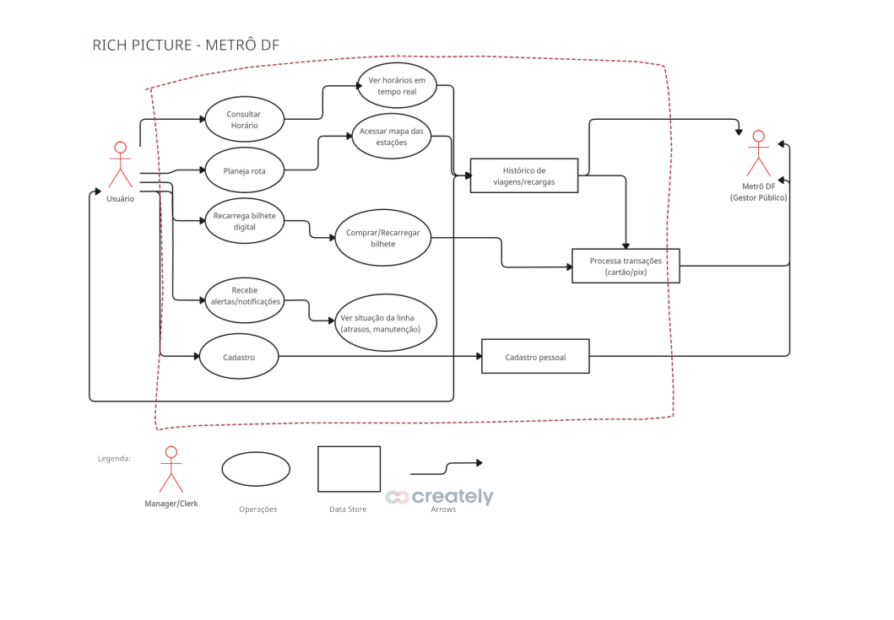
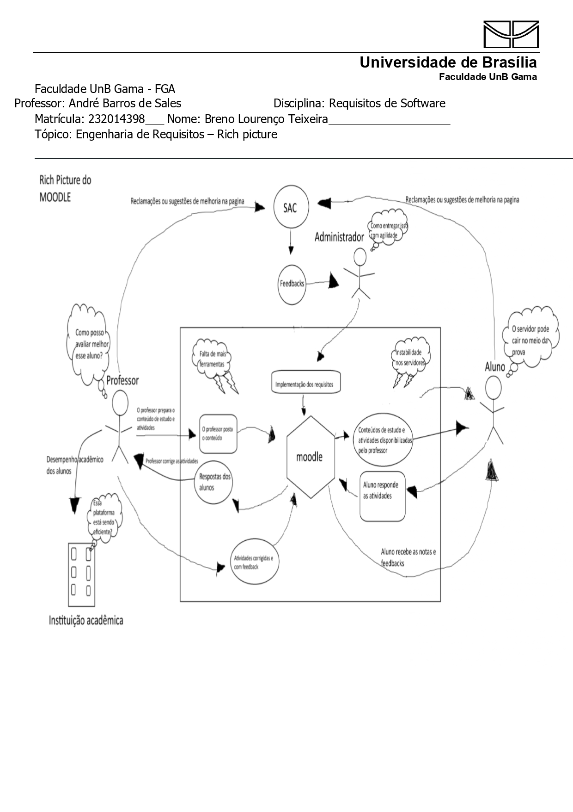
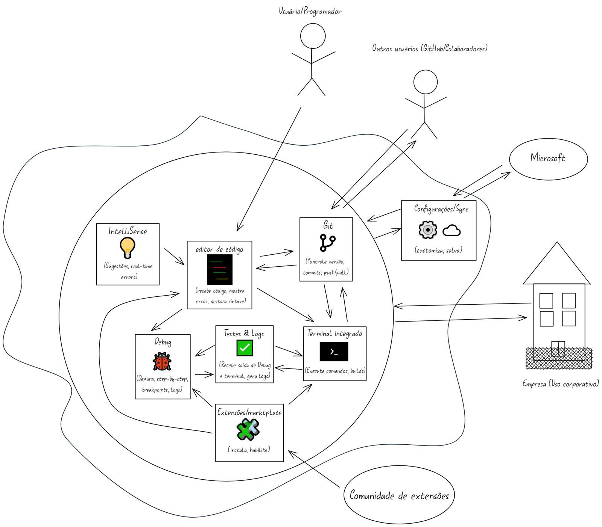
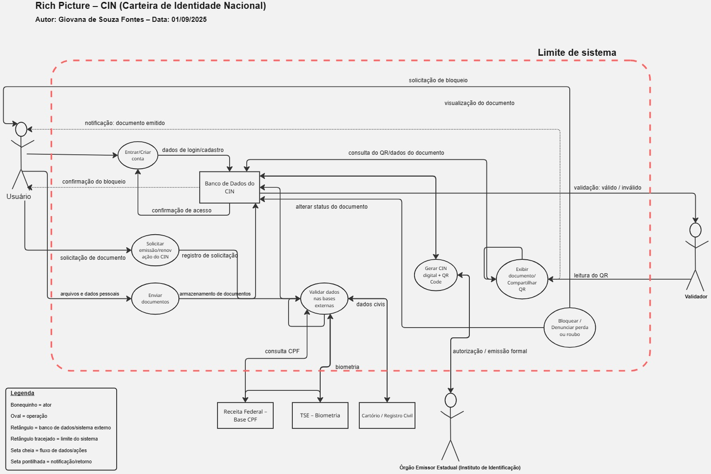
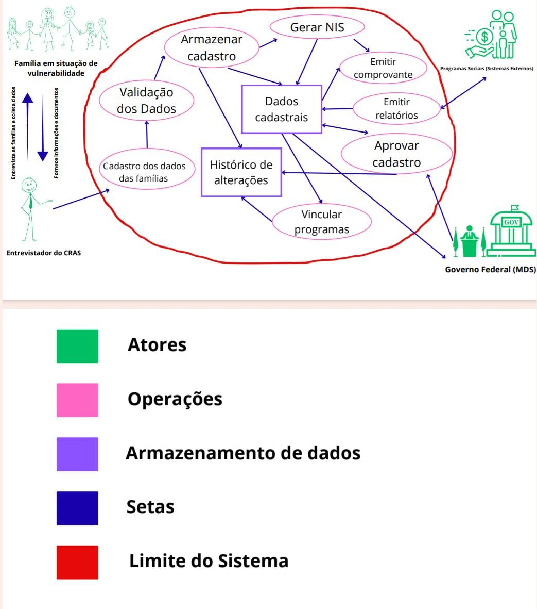

## Introdução  

No início do projeto, cada integrante do grupo selecionou um aplicativo de sua escolha, realizou uma análise crítica e representou sua compreensão por meio de uma *Rich Picture*. Esse processo permitiu identificar diferentes perspectivas sobre os sistemas avaliados, promovendo uma visão mais ampla e colaborativa.  

Este documento reúne as análises e representações visuais produzidas, com o objetivo de evidenciar como cada membro do grupo percebeu e interpretou os aplicativos escolhidos, servindo como ponto de partida para a definição do sistema a ser trabalhado ao longo do projeto.

A Tabela 1 apresenta os aplicativos escolhidos por cada integrante para desenvolvimento.

|                          Nome                           |                                                Aplicativo                                                 |
| :-----------------------------------------------------: | :-------------------------------------------------------------------------------------------------------: |
| [Arthur Fernandes](https://www.google.com/search?q=%23) |           [Metro DF](https://play.google.com/store/apps/details?id=br.gov.df.metroapp&hl=pt_BR)           |
|  [Breno Lourenço](https://www.google.com/search?q=%23)  |         [Moodle](https://play.google.com/store/apps/details?id=com.moodle.moodlemobile&hl=pt_BR)          |
|   [Danilo Melo](https://www.google.com/search?q=%23)    | [Carteira Digital de Trânsito](https://play.google.com/store/apps/details?id=br.gov.serpro.cnhe&hl=pt_BR) |
| [Dylan Cavalcante](https://www.google.com/search?q=%23) |                             [VsCode](https://code.visualstudio.com/download)                              |
| [Eduarda Domingos](https://www.google.com/search?q=%23) |        [Meu INSS](https://play.google.com/store/apps/details?id=br.gov.dataprev.meuinss&hl=pt_BR)         |
|  [Giovana Fontes](https://www.google.com/search?q=%23)  |           [CIN](https://play.google.com/store/apps/details?id=com.identidadenacional&hl=pt_BR)            |
|  [Leticia Lopes](https://www.google.com/search?q=%23)   |      [CadÚnico](https://play.google.com/store/apps/details?id=br.gov.dataprev.meucadunico&hl=pt_BR)       |

**Tabela 1:** _Tabela dos aplicativos analisados_

## Metrô DF 

O integrante **Arthur Fernandes** optou pelo aplicativo **Metrô DF**, voltado para auxiliar os usuários no uso do transporte metroviário do Distrito Federal. O aplicativo oferece funcionalidades como consulta de horários, informações sobre estações, integração com outros meios de transporte e orientações gerais para os passageiros.  

No *Rich Picture* elaborado, destacam-se elementos centrais do sistema, como a compra e recarga de bilhetes, o acesso às linhas e rotas, a comunicação de avisos e interrupções no serviço, além da interação do usuário com o aplicativo durante seu deslocamento. A representação busca evidenciar a importância da plataforma como facilitadora da mobilidade urbana e como apoio no planejamento diário dos usuários.  

O resultado do *Rich Picture* pode ser visualizado na **Figura 1**

**Figura 1 - Rich Picture Metrô DF**

Autor: <a href="https://github.com/arthurfernandesj">Arthr Fernandes</a>

## Moodle

O integrante **Breno Lourenço** optou pelo aplicativo **Moodle**, uma plataforma de aprendizagem amplamente utilizada por instituições de ensino para apoiar atividades acadêmicas em ambientes virtuais. O aplicativo tem como objetivo facilitar o acesso de alunos e professores aos conteúdos e recursos educacionais disponibilizados pela instituição.  

No *Rich Picture* desenvolvido, são evidenciadas as principais funcionalidades do sistema, como o acesso a disciplinas, materiais de estudo, envio e recebimento de tarefas, realização de fóruns e quizzes, além do acompanhamento de notas e feedback dos professores. Também são representadas as interações entre alunos, docentes e a própria plataforma, destacando o papel do aplicativo na organização e continuidade das atividades acadêmicas fora da sala de aula.  

O resultado do *Rich Picture* pode ser visualizado na **Figura 3**.

Autor: <a href="https://github.com/BrenoLTeixeira">Breno Teixeira</a>

### Carteira Digital de Trânsito  

O integrante **Danilo Melo** escolheu o aplicativo **Carteira Digital de Trânsito (CDT)**, ferramenta oficial que reúne a versão digital da Carteira Nacional de Habilitação (CNH) e do Certificado de Registro e Licenciamento do Veículo (CRLV). O aplicativo busca facilitar o acesso a documentos veiculares e de habilitação em formato digital, oferecendo praticidade e segurança aos motoristas.  

No *Rich Picture* desenvolvido, são destacados recursos como o acesso à CNH Digital, consulta de infrações, recebimento de notificações de multas, além da possibilidade de compartilhar o CRLV eletrônico. A representação evidencia como o aplicativo centraliza serviços importantes para o condutor, tornando mais ágil e acessível a gestão de documentos de trânsito.  

O resultado do *Rich Picture* pode ser visualizado na **Figura 5**.

Autor: <a href="https://github.com/EngDann">Danilo Melo</a>

### Visual Studio Code - VsCode

O integrante **Dylan Cavalcante** optou pelo **Visual Studio Code (VS Code)**, um editor de código multiplataforma amplamente utilizado por desenvolvedores. O aplicativo busca oferecer uma experiência de programação mais ágil e prática, possibilitando que os usuários editem códigos em diferentes linguagens diretamente do celular.  

No *Rich Picture* desenvolvido, são representadas funcionalidades como edição e execução de código, integração com sistemas de versionamento como Git, uso de extensões, personalização do ambiente e sincronização em nuvem. A representação mostra como o aplicativo contribui para a mobilidade dos desenvolvedores, permitindo a continuidade do trabalho em qualquer lugar.  

O resultado do *Rich Picture* pode ser visualizado na **Figura 7**.

Fonte: <a href="https://github.com/dylancavalcante">Dylan Cavalcante</a>

### Meu INSS  

A integrante **Eduarda Domingos** escolheu o aplicativo **Meu INSS**, plataforma oficial do Governo Federal voltada para cidadãos que necessitam acessar serviços previdenciários. O aplicativo reúne funcionalidades relacionadas a benefícios, contribuições e atendimentos do Instituto Nacional do Seguro Social.  

No *Rich Picture* desenvolvido, são destacados serviços como solicitação de aposentadoria, consulta de extratos de contribuição, agendamento de perícias médicas, acesso a históricos de pagamento e emissão de declarações. A representação demonstra como o aplicativo simplifica o contato do cidadão com o INSS, reduzindo a necessidade de deslocamentos presenciais.  

O resultado do *Rich Picture* pode ser visualizado na **Figura 9**.

Autor: <a href="https://github.com/eduardar0">Eduarda Domingos</a>

### CIN (Carteira de Identidade Nacional)  

A integrante **Giovana Fontes** optou pelo aplicativo **CIN (Carteira de Identidade Nacional)**, voltado para disponibilizar a nova identidade digital unificada no Brasil. O aplicativo busca modernizar o acesso aos documentos pessoais, garantindo praticidade e maior segurança contra fraudes.  

No *Rich Picture* elaborado, são evidenciadas funcionalidades como emissão e validação da identidade digital, autenticação por QR Code, integração com outros serviços do governo e armazenamento seguro dos dados do cidadão. A representação destaca como o sistema contribui para a digitalização de documentos oficiais e para a modernização dos serviços públicos.  

O resultado do *Rich Picture* pode ser visualizado na **Figura 11**.

Autor: <a href="https://github.com/GiovanaFontesS">Giovana Fontes</a>

### CadÚnico  

A integrante **Leticia Lopes** escolheu o aplicativo **CadÚnico**, plataforma destinada ao cadastro e acompanhamento de famílias em situação de vulnerabilidade social que buscam acesso a programas sociais do Governo Federal.  

No *Rich Picture* elaborado, são representados serviços como consulta de benefícios, atualização cadastral, acompanhamento da situação do registro e orientações sobre programas como Bolsa Família e Tarifa Social de Energia Elétrica. A representação mostra como o aplicativo atua como ponte entre os cidadãos e as políticas públicas, fortalecendo a inclusão social e o acesso a direitos básicos.  

O resultado do *Rich Picture* pode ser visualizado na **Figura 13**.

Autor: <a href="https://github.com/leticialopes20">Leticia Lopes</a>

| Versão |    Data    |      Descrição       |                        Autor(es)                        |                       Revisor(es)                       |
| :----: | :--------: | :------------------: | :-----------------------------------------------------: | :-----------------------------------------------------: |
| `1.0`  | 16/09/2025 | Criação do Aplicativos avaliados | [Arthur Fernandes](https://github.com/arthurfernandesj) |  |