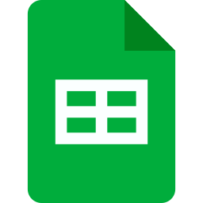

# Ferramentas

## Introdução

Com o objetivo de assegurar maior organização, eficiência na comunicação e qualidade na produção de artefatos durante o desenvolvimento do projeto, foi elaborado um levantamento das principais ferramentas a serem utilizadas pela equipe. A Tabela 1 apresenta essas ferramentas, juntamente com suas finalidades e aplicações previstas ao longo da execução do projeto.

<b>Tabela 1</b> - Ferramentas Utilizadas no Projeto

|                                      Logo                                      |      Ferramenta       |                                                             Finalidade                                                             |
| :----------------------------------------------------------------------------: | :-------------------: | :--------------------------------------------------------------------------------------------------------------------------------: |
|                             |        GitHub         |       Organização, versionamento e documentação de artefatos produzidos para o projeto.<a id="anchor_1" href="#FRM1">^1^</a>       |
|                         |       Telegram        | Como ferramenta secundária de comunicação entre o grupo e também com o docente da disciplina.<a id="anchor_2" href="#FRM2">^2^</a> |
|                               |         Teams         |                          Realização e gravação de reuniões e apresentações.<a id="3" href="#FRM3">^3^</a>                          |
|                                 |         Miro          |                     Criação de diagramas, fluxogramas e esquemas visuais.<a id="anchor_4" href="#FRM4">^4^</a>                     |
|                               |         Figma         |                                   Produção de arte gráfica.<a id="anchor_3" href="#FRM3">^5^</a>                                   |
|                             |        MkDocs         |                             Criação das páginas de documentação.<a id="anchor_4" href="#FRM4">^6^</a>                              |
|                             |  Visual Studio Code   |                        Criação e edição dos arquivos de documentação.<a id="anchor_5" href="#FRM5">^7^</a>                         |
|                         |       WhatsApp        |                           Comunicação do time e avisos de demandas.<a id="anchor_6" href="#FRM6">^8^</a>                           |
|                           |        YouTube        |                               Hospedagem de vídeos produzidos.<a id="anchor_7" href="#FRM7">^9^</a>                                |
|                  |   Google Planilhas    |                 Criação de planilhas relacionadas ao cronograma e horários.<a id="anchor_8" href="#FRM8">^10^</a>                  |
|                         |      Google Docs      |   Ferramenta para a primeira versão da escrita dos documentos necessários para o projeto.<a id="anchor_9" href="#FRM9">^11^</a>    |
|                           |        ChatGPT        |                             Ferramenta de consulta de dúvidas.<a id="anchor_12" href="#FRM10">^12^</a>                             |
|                             |        ZenHub         |                    Para atribuição de demandas aos membros do grupo 4.<a id="anchor_13" href="#FRM11">^13^</a>                     |
|  | This Person Not Exist |                        Criação de imagens falsas para as personas.<a id="anchor_14" href="#FRM12">^14^</a>                         |
|                          |         Canva         |                          Criação de slides para as apresentações.<a id="anchor_15" href="#FRM15">^15^</a>                          |

Fonte: <a href="https://github.com/leticialopes20">Letícia Lopes</a>

## Referências Bibliográficas

> <a id="FRM1" href="#anchor_1">1.</a> GitHub. Disponível em: https://docs.github.com/pt. Acesso em: 08 de set. de 2025.
>
> <a id="FRM2" href="#anchor_2">2.</a> Telegram. Disponível em: https://web.telegram.org/k/. Acesso em: 08 de set. de 2025.
>
> <a id="FRM3" href="#anchor_3">3.</a> Microsoft Teams. Disponível em: https://www.microsoft.com/pt-br/microsoft-teams/group-chat-software. Acesso em: 08 de set. de 2025.
>
> <a id="FRM4" href="#anchor_4">4.</a> Miro. Disponível em:https://miro.com/pt/. Acesso em: 08 de set. de 2025.
>
> <a id="FRM5" href="#anchor_5">5.</a> Figma. Disponível em: https://www.figma.com. Acesso em: 08 de set. de 2025.
>
> <a id="FRM6" href="#anchor_6">6.</a> MkDocs. Disponível em: https://www.mkdocs.org. Acesso em: 08 de set. de 2025.
>
> <a id="FRM7" href="#anchor_7">7.</a> Visual Studio Code. Disponível em: https://code.visualstudio.com. Acesso em: 08 de set. de 2025.
>
> <a id="FRM8" href="#anchor_8">8.</a> WhatsApp. Disponível em: https://www.whatsapp.com/?lang=pt_br. Acesso em: 08 de set. de 2025.
>
> <a id="FRM9" href="#anchor_9">9.</a> YouTube. Disponível em: https://www.youtube.com/howyoutubeworks/. Acesso em: 08 de set. de 2025.
>
> <a id="FRM10" href="#anchor_10">10.</a> Google Planilhas. Disponível em: https://www.google.com/intl/pt-BR/sheets/about. Acesso em: 08 de set. de 2025.
>
> <a id="FRM11" href="#anchor_11">11.</a> Google Docs. Disponível em: https://www.google.com/intl/pt-BR/docs/about. Acesso em: 08 de set. de 2025.
>
> <a id="FRM12" href="#anchor_12">12.</a> ChatGPT. Disponível em: https://openai.com/index/chatgpt. Acesso em: 08 de set. de 2025.
>
> <a id="FRM13" href="#anchor_13">13.</a> ZenHub. Disponível em: https://www.zenhub.com/. Acesso em: 08 de set. de 2025.
>
> <a id="FRM14" href="#anchor_14">14.</a> This Person Not Exist. Disponível em: https://thispersonnotexist.org/. Acesso em: 08 de set. de 2025.
>
> <a id="FRM15" href="#anchor_15">15.</a> Canva. Disponível em: https://www.canva.com/. Acesso em: 08 de set. de 2025.
>
>  

## Histórico de Versões 📅

| Versão |    Data    |                   Descrição                   |                     Autor(es)                      |                      Revisor(es)                       |
| :----: | :--------: | :-------------------------------------------: | :------------------------------------------------: | :----------------------------------------------------: |
| `1.0`  | 08/09/2025 |       Criação da página de ferramentas        | [Letícia Lopes](https://github.com/leticialopes20) | [Dylan Cavalcante](https://github.com/dylancavalcante) |
| `1.1`  | 08/09/2025 | Mudanças para melhor visualização das imagens |    [Danilo de Melo](https://github.com/engdann)    | [Dylan Cavalcante](https://github.com/dylancavalcante) |
| `1.2`  | 09/09/2025 | Correção de tamanho das imagens |    [Breno Teixeira](https://github.com/BrenoLTeixeira)    | [Arthur Fernandes](https://github.com/arthurfernandesj) |