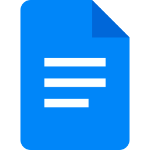

# Ferramentas

## Introdução

Com o objetivo de assegurar maior organização, eficiência na comunicação e qualidade na produção de artefatos durante o desenvolvimento do projeto, foi elaborado um levantamento das principais ferramentas a serem utilizadas pela equipe. A Tabela 1 apresenta essas ferramentas, juntamente com suas finalidades e aplicações previstas ao longo da execução do projeto.

<b>Tabela 1</b> - Ferramentas Utilizadas no Projeto

|                                      Logo                                      |      Ferramenta       |                                                             Finalidade                                                             |
| :----------------------------------------------------------------------------: | :-------------------: | :--------------------------------------------------------------------------------------------------------------------------------: |
|                             |        GitHub         |       Organização, versionamento e documentação de artefatos produzidos para o projeto.<a id="anchor_1" href="#FRM1">^1^</a>       |
|                         |       Telegram        | Como ferramenta secundária de comunicação entre o grupo e também com o docente da disciplina.<a id="anchor_2" href="#FRM2">^2^</a> |
|                               |         Teams         |                          Realização e gravação de reuniões e apresentações.<a id="3" href="#FRM3">^3^</a>                          |
|                                 |         Miro          |                     Criação de diagramas, fluxogramas e esquemas visuais.<a id="anchor_4" href="#FRM4">^4^</a>                     |
|                               |         Figma         |                                   Produção de arte gráfica.<a id="anchor_3" href="#FRM3">^5^</a>                                   |
|                             |        MkDocs         |                             Criação das páginas de documentação.<a id="anchor_4" href="#FRM4">^6^</a>                              |
|                             |  Visual Studio Code   |                        Criação e edição dos arquivos de documentação.<a id="anchor_5" href="#FRM5">^7^</a>                         |
|                         |       WhatsApp        |                           Comunicação do time e avisos de demandas.<a id="anchor_6" href="#FRM6">^8^</a>                           |
|                           |        YouTube        |                               Hospedagem de vídeos produzidos.<a id="anchor_7" href="#FRM7">^9^</a>                                |
|                  |   Google Planilhas    |                 Criação de planilhas relacionadas ao cronograma e horários.<a id="anchor_8" href="#FRM8">^10^</a>                  |
|                         |      Google Docs      |   Ferramenta para a primeira versão da escrita dos documentos necessários para o projeto.<a id="anchor_9" href="#FRM9">^11^</a>    |
|                           |        ChatGPT        |                             Ferramenta de consulta de dúvidas.<a id="anchor_12" href="#FRM10">^12^</a>                             |
|                             |        ZenHub         |                    Para atribuição de demandas aos membros do grupo 4.<a id="anchor_13" href="#FRM11">^13^</a>                     |
|  | This Person Not Exist |                        Criação de imagens falsas para as personas.<a id="anchor_14" href="#FRM12">^14^</a>                         |
|                          |         Canva         |                          Criação de slides para as apresentações.<a id="anchor_15" href="#FRM15">^15^</a>                          |
|                          |         Capcut         |                          Edição de gravações das apresentações e reuniões.<a id="anchor_16" href="#FRM16">^16^</a>                          |

Fonte: <a href="https://github.com/leticialopes20">Letícia Lopes (2025)</a>

## Referências Bibliográficas

> <a id="FRM1" href="#anchor_1">1.</a> GITHUB. GitHub Docs. [San Francisco, CA]: GitHub, c2025. Disponível em: <a href="https://docs.github.com/pt">https://docs.github.com/pt</a>. Acesso em: 8 set. 2025.
>
> <a id="FRM2" href="#anchor_2">2.</a> TELEGRAM MESSENGER. Telegram Web. [Dubai]: Telegram, c2025. Disponível em: <a href="https://web.telegram.org/k/">https://web.telegram.org/k/</a>. Acesso em: 8 set. 2025.
>
> <a id="FRM3" href="#anchor_3">3.</a> MICROSOFT. Microsoft Teams. [Redmond, WA]: Microsoft, c2025. Disponível em:<a href = "https://www.microsoft.com/pt-br/microsoft-teams/group-chat-software">https://www.microsoft.com/pt-br/microsoft-teams/group-chat-software</a>. Acesso em: 8 set. 2025.
>
> <a id="FRM4" href="#anchor_4">4.</a> MIRO. Miro. [San Francisco, CA]: Miro, c2025. Disponível em: <a href = "https://miro.com/pt/"> https://miro.com/pt/</a>. Acesso em: 8 set. 2025.
>
> <a id="FRM5" href="#anchor_5">5.</a> FIGMA. Figma. [San Francisco, CA]: Figma, c2025. Disponível em: <a href="https://www.figma.com">https://www.figma.com</a>. Acesso em: 8 set. 2025.
>
> <a id="FRM6" href="#anchor_6">6.</a> MKDOCS. MkDocs. [S.l.]: MkDocs, c2025. Disponível em: <a href = "https://www.mkdocs.org">https://www.mkdocs.org</a>. Acesso em: 8 set. 2025.
>
> <a id="FRM7" href="#anchor_7">7.</a> MICROSOFT. Visual Studio Code. [Redmond, WA]: Microsoft, c2025. Disponível em: <a href = "https://code.visualstudio.com">https://code.visualstudio.com</a>. Acesso em: 8 set. 2025.
>
> <a id="FRM8" href="#anchor_8">8.</a> META. WhatsApp. [Menlo Park, CA]: Meta, c2025. Disponível em: <a href ="https://www.whatsapp.com/?lang=pt_br">https://www.whatsapp.com/?lang=pt_br</a>. Acesso em: 8 set. 2025.
>
> <a id="FRM9" href="#anchor_9">9.</a> GOOGLE. How YouTube Works. [Mountain View, CA]: Google, c2025. Disponível em: <a href = "https://www.youtube.com/howyoutubeworks/">https://www.youtube.com/howyoutubeworks/</a>. Acesso em: 8 set. 2025.
>
> <a id="FRM10" href="#anchor_10">10.</a> GOOGLE. Google Planilhas. [Mountain View, CA]: Google, c2025. Disponível em: <a href = "https://www.google.com/intl/pt-BR/sheets/about">https://www.google.com/intl/pt-BR/sheets/about</a>. Acesso em: 8 set. 2025.
>
> <a id="FRM11" href="#anchor_11">11.</a> GOOGLE. Google Docs. [Mountain View, CA]: Google, c2025. Disponível em: <a href = "https://www.google.com/intl/pt-BR/docs/about">https://www.google.com/intl/pt-BR/docs/about</a>. Acesso em: 8 set. 2025.
>
> <a id="FRM12" href="#anchor_12">12.</a> OPENAI. ChatGPT. [San Francisco, CA]: OpenAI, c2025. Disponível em: <a href = "https://openai.com/index/chatgpt">https://openai.com/index/chatgpt</a>. Acesso em: 8 set. 2025.
>
> <a id="FRM13" href="#anchor_13">13.</a> ZENHUB. ZenHub. [Vancouver, BC]: ZenHub, c2025. Disponível em: <a href = "https://www.zenhub.com/">https://www.zenhub.com/</a>. Acesso em: 8 set. 2025.
>
> <a id="FRM14" href="#anchor_14">14.</a> THIS PERSON DOES NOT EXIST. This Person Does Not Exist. [S.l.: s.n.], [20--?]. Disponível em: <a href = "https://thispersondoesnotexist.com/">https://thispersondoesnotexist.com/</a>. Acesso em: 8 set. 2025.
>
> <a id="FRM15" href="#anchor_15">15.</a> CANVA. Canva. [Sydney, AU]: Canva, c2025. Disponível em: <a href="https://www.canva.com/">https://www.canva.com/</a>. Acesso em: 8 set. 2025.
>
> <a id="FRM16" href="#anchor_16">16.</a> CAPCUT. CapCut. [S.l.]: ByteDance, c2025. Disponível em: <a href="https://www.capcut.com/pt-br">https://www.capcut.com/pt-br</a>. Acesso em: 29 set. 2025.

## Histórico de Versões 

| Versão |    Data    |                       Descrição                        |                      Autor(es)                      |                       Revisor(es)                       |
| :----: | :--------: | :----------------------------------------------------: | :-------------------------------------------------: | :-----------------------------------------------------: |
| `1.0`  | 08/09/2025 |            Criação da página de ferramentas            | [Letícia Lopes](https://github.com/leticialopes20)  | [Dylan Cavalcante](https://github.com/dylancavalcante)  |
| `1.1`  | 08/09/2025 |     Mudanças para melhor visualização das imagens      |    [Danilo de Melo](https://github.com/engdann)     | [Dylan Cavalcante](https://github.com/dylancavalcante)  |
| `1.2`  | 09/09/2025 |            Correção do tamanho das imagens             | [Breno Teixeira](https://github.com/BrenoLTeixeira) | [Arthur Fernandes](https://github.com/arthurfernandesj) |
| `1.3`  | 28/09/2025 | Correção e padronização das referências bibliográficas |      [Danilo Melo](https://github.com/EngDann)      |                               [Letícia Lopes](https://github.com/leticialopes20)                     |
| `1.4`  | 29/09/2025 | Correção dos links das referências bibliográficas e adição de nova ferramenta|      [Letícia Lopes](https://github.com/leticialopes20)       |                             [Eduarda](https://github.com/eduardar0)                   |
