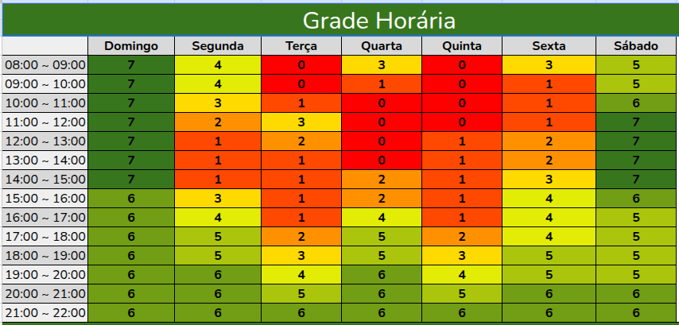

# Plano de Reuniões

## *Heatmap* de Disponibilidade

Inicialmente, foi elaborado um heatmap para avaliar a disponibilidade dos integrantes da equipe de desenvolvimento, com o objetivo de apoiar decisões relacionadas ao planejamento das reuniões subsequentes.

 
 
Tabela 1: *Disponibilidade de horário dos membros da equipe de desenvolvimento*

Fonte: <a href="https://github.com/arthurfernandesj">Arthur Fernandes</a>

## Discussão e Definição

Após a análise do *heatmap* e discussões entre os integrantes na reunião do dia [01/09](../atas/ata_01.md), foram definidas as datas e horários das reuniões, garantindo que nenhum membro fosse prejudicado por indisponibilidade.

Decidiu-se que o número de reuniões semanais seria variável, conforme detalhado a seguir:

- **Reunião Principal**: Realizada toda **Segunda-Feira**, em um horário dentro do intervalo **20h-22h**. Nela, são revisadas as atividades da semana anterior e planejadas as atividades da semana seguinte.
- **Reunião(ões) Secundária(s)**: Ocorrerão apenas quando necessário, em sprints de maior demanda, com dia e horário definidos via *WhatsApp*. Cada reunião secundária será identificada com um código ".1", ".2", e assim sucessivamente, seguindo o código da última reunião principal realizada.
 

## Histórico de Versões

| Versão | Data | Descrição | Autor(es) | Revisor(es) |
| :-: | :-: | :-: | :-: | :-: |
| `1.0` | 07/09/2025 | Criação do plano de reuniões | [Todos]() | [Todos]() |
