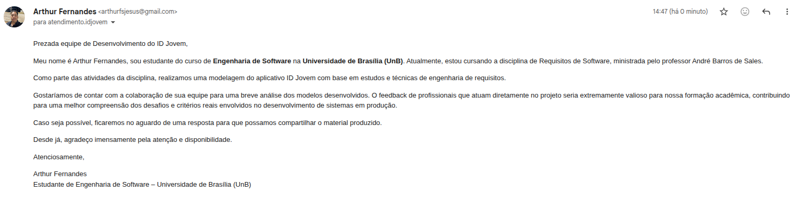
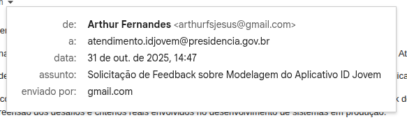

## Introdução

A *Comprovação Informal* é uma metodologia de validação que utiliza a **linguagem natural** para descrever os requisitos modelados, permitindo que o cliente atue como agente na identificação de possíveis inconsistências na formulação desses requisitos<a id="anchor_1" href="#REF1">1</a>. Essa abordagem visa garantir que as funcionalidades descritas estejam alinhadas com as expectativas reais dos usuários do sistema. Para que essa validação ocorra de forma eficaz, é essencial a participação direta do cliente. Assim, em [*Metodologia*](#metodologia), foi apresentado o método de comunicação estabelecido com o mesmo.

## Metodologia

A metodologia definida para a participação do cliente na comprovação informal consiste, primeiramente, na tentativa de contato do grupo com a equipe de desenvolvimento responsável pelo aplicativo *ID Jovem*, de modo que, havendo retorno, a validação dos requisitos possa ser efetivada. Para isso, com o auxílio de todos os integrantes do **Grupo 04**. Caso haja resposta, o conteúdo será posteriormente adicionado a esta seção.

## Contato

Na figura 1, está representado o modelo da primeira tentativas de contato efetuada, que se repetiu para todos os endereços de *email* utilizados.

Figura 1: Tentativa de contato por [Arthur Fernanes](https://github.com/arthurfernandesj)

 

Fonte: [Arthur Fernandes](https://github.com/arthurfernandesj)

## Endereço de Email

Na figura 2, está representado o endereço de *email* utilizado para contato.

Figura 2: Email de contato por [Arthur Fernanes](https://github.com/arthurfernandesj)

 

Fonte: [Arthur Fernandes](https://github.com/arthurfernandesj)

## Retorno

Até o momento da entrega final do projeto, posterior à entrega dos artefatos de validação, os membros do grupo 4 não receberam retorno da equipe do ID Jovem por nenhum dos e-mails utilizados para contato. Nesse sentido, caso haja qualquer forma de retorno, a mesma será inserida neste tópico.

## Referências Bibliográficas

> <a id="REF1">1.</a> SERRANO, Milene; SERRANO, Maurício. Requisitos – Aula 23. Brasília, DF: Universidade de Brasília, Campus Gama, [s.d.]. Disponível em: https://aprender3.unb.br/pluginfile.php/3096017/mod_resource/content/2/Requisitos%20-%20Aula%20023.pdf. Acesso em: 22 jun. 2025.

## Histórico de Versão

| Versão |    Data    |       Descrição      |                                          Autor(es)                                         |                  Revisor(es)                  |
| :----: | :--------: | :------------------: | :----------------------------------------------------------------------------------------: | :-------------------------------------------: |
|  `1.0` | 31/10/2025 | Criação do documento | [Arthur Fernandes](https://github.com/arthurfernandesj) e [Dylan Cavalcante](https://github.com/dylancavalcante) |
