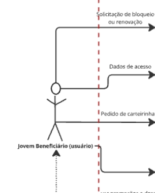
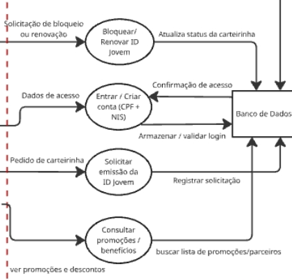
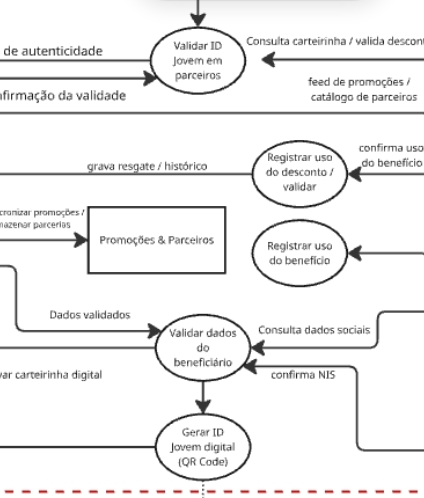
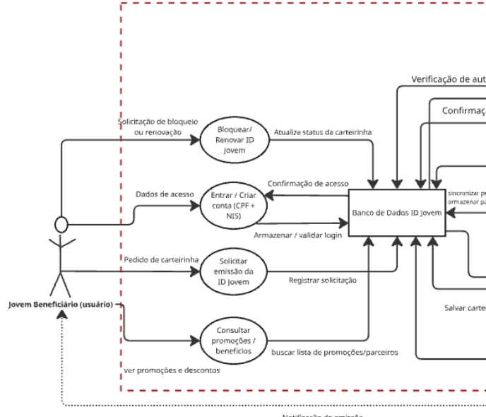

## Introdução

Após o planejamento da verificação, foi iniciada a inspeção do artefato <b>Rich Picture</b> referente ao aplicativo <b>ID Jovem</b>. O propósito da verificação é garantir que o Rich Picture esteja devidamente estruturado, coerente com os requisitos levantados e alinhado aos objetivos do aplicativo ID Jovem, voltado para facilitar o acesso de jovens de baixa renda a benefícios culturais e de transporte. Como referência, utilizou-se (SERRANO Milene; SERRANO Mauricio) Requisitos – Aula 07. Universidade de Brasília. Durante o processo, foram coletadas informações, identificadas inconsistências e elaboradas sugestões de melhoria, com o intuito de aprimorar o artefato e assegurar sua adequação ao desenvolvimento do sistema.

<small><em>Revisado por [Chat GPT](https://chatgpt.com/share/691354f7-5404-8000-92b0-0138793cdd24), em 11 de Novembro 2025</em></small>

## Objetivo 

O presente documento tem como finalidade relatar os resultados obtidos na verificação do artefato Rich Picture do aplicativo <b>ID Jovem</b>, em sua versão 1.0, datada de 08/09/2025 , integrante da Entrega 1 do grupo 4.

## Metodologia 

A verificação foi conduzida com base nas checklists definidas na etapa de planejamento. Cada item da lista foi avaliado individualmente, sendo marcado como <b>Sim</b>, <b>Não</b> ou <b>Incompleto</b>, conforme seu atendimento aos critérios estabelecidos. Quando necessário, o avaliador adicionou <b>observações complementares</b> para justificar as marcações e sugerir ajustes que contribuam para a melhoria do artefato.

## Cronograma e participantes

<h3 style="text-align: center;">Tabela 1: Participantes</h3>

<table>
  <thead>
    <tr>
      <th>Nome</th>
      <th>Função</th>
      <th>Data</th>
      <th>Hora</th>
    </tr>
  </thead>
  <tbody>
    <tr>
      <td><a href="https://github.com/GiovanaFontesS" target="_blank">Giovana Fontes</a></td>
      <td>Verificadora</td>
      <td>10/11/2025</td>
      <td>10:30</td>
    </tr>
    <tr>
      <td><a href="https://github.com/arthurfernandesj" target="_blank">Arthur</a></td>
      <td>Autor</td>
      <td>10/11/2025</td>
      <td>14:00</td>
    </tr>
  </tbody>
</table>

## Lista de Verificação 1.2 Rich Picture 

A seguir, apresenta-se a tabela com os itens utilizados na verificação do artefato <b>Rich Picture</b> do aplicativo <b>ID Jovem</b>. Essa verificação tem como objetivo assegurar que o diagrama represente de forma clara e completa os elementos do sistema, incluindo atores, fluxos de informação, operações e limites. Além disso, a análise busca confirmar a coerência visual e conceitual do artefato, garantindo que ele atenda aos critérios definidos no planejamento e contribua para o entendimento do escopo e funcionamento do sistema.

<h3 style="text-align: center;">Tabela 2: Itens do artefato Rich Picture – ID Jovem</h3>

<table border="1" style="border-collapse: collapse; width: 95%; text-align: center;">
  <thead>
    <tr>
      <th>Item</th>
      <th>Referência</th>
      <th>Avaliação</th>
      <th>Observação</th>
      <th>Print</th>
      <th>Autor</th>
    </tr>
  </thead>
  <tbody>
    <tr>
      <td><b>01:</b> O Rich Picture representa todos os atores envolvidos no sistema?</td>
      <td>-</td>
      <td></td>
      <td>-</td>
      <td></td>
      <td><a href="https://github.com/GiovanaFontesS" target="_blank">Giovana Fontes</a></td>
    </tr>
    <tr>
      <td><b>02:</b> Os fluxos de informação entre os elementos estão ilustrados?</td>
      <td>-</td>
      <td></td>
      <td>-</td>
      <td></td>
      <td><a href="https://github.com/arthurfernandesj" target="_blank">Arthur Fernandes</a></td>
    </tr>
    <tr>
      <td><b>03:</b> As principais operações do sistema estão representadas?</td>
      <td>-</td>
      <td></td>
      <td>-</td>
      <td></td>
      <td><a href="https://github.com/eduardar0" target="_blank">Eduarda Rodrigues</a></td>
    </tr>
    <tr>
      <td><b>04:</b> Os limites do sistema estão claramente indicados?</td>
      <td>-</td>
      <td></td>
      <td>-</td>
      <td></td>
      <td><a href="https://github.com/dylancavalcante" target="_blank">Dylan Cavalcante</a></td>
    </tr>
    <tr>
      <td><b>05:</b> Os armazenamentos de dados (tabelas) estão representados adequadamente?</td>
      <td>-</td>
      <td></td>
      <td>-</td>
      <td></td>
      <td><a href="https://github.com/BrenoLTeixeira" target="_blank">Breno Teixeira</a></td>
    </tr>
    <tr>
      <td><b>06:</b> O Rich Picture foi validado com a equipe ou stakeholders?</td>
      <td>-</td>
      <td></td>
      <td>-</td>
      <td></td>
      <td><a href="https://github.com/leticialopes20" target="_blank">Leticia Maria</a></td>
    </tr>
    <tr>
      <td><b>07:</b> O artefato possui uma legenda explicando os símbolos utilizados no diagrama?</td>
      <td>-</td>
      <td></td>
      <td>-</td>
      <td></td>
      <td><a href="https://github.com/GiovanaFontesS" target="_blank">Giovana Fontes</a></td>
    </tr>
  </tbody>
</table>

Fonte: <a href="https://github.com/GiovanaFontesS" target="_blank">Giovana Fontes</a>

## Análises dos resultados 

Durante a análise de verificação do diagrama de sequência, foram adicionados dois novos critérios ao checklist utilizado, com o objetivo de tornar a avaliação mais completa e precisa. Esses novos itens contribuem para garantir que o diagrama esteja não apenas correto em sua estrutura, mas também claro e compreensível visualmente.

- **Item 5:** Os armazenamentos de dados (tabelas) estão representados adequadamente?  
- **Item 7:** O artefato possui uma legenda explicando os símbolos utilizados no diagrama?

## Conclusão 

Após a análise da primeira versão da tabela de verificação, observou-se que não ocorreram alterações significativas nos itens já existentes. No entanto, foi identificado que alguns aspectos importantes ainda não estavam sendo inspecionados, o que poderia comprometer a completude da avaliação do artefato. Por esse motivo, foram incluídos dois novos itens na lista de verificação, voltados à representação dos armazenamentos de dados e à presença de uma legenda explicativa dos símbolos utilizados. Essas adições tornaram o processo de verificação mais completo e preciso, assegurando que o Rich Picture do aplicativo ID Jovem esteja devidamente estruturado e alinhado às boas práticas de modelagem visual.

## Referencias Bibliograficas

> <a id="RP1" href="#TEC1">1.</a> SERRANO, Milene. Requisitos - Aula 10. Local: UnB-FGA, Gama, DF. Apresentação de Power Point. 35, color. Disponível em: [Requisitos - Aula 10](https://aprender3.unb.br/pluginfile.php/3210627/mod_resource/content/1/Aula%2010.pdf). Página 19. Acesso em: 11 de Outubro de 2025.

> <a id="RP3" href="#TEC3">1.</a> VAZQUEZ, Carlos Eduardo; SIMÕES, Guilherme Siqueira; SIMÕES. *Engenharia de Requisitos: Software Orientado ao Negócio.* São Paulo , 2016. Acesso em: 19 de outubro de 2025.

## Bibliografia 
> SERRANO, Milene. Requisitos - Aula 10. Local: UnB-FGA, Gama, DF. Apresentação de Power Point. 35, color. Disponível em: [Requisitos](https://aprender3.unb.br/pluginfile.php/3210627/mod_resource/content/1/Aula%2010.pdf). Acesso em: 11 de Outubro de 2025.
>

## Histórico de Versões

| Versão | Data | Descrição | Autor(es) | Revisor(es) |
| :--: | :--: | :-- | :-- | :-- |
| `1.0` | 11/11/2025 | Criação de Verificação Rich Picture | [Giovana Fontes](https://github.com/GiovanaFontesS) | [ Dylan Cavalcante ](https://github.com/dylancavalcante) |

## Agrecimentos

Queremos agradecer ao [Chat GPT](https://chatgpt.com/share/691354f7-5404-8000-92b0-0138793cdd24), ferramenta de Inteligência Artificial Generativa, pelo apoio durante o desenvolvimento deste projeto ID Jovem. Sua ajuda foi essencial na revisão de textos, na organização das ideias e na pesquisa de conteúdos complementares que contribuíram para deixar nossa documentação mais clara e completa.

De acordo com o Código de Conduta da Sociedade Brasileira de Computação (SBC), destacamos que a ferramenta foi utilizada apenas como apoio técnico e linguístico.
Todo o conteúdo apresentado é de autoria do Grupo 04, que assume total responsabilidade por sua originalidade e precisão.

